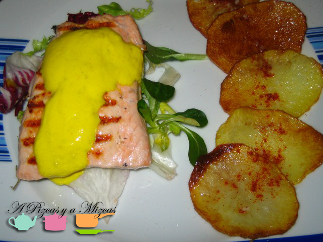

Esta es una receta fácil, rápida y que preparamos bastante a menudo. Esta tarde hemos ido al súper y hemos visto unos lomos de salmón que estaban muy bien de precio. Eran hermosos y fresquísimos, así que los hemos metido en el carro y... rápido para casa preparar la cena, en este caso salmón a la mostaza. Como estamos en víspera de San Valentín hemos pensado que este plato puede servir a muchos pizqueros que mañana no salgan a cenar fuera de casa y que opten por cocinar en pareja. Seguro que triunfan!

Ingredientes (2 personas que se quieran mucho):

- Dos lomos de salmón hermosos.
- Una patata pequeña.
- Un yogur griego natural.
- Mostaza.
- Mix de brotes tiernos.
- Romero, pimentón, sal en escamas

Para seguir un orden correcto, lo más práctico es preparar primero la salsa de mostaza que es muy sencilla y rápida. Tomamos un bote de yogur griego natural y lo echamos en un bol. A continuación, le añadimos mostaza a discreción. Removemos y vamos probando a ver qué tal el sabor. En esta ocasión, nosotros le pusimos también un poco de sésamo y una pizca de colorante alimentario. La reservamos en el frigorífico.

Luego, acompañaremos el salmón, con unas patatas chip caseras. Para eso, cortamos la patata en rodajas lo má finas posibles, bien con un cuchillo o una mandolina. Calentamos aceite en un sartén y cuando esté bien caliente echamos las patatas. Les damos una vuelta y las retiramos sobre papel absorbente.

El salmón no tiene misterio. Se calienta la parrilla y se colocan los lomos, primero por la parte de la piel. En unos cinco minutos lo tendremos listo. Nosotros lo aromatizamos con un poco de romero de Navarrés en la parrilla.

Ahora emplatamos. Tomamos un puñadito del mix de lechugas, lo salamos y le añadimos un chorro de aceite de oliva virgen extra. Será la "cama" del salmón.

Sobre la lechuga colocamos el salmón y le ponemos una cucharadita de la salsa de mostaza y yogur. A un lado ponemos las patatas, las salamos con la sal en escamas y un poco de pimentón. Ahora ya a comerlo calentito.

Bon profit!!
