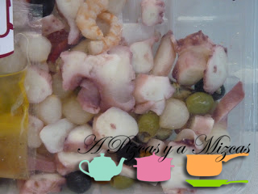

Esta entrada más que una receta podríamos decir que "nos lo han dado hecho"... pero como hemos añadido algunos ingredientes os lo explicamos. Estos días de tanta comilona apetece algo fresco y ligerito y eso es lo que pretendíamos con este salpicón de marisco rápido.

Nosotros utilizamos las bandejitas que venden en Mercadona para preparar el salpicón de marisco rápido y la verdad que con tanta preparación de platos se agradece algo de ayuda... je je

Servimos este plato cómo un entrante como si fuera una ensalada, aunque también se puede servir como montaditos. Vosotros decidis...

## Ingredientes para el salpicón de marisco rápido

- Una bandejita de salpicón de marisco de Mercadona
- 5 o 6  langostinos cocidos
- medio pimiento verde
- medio pimiento rojo
- una cebolla tierna pequeña
- aceite de oliva virgen extra
- sal

##### 

Con esto tenemos el 90% del plato elaborado :)

Lavamos y troceamos en pedacitos muy pequeños los pimientos y la cebolla. En una fuente ponemos el contenido de la bandejita de salpicon de marisco de Mercadona y le añadimos los pimientos y la cebolla troceados.

A continuación pelamos las gambas y las troceamos las agregamos al resto de los ingredientes.

Por último aliñaremos con el sobrecito de la vinagreta que acompaña la bandeja a la que nosotros añadimos una pizca de sal y un chorrito de aceite de oliva virgen extra.

Cuando nos lo dan casi hecho si que es fácil, eh?

")

A disfrutar del salpicón de marisco rápido!
