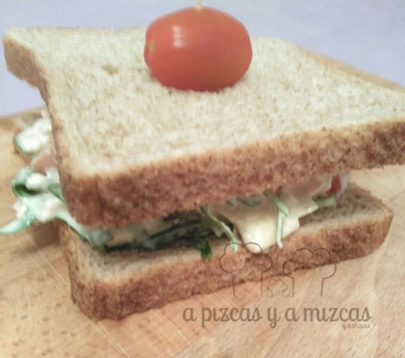
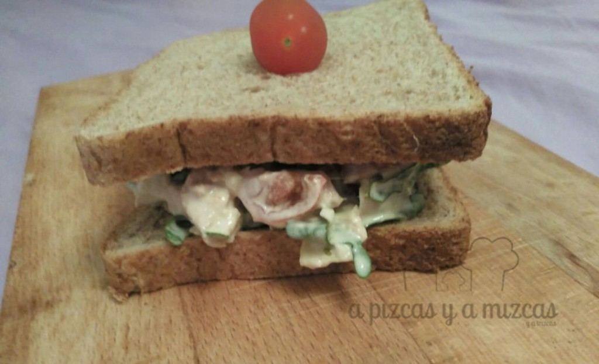

Todos los que nos acompañáis desde hace tiempo sabéis que nos encanta comer con las manos y poder disfrutar de un buen bocadillo o sandwich al aire libre... que sí que somos súper fans de los picnics y ahora que se acerca el buen tiempo este sandwich de atún y alcachofas se va a convertir en uno de nuestro sandwich favorito.

## Ingredientes para preparar el sandwich de atún y alcachofas (para dos personas)

- 4 rebanadas de pan de molde integral
- 2 latitas de atún
- 7 tomatitos cherry
- 100 gramos de corazones de alcachofa en conserva
- 2 cucharadas soperas de mayonesa
- brotes tiernos de ensalada
- sal y pimienta

Escurrimos el atún, cortamos los tomates cherry por la mitad y los corazones de las alcachofas los cortamos en trocitos muy pequeños. Mezclamos todo en un cuenco y añadimos la mayonesa y salpimentamos.

Repartimos la mezcla sobre las rebanadas del pan de molde. Por último los decoramos con un tomatito cherry con un palillo y a disfrutar de vuestra cena o merienda al aire libre.

Esta receta la vimos en el blog de [L´Exquisit](http://blogexquisit.blogs.ar-revista.com/sandwich-de-atun-y-alcachofas/) y es que Sonia prepara unos sandwiches y unos bocadillos... que quitan el sentido!! Si no conocéis el blog es uno de los blogs más que recomendable. Para nosotros es uno de nuestros favoritos!

Si os gusta la idea de preparar bocadillos o sandwiches e ir a disfrutar del buen tiempo.... os dejamos alguna sugerencia:

- [Sandwich con queso edam, manzana y bacon](/sandwich-con-queso-edam-manzana-y-bacon/)
- [Recetas para un picnic por Valencia](/picnic-fallero-la-solucion-perfecta-para-comer-en-valencia-en-fallas/)
- [Empanadas chilenas de carne](/empanadas-chilenas-de-carne/)
- [Empanada de pollo](/empanada-de-pollo/)
- [Empanada de setas y bacon](/empanada-de-setas-y-bacon/)
