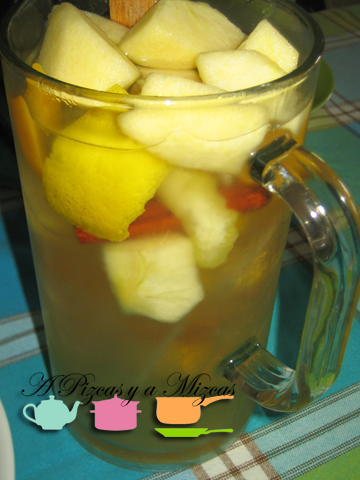

Nos hemos empeñado en alargar el verano...y la verdad es que mientras el tiempo nos acompañe nosotros encantados. Que  el invierno es muy largo y después echamos mucho de menos nuestra terracita. Así que para celebrarlo se nos ocurrió preparar una sangría blanca que nos recordara los día de playa de julio y agosto.

## Ingredientes para preparar una sangría blanca

- una botella de vino blanco frío (cuanto más afrutado mejor)
- un melocotón
- un paraguayo
- una manzana verde
- cáscara de una naranja
- cáscara de un limón
- una rama de canela
- azúcar al gusto
- 40 cl de gaseosa

Cuesta más enumerar los ingredientes que preparar la sangría blanca. Empezaremos preparando la fruta: pelando el melocotón, el paraguayo y la manzana verde. Las troceamos en cuadrados medianos. Y añadimos a un bol.

A continuación obtenemos las cáscaras del limón y la naranja (sin apurar la parte blanca, acordaros que amarga) y lo agregamos al bol con las frutas. Añadimos la rama de canela y azúcar al gusto.

Por último añadimos el vino blanco bien frío tapamos el bol e introducimos en el frigorífico y dejamos reposar al menos una hora.

A la hora de servir la sangría blanca añadimos la gaseosa y a disfrutar con amigos de los últimos días de veranillo. Acordaros a la hora de servir las copas de sangría blanca poner un trocito de cada fruta que hemos puesto.

Con estas cantidades nos salieron aproximadamente dos litros de sangría.
