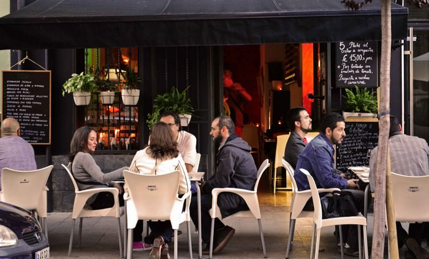
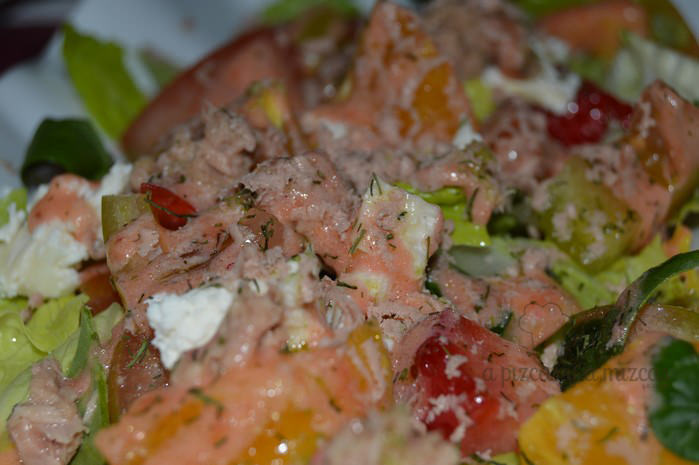
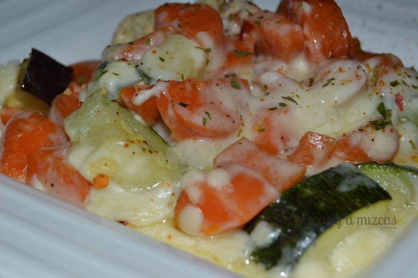
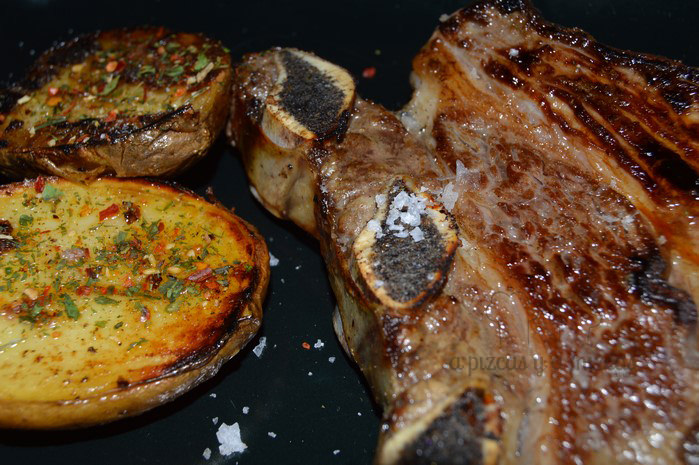

Siempre que nos paseamos por [Ruzafa](/tag/ruzafa/ "Ruzafa") encontramos algún lugar interesante por descubrir. En nuestro último paseo nuestros amigos de [Espacio 40 - Vinos de Chile](http://vinosdechile.es/ "Espacio 40  - Vinos de Chile") nos recomendaron que probáramos el menú de [Santino Gastrobar](http://www.santinogastrobar.com/ "Santino Gastrobar"), en la calle Puerto Rico, 38, de Valencia. Así que viniendo la recomendación de Rosa y de Jose, no lo dudamos ni un segundo. Os contamos cómo fue la experiencia en Santino Gastrobar.

El restaurante destaca por utilizar productos frescos y por el trato cordial de su personal. El espacio no es excesivamente grande pero es acogedor, que combina la tradicional cocina de mercado con platos latinoamericanos y muy buenas carnes.

## Nuestra comida en Santino Gastrobar

- **Comida**: ⭐⭐⭐
- **Local**: ⭐⭐⭐
- **Servicio**: ⭐⭐⭐⭐

El día que fuimos a comer era un domingo y Valencia estaba a tope, sin embargo mantienen el menú del día. La persona que nos atendió nos indicó que con dos menús habría más que suficiente como para que Trizcas también comiera bien, sin necesidad de pedir nada extra para ella. Un gesto fantástico por su parte y acertó.

Esto es lo que comimos.

- Dos entrantes: ensalada de cítricos y verduras gratinadas con bechamel.
- Plato principal a elegir arroz del senyoret, paella o churrasco con patatas. Elegimos una de paella y churrasco.
- De postre compartimos una ración de tarta de queso de la abuela.
- Pedimos vino tinto chileno.

Todo ello por 10€ por persona. Como veis, un precio muy competitivo y además, la calidad bastante buena.

Nos sorprendió la ensalada, que combinaba ensalada clásica con piezas de naranja, fresas y quesos. Mizcas no es muy partidaria de las ensaladas con frutas, pero esta le gustó bastante.

La paella estaba correcta y Trizcas le dió su aprobación. La carne muy rica y el postre también, tarta de queso sin añadidos, como más nos gusta.

Ahora tenemos pendiente volver para probar su carta y pedir alguna de sus especialidades como las empanadas criollas, los envoltinis de queso con salsa barbacoa, los crujientes de langostinos o los tubos de berenjena rellenos de ricota y parmesano.
