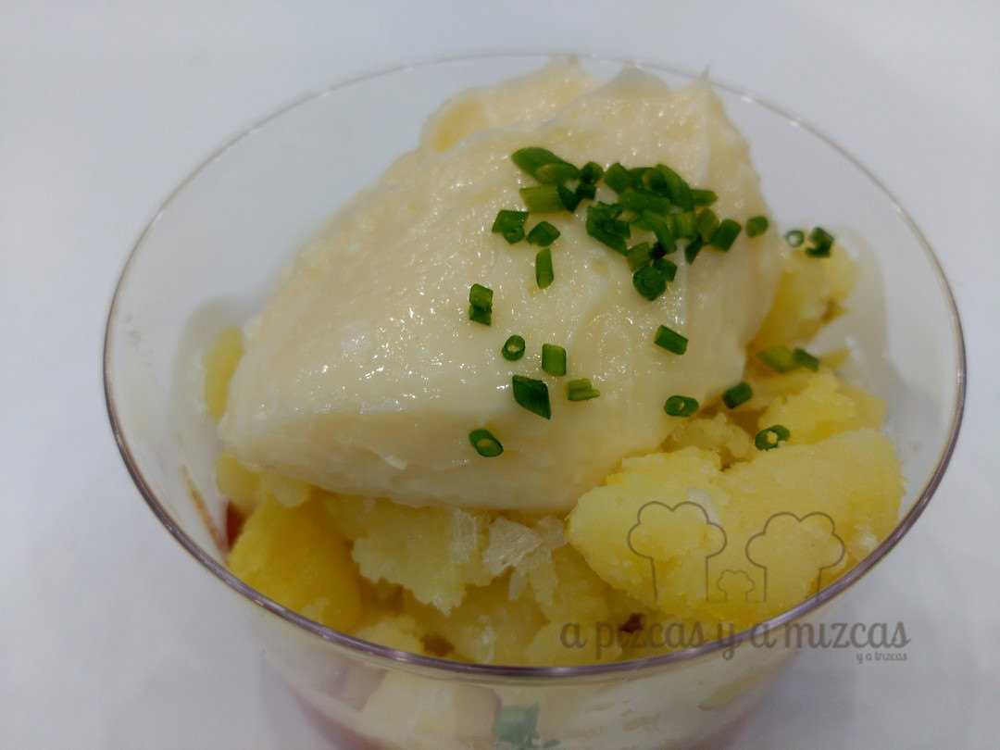
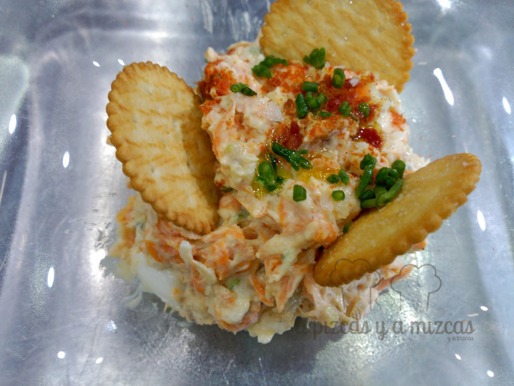
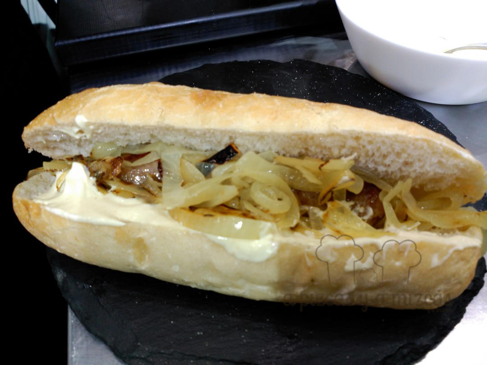

Uuuff! Hemos sobrevivido a un fin de semana apasionante y es que en Valencia se celebró la feria Gastrónoma (14 al 15 de noviembre), con más de 130 firmas presentes y un riquísimo programa de ponencias y talleres prácticos. Precisamente, queremos contaros cómo fue el taller de Bocadillos y Tapas de Autor que impartió el chef Juan Casamayor y además nos hicieron trabajar…

Desde que vimos en el programa que Juan Casamayor iba a explicar sus técnicas en un showcooking en Gastrónoma, tuvimos claro que teníamos que estar allí. Fue el domingo 15 de noviembre en el espacio Cooking Lovers (en colaboración con Valencia Club Cocina y Laura Ramírez –[The Spanish Food](http://www.thespanishfood.es/)\- ).

Antes de que comenzara el curso dimos una vuelta por el pabellón y vimos miles de cosas ricas que probaremos y que os contaremos. Luego, puntuales, acudimos Pizcas y Mizcas, dispuestos a aprender de Juan. Con lo que no contábamos es que a Pizcas lo seleccionaran para hacer de improvisado pinche (junto con otros tres asistentes) de Juan Casamayor y de su mano derecha Néstor Oreiro.

## Showcooking con Juan Casamayor ‘Bocadillos y Tapas de Autor’

En el showcooking preparamos una tapa de “Patatas a mi bola” (mermelada de tomate picante, patata cocida sin agua, ajoaceite y cebollino); una rica ensaladilla (como la que hace la iaia, pero con toques de sabor diferentes, como los que aporta el tomate seco molido o las algas); el premiado mejor bocadillo en 2014, el “Tierra Magra” (morcilla, habitas baby condimentadas, queso brie, pluma ibérica y rúcula con un buen pan de agua) y su versión de hotdog, que bautizó como “Gosset Calentet”, en el que la salchicha es reemplazada por una longaniza artesana, con una salsa de mayonesa, caldo de carne reducido, mostaza dulce y mostaza de Dijon, con cebolla pochada, mermelada de tomate picante y queso gratinado a soplete).

Como veis, Juan Casamayor hace comida sin tonterías, pero llena de sabor y para comer con las manos, como nos gusta. Aprendimos muchísimo y aplicaremos esos conocimientos.

Patatas a mi bola de Juan Casamayor

Ensaladilla

"Gosset calentet"

No le perdáis la pista. Ahora mismo anda embarcado junto con una buena troupe (entre ella Maje Martínez) en la empresa de asesoramiento gastronómico [Cooking Bussines](http://cookingbusiness.es) y en otro proyecto “hermano” bautizado como [Black Pork](http://www.blackpork.es/), para poner al bocata y a la tapa donde corresponde. Van a triunfar (ya lo están haciendo) seguro.

Photo: Alberto Sáiz

No podemos cerrar este post, sin hacer algo de balance de Gastrónoma 2015. Valencia tenía ganas de gastronomía y la feria ha superado todas las perspectivas tras haber recibido a cerca de 15.000 visitantes en tres días.

Casi 50 chefs de máximo prestigio, 16 Estrellas Michelín y 26 soles Repsol han deleitado a los visitantes en la gran apuesta de la feria, su “Cocina Central”, con showcookings permanentes en los que han exhibido su creatividad chefs como Jordi Cruz, Kiko Moya, Manuel Alonso, Quique Barella, Alessandro Castro, Alejandro Platero, Bernd Knöller, María José San Román , Alberto Ferruz, Xesc Reina, Miguel Barrera o Vicente Patiño entre tantos otros. Todo ello, gracias a la colaboración de la firma [Gastronostrum](http://www.gastronostrum.com/) (olé por Mar Milá y Lluís Soler).

Ya descontamos los días para la próxima edición.
