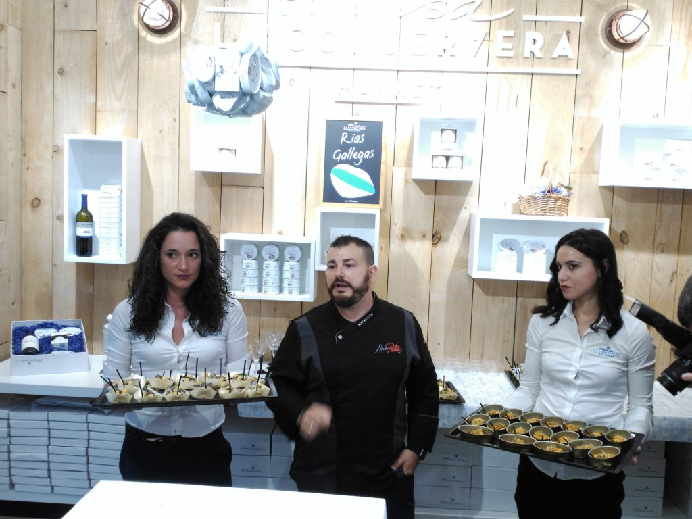
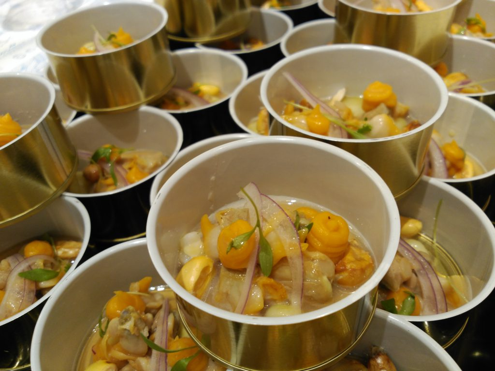

El pasado 21 de septiembre descubrimos un rinconcito en el centro de Valencia que vale la pena que conozcáis. Se trata de [La Conservera Market](http://www.laconservera.es), la tienda que [Frinsa](http://www.frinsa.es), empresa gallega responsable de algunas de las mejores conservas de España, ha abierto desde hace unos meses en la calle Roger de Lauria, número 10. Un pedacito de las Rías Baixas gallegas, que fue el escenario en el que el chef Alejandro Platero (Macel·lum, Come y Calla, segundo puesto como cocinero revelación en Madrid Fusión 2015, finalista de Top Chef...) realizó un showcooking con tres ricas recetas elaboradas con conservas de Frinsa.

## Shoowcooking en La Conservera Market

En la degustación se vio reflejada la esencia de la marca y lo mejor de las Rías Gallegas, gracias a las los platos elaborados mostrando la versatilidad de las conservas Frinsa.

Los platos que preparó Platero fueron:

- _Ceviche de Berberecho_
- _Mejillón a la diabla_
- _Ensaladilla rusa con Sardinilla_

   

Os contamos un poco más de la tienda, que vale la pena. Si entras, te llevas algo seguro. La Conservera Market es un nuevo concepto de “mercado” con las mejores esencias del mar. En ella se encuentran la gama completa de productos: Frinsa, Ribeira y Proteína Natural. Además de Valencia, La Conservera está ubicada en otros lugares de España como  Ribeira (A Coruña),  Murcia, Alicante, Bilbao o Madrid.

   

Además, Frinsa ubicará en la Calle Ribera (esquina con la Plaza del Ayuntamiento de Valencia) durante los días 30 de septiembre y 1 de octubre una _Foodtruck_ en la que se podrán degustar de manera gratuita sus productos. En el marco de una campaña denominada “_La Conservera_ _Experience”_, furgonetas decoradas con aire “retro” y con los tonos corporativos de la marca permitirán disfrutar de la experiencia de descubrir y compartir los productos Frinsa. Berberechos, sardinillas, ventresca de bonito o mejillones en Escabeche, entre otros, así como deliciosas tapas elaboradas con estos productos, servirán para acercar al público el mejor sabor y calidad de las Rías Gallegas.

**MEETING POINT FOODTRUCK VALENCIA**

Fecha: 30 de Septiembre y 1 de Octubre

Lugar: Calle Ribera, (esquina con la Plaza del Ayuntamiento de Valencia)

Hora: De 12.00 a 15.00 y de 18.00 a 21.00 horas

En próximas fechas, la _foodtruck_ viajará a Alicante (14 y 15 de octubre) y a Bilbao (21 y 22 de octubre).
