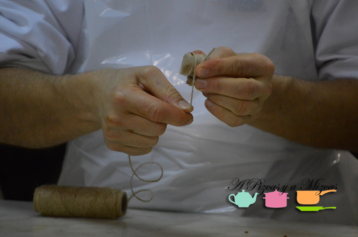

El pasado 30 de enero fuimos invitados a una clase práctica, un showcooking de monas de pascua de chocolate en el Gremio de Maestros Confiteros de Valencia, a cargo del maestro confitero y formador Miguel A. Señoris. Tuvimos el privilegio de ver cómo, literalmente, Señoris hacía magia con el chocolate, manipulándolo a su antojo y transformándolo en unas monas de chocolate espectaculares, divertidas, llenas de color y de imaginación a partes iguales.

## Así vivimos el showcooking de monas de pascua

Antes de hablar del showcooking de monas de pascua, es obligatorio hacer una referencia al [Gremio de Maestros Confiteros de Valencia](http://www.gremioconfiterosvalencia.org/ "Gremio de Maestros Confiteros de Valencia") (Gremi de Mestres Sucrers de València), que se encuentra en la calle Hugo de Moncada, 4, de Valencia. No es baladí hablar primero del Gremio, pues se trata del Gremio de Maestros Confiteros decano en Europa, con una antigüedad que data del 1283, si bien en aquel entonces se conocía como el Gremio de Cereros y Confiteros. Además, Valencia ha tenido una vinculación muy estrecha con el azúcar y su transformación, de hecho, hasta uno de sus barrios más auténticos debe su nombre a este arte: El Cabañal/Canayamelar, que deriba de canyamel (como era conocida la caña de azúcar).

Recintemente ha cambiado su imagen corporativa, más acorde con los tiempos actuales. Su labor formativa es ingente y está reconocida a nivel internacional.

Ahora sí, podemos empezar a contar el showcooking de monas de pascua. Lo primero que enseñó Señoris fue la elaboración de unos particulares trons de bac (petardos que explotan al lanzarlos contra el suelo, típicos de las despertaes falleras) a base chocolate e higo. Un trampantojo que seguro que es un éxito en las próximas fallas.

La magia siguió con la explicación de técnicas como el pintado de moldes de huevos de pascua para conseguir unos resultados espectaculares, como podéis ver en las fotos. Colores brillantes y apariencia casi de mentira. La clave, las proporciones entre manteca de cacao y coloranres  y luego controlar firmemente la temperatura, tanto de la sala de trabajo, como de la mezcla de pintado.

Miguel A. Señoris también nos enseñó el pintado sobre piezas y el pintado sobre piezas de chocolate en frío, para conseguir una textura similar al terciopelo (la podéis ver en los trenecitos de chocolate).

A continuación, siguió con las claves para transformar el chocolate en monas de pascua de chocolate. Así, con elementos muy sencillos, hizo unas latas de chocolate con espagueti de chocolate, un arbolito con bolitas crujientes, una planta carnívora, un arrecife ccon carbón, frutas y cangrejo, el tren con mono conductor o unas preciosas brochetas con bombones sobre palillos chinos.

Seguro que en breve las vemos en los escaparates de las confiterías y pastelerías de toda la provincia. Además de belleza, estas auténticas obras de arte están de vicio.

Mil gracias al Gremio por dejarnos participar!
