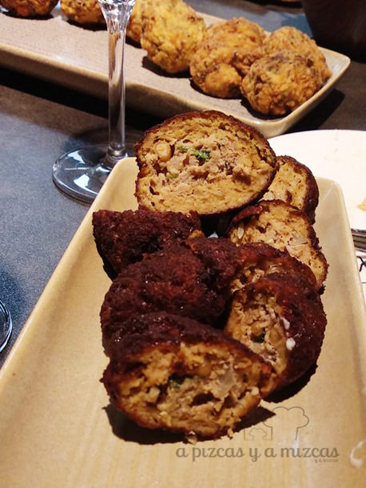

El 24 de noviembre en el showcooking [Ma Khin Cafe](https://www.makhincafe.com/es/) tuvimos la ocasión de disfrutar de la mejor gastronomía y cava de Requena en el restaurante que dirije Steve Anderson en el [Mercado de Colón](http://mercadocolon.es/) de Valencia, gracias a la organización de la sexta Feria del Cava Valenciano de la [Asociación de Elaboradores de Cava de Requena](http://www.cavavalenciano.com/empresa/). Un showcooking que fue conducido por Silviu Martín, jefe de cocina, y que nos permitió conocer cómo elaborar platos como  la dolma de pimiento con yogur picante, kibbeh de cordero, puerros con tahini y melaza de granada, croquetas de feta, calabacín y menta y el hummus. Todo ello mientras la enóloga Raquel Armero (Dominio de la Vega) explicaba las peculiaridades del cava de Requena, su elaboración y nociones básicas de cata.

## Showcooking Ma Khin Cafe

Como habéis visto, las recetas ofrecidas difieren un poco de los referentes conocidos de Ma Khin Cafe, que suelen ser asiáticas y de fusión, para apostar por platos de origen mediterráneo oriental y de oriente próximo. El motivo es que Steve Anderson va a abrir dentro de poco un nuevo local en la Gran Vía centrado en esta gastronomía.

El Showcooking Ma Khin Cafe estaba incluido en la programación de la Feria del Cava Valenciano y nos permitió conocer los cavas de [Chozas Carrascal](http://www.chozascarrascal.com/), [Bodegas Murviedro](https://murviedro.es/), [Torre Oria](https://www.torreoria.es/), [Vegalfaro](http://vegalfaro.com/) y [Bodegas Hispano Suizas](http://bodegashispanosuizas.com/). Pudimos apreciar los diferentes matices entre elaboraciones y cómo el cava de Requena tiene una gran versatilidad gastronómica para acompañar las recetas que preparamos en el showcooking Ma Khin Cafe.

Lo mejor de todo es que tras las detalladas explicaciones de Silviu y de Raquel, pudimos probar todas las elaboraciones y debatir con los compañeros de clase los platos, técnicas y alternativas en su elaboración.

Estuvimos muy atentos y en primera fila para poner en práctica muy pronto los platos que aprendimos. Os lo contaremos enseguida en el blog.

