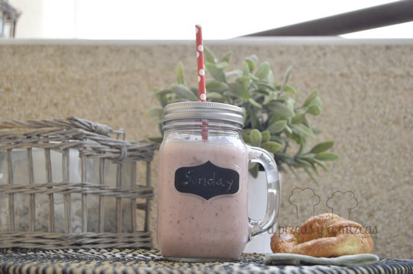
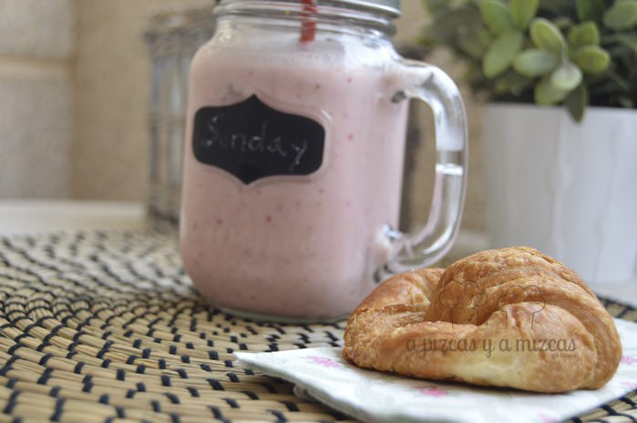

Ya sabemos que estamos un poquito pesados con las fresas, pero es que nos encantan y además en esta ocasión estábamos deseando estrenar las "mason jars" que le regalaron a Mizcas nuestros espías favoritos: Mr. Brown y Mrs. Green para su cumpleaños. Así que preparamos para desayunar un smoothie de fresa y plátano.

Es un batido de fruta y el nombre proviene del inglés _smooth_ que significa suave. Es una bebida cremosa preparada con trozos y zumos de fruta mezclados con productos lácteos, hielo o helado. Su consistencia en densa parecida a un batido espeso.

Para este verano cuando el calor apriete el smoothie  va  a ser la mejor opción para refrescarnos además muy nutritivo y súper sano. Además podemos dar salida a la fruta más madura que se va quedando en el fondo del frutero. Que más podemos pedir!

## Ingredientes para preparar un smoothie de fresa y plátano (para dos vasos)

- un plátano
- 10 -12 fresas
- un vaso y medio de leche
- un yogur griego de fresa
- azúcar
- hielo picado

El smoothie de fresa y plátano se prepara muy rápido, en menos de 10 minutos tienes el desayuno listo. Limpiamos las fresas y las troceamos. También troceamos el plátano y lo trituramos en la batidora. Agregamos el yogur griego, la leche nosotros utilizamos leche desnatada y también añadimos azúcar al gusto de cada uno. Batimos para que se mezclen todos los ingredientes.

Por último añadimos hielo picado y volvemos a batir todo para que se quede todo integrado.

Servimos en nuestras nuevas mason jar bien fresquito y ya tenemos preparado nuestro desayuno, merienda o postre lleno de vitaminas. Una merienda que encanta a los peques y comen fruta sin que renieguen. ji ji ji

Ya está preparado el desayuno: smoothie de fresa y plátano

Nosotros preparamos nuestro smoothie con fresas y plátanos pero las posibilidades son infinitas... vamos a dejar volar nuestras imaginación. Animaros con los smoothies.

Smoothie de fresa y plátano
