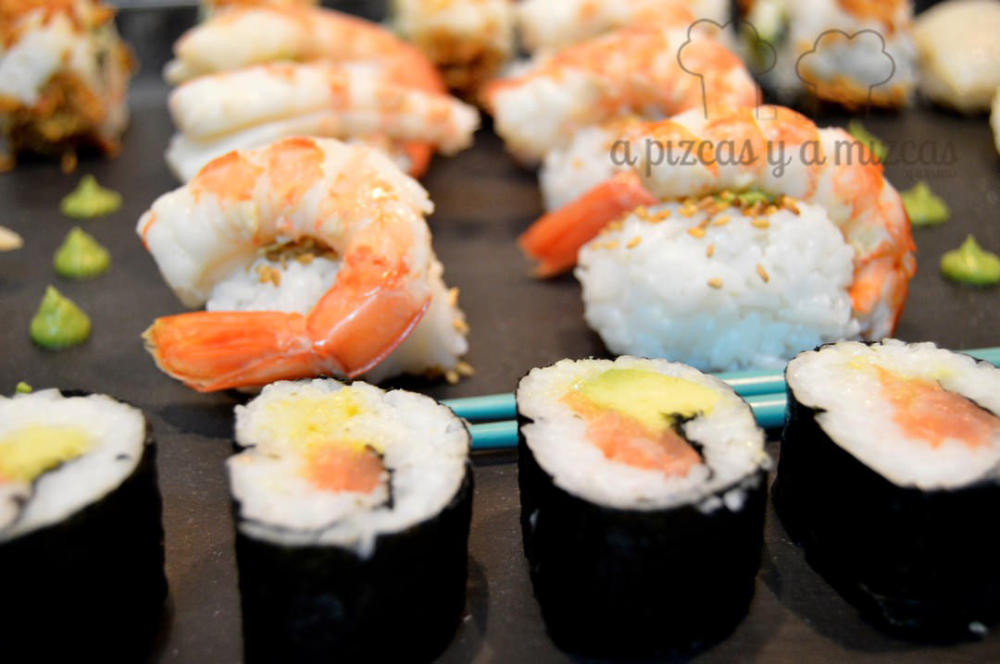
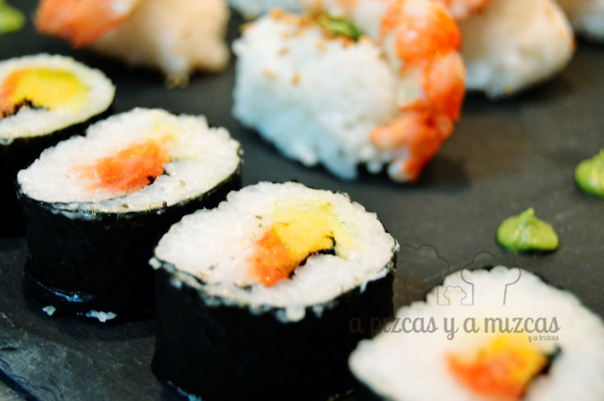
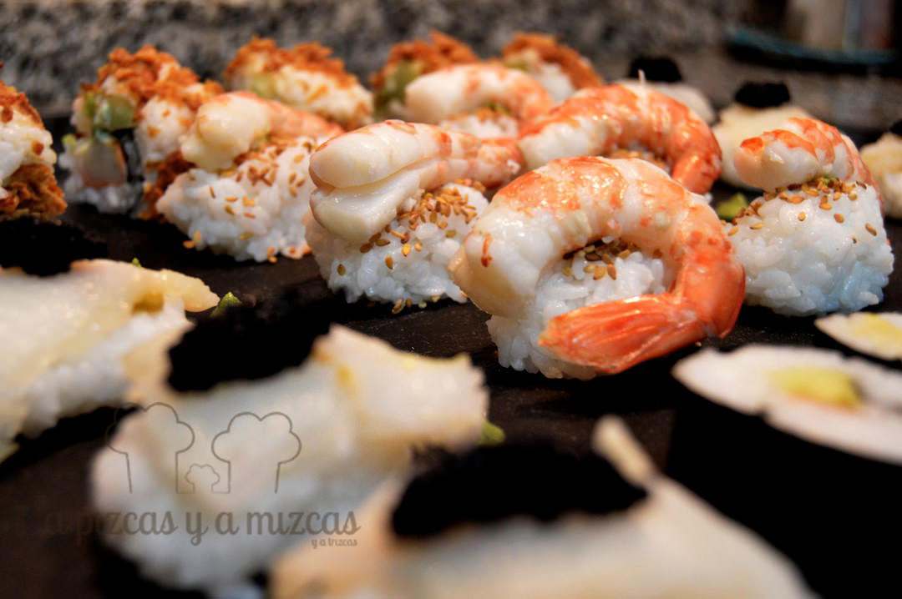
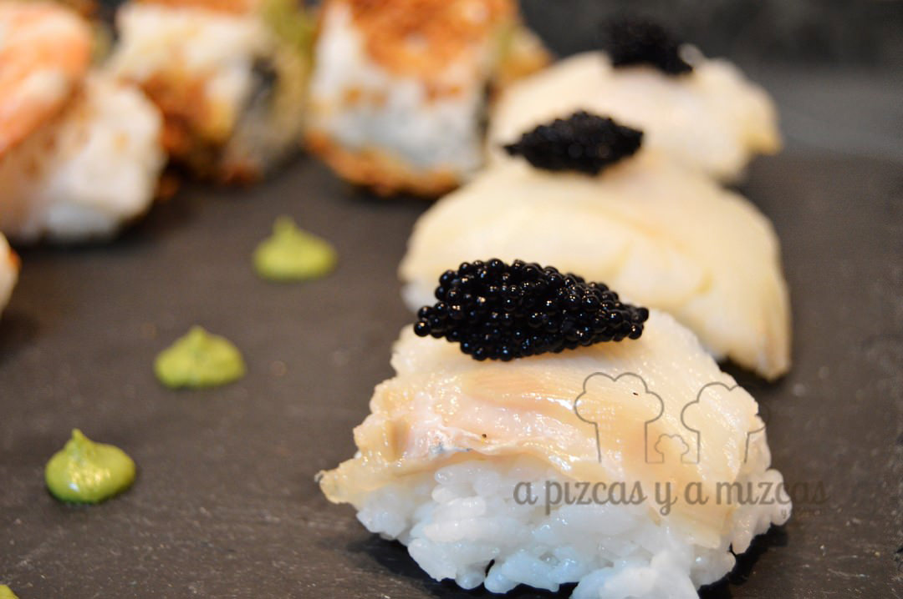
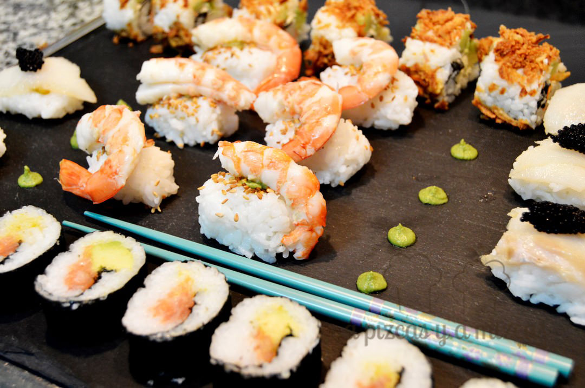

Buenos días. Uno de los platos que siempre nos ha dado mucho respeto preparar es el sushi. Nos parece admirable la técnica de los sushiman y el respeto por el producto que demuestran en sus elaboraciones. Además, aún no nos atrevemos a manejar el pescado crudo. Para quitarnos el deseo, organizamos una cena en casa de sushi sin pescado crudo, un falso sushi, que fue todo un éxito. Os contamos las claves de nuestro sushi sin pescado crudo.

Los elementos básicos para preparar esta cena a base de sushi son, el arroz para sushi (lo podéis encontrar ya en la mayoría de grandes superficies), vinagre de arroz, alga nori, agua y los elementos de relleno, que tradicionalmente son pescado crudo, pero que nosotros cambiamos por pescados ahumados, gambones cocidos y huevas de pescado.

## Ingredientes para el sushi sin pescado crudo (24-28 piezas)

- 250 gramos de arroz para sushi (lo compramos en Lidl)
- Vinagre de arroz (Lidl)
- Dos hojas de alga nori (Lidl)
- Salmón ahumado
- Bacalao ahumado
- Huevas
- Seis gambones
- Surimi
- Aguacate
- Pepino
- Mayonesa
- Mostaza
- Cebolla crujiente
- Wasabi
- Sésamo

Con todo ello preparamos:

1. Makis (la clásica pieza de sushi con el alga nori por fuera y el relleno en el centro del arroz), que hicimos de aguacate y salmón.
2. Unamakis (es un maki 'invertido', con el arroz por fuera, dentro el alga nori y el relleno), que preparamos con surimi, pepino, aguacate, y que coronamos con cebolla crujiente.
3. Naguiris, bocaditos de arroz con el pescado encima. En este caso preparamos nuestro sushi sin pescado crudo con bacalao ahumado y huevas, y con gambón cocido y sésamo.

El primer paso es hervir el arroz, según las indicaciones del fabricante. La clave está en la "limpieza" previa del arroz, para que elimine el almidón, y quede perfecto y ligero en boca. Antes de hervirlo, hay que colarlo con abundante agua, hasta que el agua salga transparente. Unos seis lavados suele ser suficiente. Para cocerlo, con el doble de agua que de arroz.

Para elaborar el sushi el arroz debe estar frío, pero debe enfriarse a temperatura ambiente, en todo caso con ayuda de un abanico o similar, nunca en la nevera. Para ello, lo ideal es colar bien el arroz, para eliminar el agua completamente, y colocarlo extendido en una bandeja amplia. Preparamos una mezcla de vinagre de arroz (unos 80 gramos), con azúcar (80 gramos) y unos 20 gramos de sal. Lo importante son las proporciones, de cantidad os sobrará, pero la gastaremos luego para las manos para poder manipular bien el arroz. Con ayuda de una cuchara repartimos la mezcla de vinagre sobre el arroz y dejamos que se enfríe por completo sobre la bandeja.

Una vez enfríado, colocamos la mezcla de vinagre en un bol amplio y la rebajamos ligeramente con agua. Cuando manipulemos el arroz deberemos ir remojando las manos en esta agua para evitar que se pegue.

Vamos al lío.

Una cena diferente

Para preparar los makis de aguacate y salmón:

- Colocamos la hoja de alga nori en una esterilla de bambú (makisu). Un truco consiste en cubrir previamente la esterilla con papel film. Luego extendemos una capa fina de arroz sobre el alga, dejando unos dos centímetros libres de arroz en el extremo superior. Acordaros de ir mojandóos las manos con el agua avinagrada conforme vayáis cogiendo el arroz. Es importante que la capa de arroz no sea muy gruesa y que sea uniforme. A continuación colocamos en tiras finas el salmón, tiras de aguacate y un poco de mostaza. Con ayuda de la esterilla vamos enrollando y apretando poco a poco y de manera uniforme, hasta el final. Nos quedará un rulo. Si no lo vamos a comer de inmediato, lo podemos dejar envuelto en papel film en la nevera. Para cortarlo, quitamos el film, y con un cuchillo bien afilado y mojado en el agua con vinagre, retiramos los extremos del rulo (así el resto quedará equilibrado e igualado) y cortamos los makis de forma uniforme. Os deberían salir unas seis piezas por rulo.

Para preparar los unamakis de surimi:

- En la esterilla colocamos el arroz, lo cubrimos con el alga nori y sobre ella la mezcla. En este caso palitos de surimi, pepino cortado en tiras y sin piel, aguacate y mayonesa. Formamos el rulo y cortamos (si es necesario) el sobrante de alga. Antes de cortarlo, colocamos un poco de cebolla crujiente por encima del rulo y presionamos ligeramente. Procedemos a cortarlo como los makis.

Para preparar los niguiris de gambón cocido:

- Cocemos los gambones en agua salada y con una hoja de laurel. Solo dos minutos de cocción a fuego muy vivo y enfríamos rápidamente los gambones en agua con hielo. Los pelamos dejando la cola con piel y retiramos el intestino. Con la mano formamos puñaditos de arroz (del tamaño de una albóndiga pequeña) y presionamos bien, para que quede compacto. Añadimos semillas de sésamo encima del naguiri. Ponemos un punto de pasta de wasabi en el centro y sobre él colocamos el gambón.

niguiris de gambón

Para preprar los niguiris de bacalao ahumado con huevas.

- Con la mano formamos puñaditos de arroz (del tamaño de una albóndiga pequeña) y presionamos bien, para que quede compacto. Ponemos un punto de pasta de wasabi en el centro y sobre él un filetito de bacalao ahumado. Coronamos con una cucharadita de huevas.

Niguiris

A la hora de comerlos, hay que ofrecer cuencos con salsa de soja y bandejitas o platitos con la pasta de wasabi. Un cuenco y un platito por comensal, para que cada uno pueda mezclar la soja con el wasabi (pica) al gusto. Luego se toma cada pieza de sushi y se moja un poco en la salsa y se come de un bocado.

A disfrutar de la cena

A nosotros nos encantó.
