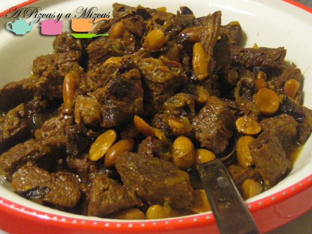
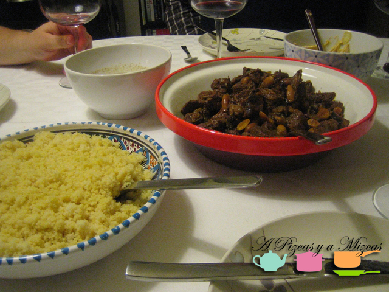

Hace ya mucho tiempo que Mizcas me está "apretando" para que suba esta receta de nuestro tajine de ternera. Es una de nuestras preferidas y es perfecta para compartir entre amigos, que es lo que más nos gusta en A Pizcas y a Mizcas. El tajine es de origen norteafricano y toma su nombre del recipiente en el que se cocina. Nosotros los solemos preparar con pollo o con ternera, como el que aquí os presentamos.

## Ingredientes para un tajine de ternera (cuatro raciones)

- Un kilo o un poco más de carne de ternera para guisar
- Tres o cuatro cucharaditas de aceite de oliva virgen extra
- Un puñadito de ciruelas pasas
- Dos cebollas dulces
- Un ajo picado
- Una ramita grande de canela en rama o una pequeña
- Un puñado generoso de almendras
- Una pizca de colorante alimentario
- Sal y pimienta

El tajine realmente se debe cocinar en el recipiente que le da nombre, pero hoy en día la mayoría de las cocinas domésticas son de vitrocerámica o inducción y es bastante difícil (y caro) encontrar un tajine que funcione en estos fuegos. No os preocupéis que los podemos preparar de una forma bastante similar con una olla y luego servirlo en un tajine.

Vamos con el tajine de ternera que es lo que interesa. En una olla ampllia colocamos el aceite de oliva virgen extra y sofreímos la carne cortada en daditos medianos (más pequeños que para un guisado de ternera) a fuego bastante vivo para que la ternera (salpimentada) quede sellada rápidamente y conserve los jugos en su interior durante la cocción posterior.

Cuando la tengamos sellada la retiramos, bajamos el fuego y pochamos la cebolla cortada en juliana y el ajo picado. Una vez que la cebolla empiece a caramelizarse y a ponerse transparente (un poquito de sal es imprescindible para pochar correctamente la cebolla), incorporamos de nuevo la carne y las ciruelas cortadas en cuartos, las almendras enteras y la canela. Lo cocinamos todo junto a fuego medio para que se integren todos los sabores. Durante unos 5 o 7 minutos.

Transcurrido ese tiempo, cubrimos todo con agua a temperatura ambiente, echamos el colorante alimentario y dejamos cocinar a fuego lento/medio durante una hora y media (si empleáis una olla a presión podéis reducir este tiempo a unos 40/45 minutos). Rectificamos de sal si es necesario.

Nosotros lo presentamos en un tajine de cerámica y no olvidéis que el acompañante perfecto para el tajine de ternera es un buen cous cous.
