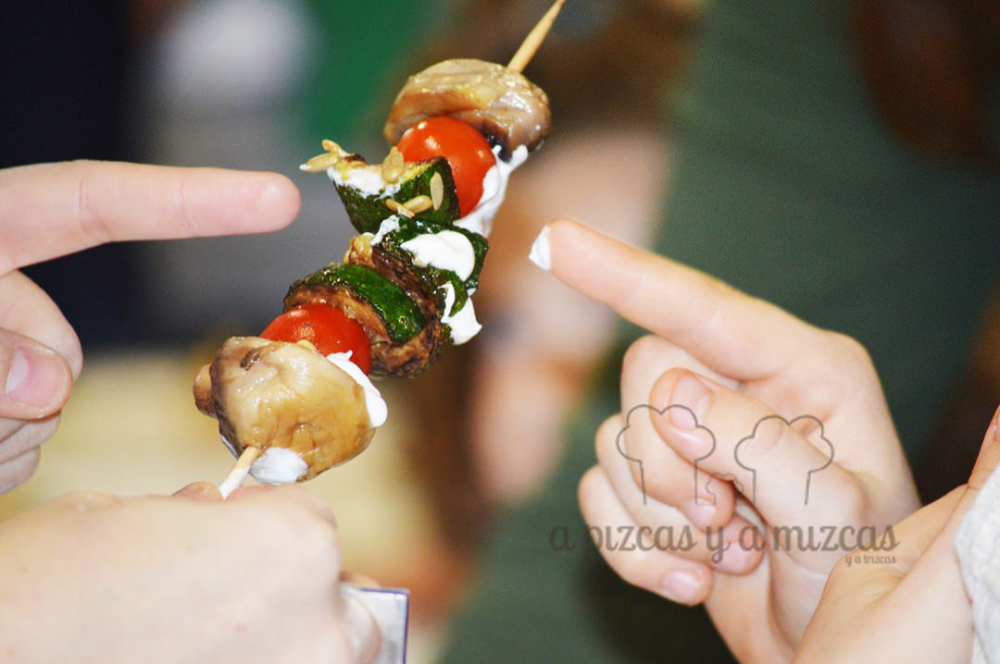
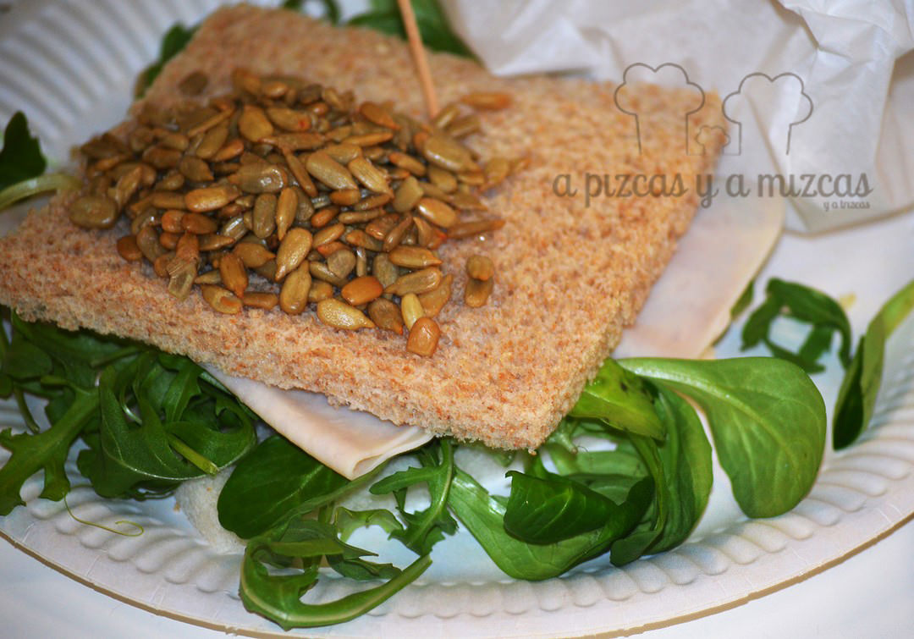
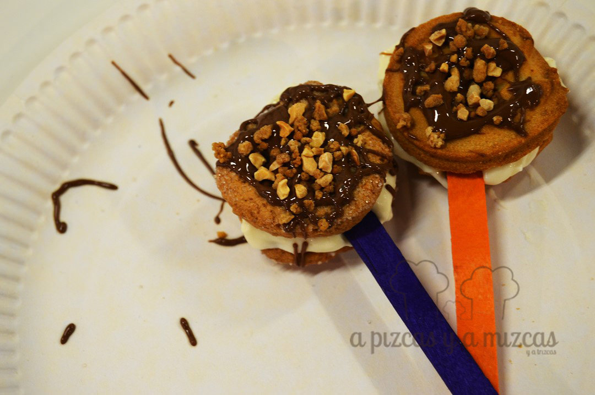
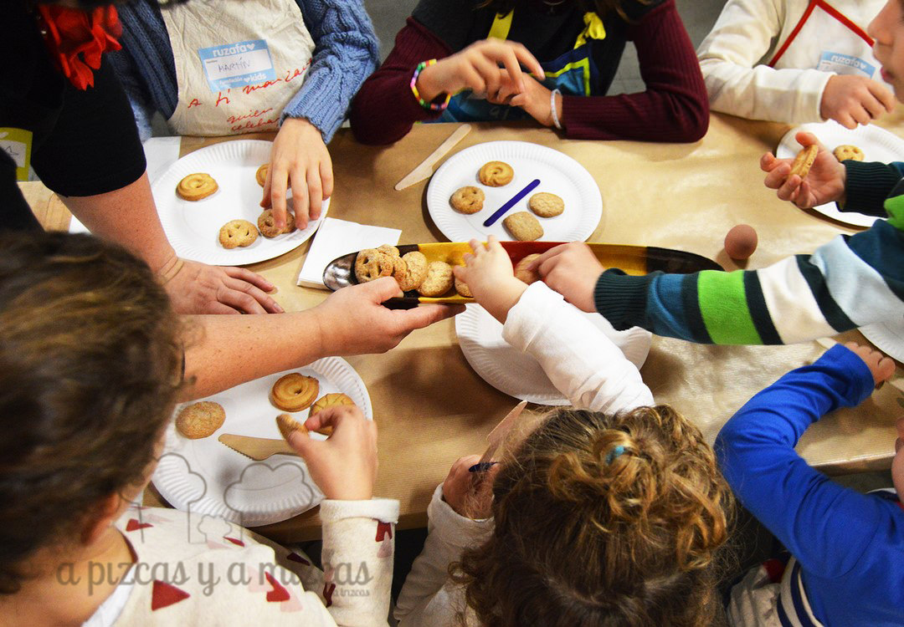

¿Os habéis detenido a mirar cómo disfrutan los peques cocinando? Es una maravilla. Nosotros siempre que podemos dejamos que Trizcas se ponga el minidelantal y nos eche una manita en nuestras recetas. Así que cuando vimos que en la programación de [Ruzafa Love Kids](http://ruzafaloveskids.com/) había un taller de cocina para peques el [6 de diciembre](http://ruzafaloveskids.com/Domingo-6-por-la-manana) en [Espacio 40-Vinosdechile.es](http://vinosdechile.es/) no lo dudamos ni un segundo. Además, aprovechamos y mientras Trizcas guarreteaba y nos preparaba bocados exquisitos, pudimos probar los deliciosos vinos que nos ofrecieron Rosa y José Antonio. ¿Quieres saber con qué nos deleitó Trizcas?

## El menú del taller de cocina para peques

La responsable del taller fue la chef [Claudia Callejón](https://www.facebook.com/casadeclau/) que se manejó a unos 10 niños de tres a 10 años con bastante soltura. Los papis nos despreocupamos, pues así los peques estuvieron más atentos a las explicaciones para preparar una brocheta de verdura asada con salsa (verduras asadas en un pincho de bambú, servidas con salsa de yogurt y especias), sandwich de pavo con vegetales crujientes (pan relleno de pavo especiado con rúccula, tomate cherri, pepino y cebolla) (Trizcas nos lo preparó con una extra doble de pipas peladas de girasol por encima), bocados salados (masitas rellenas de queso y jamón con salsa) y de postre unas originales varitas mágicas (dos galletas caseras rellenas de frosting de vainilla decoradas con chocolate).

Brocheta de verduras

El sandwich que nos preparó trizcas, con extra de pipas!

Varitas mágicas de postre

Cómo veis, una fantástica aproximación a la cocina y a los ingredientes de lo más variado. Fue una experiencia que dejó ver la creatividad de cada uno de los niños y que a más de un papi sorprendió.

Después de que acabaran de cocinar, todos comimos sus creaciones y pasamos un rato muy agradable, pues el ambiente que crean [José Antonio y Rosa en Espacio 40-Vinosdechile.es](https://www.facebook.com/espacio40-vinosdechilees-620321867982835/?fref=ts) es súper familiar. Da gusto.

