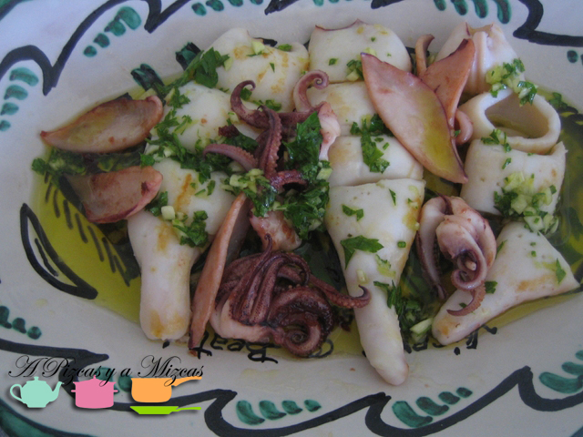

Los calamares son uno de los ingredientes más versátiles. Se pueden preparar de muchas maneras: encebollados, a la romana, rellenos, como parte de un arroz o de una fideuà... pero una de las formas mas ricas, y más ahora en verano, es calamares a la plancha, con ajilimójili a base de aceite de oliva virgen extra de la variedad Serrana de Espadán, ajo, perejil y esencia de limón. Ademas, se preparan rápidamente. No podemos pedir más.

## Ingredientes para la tapa de calamares a la plancha

- Cuatro calamares frescos (también podemos emplear calamar congelado)
- Un diente de ajo
- Un puñado de perejil picado
- Aceite de oliva virgen extra
- Sal

Lo más engorroso de esta receta de calamares a la plancha es limpiar los calamares, pero es sencillo. Os explicamos cómo lo hacemos nosotros. Bajo el grifo, los lavamos. Luego, de un tirón separamos los tentáculos y la boca del cuerpo y lo reservamos. Cortamos las aletas y las reservamos también. Con ayuda de las uñas, quitamos toda la piel exterior. Enjuagamos bien. Luego, le damos la vuelta al cuerpo del calamar como si fuera un calcetín. Retiramos toda la posible suciedad y así con todos. Luego, limpiamos bien de piel las aletas y con unas tijeras dejamos los tentáculos listos (quitándole los ojos y la boca).

Calentamos bien una plancha de cocina y cuando veamos que está lista, añadimos un rayito de aceite de oliva virgen y a continuación los calamares, las aletas y los tentáculos. Los cocinamos vuelta y vuelta hasta que veamos que estén cocinados, pero tiernos.

Los pasamos a una fuente y regamos los calamares a la plancha cortados en pedazos con el ajilimójili que habremos preparado de la siguiente forma: en un bol echamos dos cucharadas soperas de aceite de oliva virgen extra. Nosotros utilizamos en esta ocasión un monovarietal de Serrana de Espadán, autóctona de la Comunitat Valenciana. Una pizca de sal, un diente de ajo bien picado, una cucharadita de las de café de perejil picado. Lo emulsionamos bien y lo aromatizamos estrujando la piel de medio limón. Solo nos interesa la esencia, nada de zumo, de esta forma obtenemos el aroma, pero sin la acidez que daría el zumo.

No se nos ocurre un aperitivo mejor.
