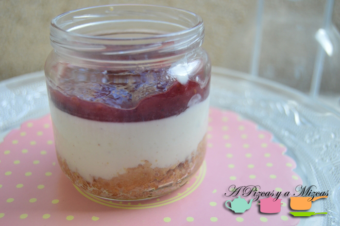

La tarta de queso (cheesecake es uno de los postres más socorridos y recurrentes, pues tiene muchas variantes. Además, con el cheesecake puedes jugar mucho con el acompañamiento. Mizcas llevaba ya unos días "presionando" para que cocináramos una rica tarta de queso, así que aprovechamos la visita de unos buenos amigos para elaborarla. Apostamos por presentarla en tarritos, para controlar las raciones y optamos por una receta de "toda la vida", en la que no hace falta ni horno, ni huevo, por tanto: coser y cantar. Un cheesecake clásico que salió riquísimo.

## Ingredientes para 8 tarritos de cheesecake

- Una tarrina de 250 gramos de queso fresco tipo philadelphia
- 250 ml de nata para cocinar
- 3 hojas de gelatina
- 6 cucharadas de azúcar
- 1 sobre de azúcar vainillado
- 1 paquete de galletas maría
- Mantequilla
- Canela molida
- Una ramita de canela
- Mermeladas para acompañar

Lo más útil es empezar por la base de nuestra tarta de queso (cheesecake). Nosotros hicimos la versión más tradicional, con galleta maría molida y mantequilla, pero podéis optar por mezclar en la masa cereales, o frutos secos molidos. Las opciones son muy variadas. Hay que moler bien la galleta, atemperar la mantequilla (empezad con dos nueces y luego id viendo si os hace falta más), y amasar bien. Nosotros añadimos una pizca de canela molida.

Una vez lista la base, con unas cucharas, la colocamos en el fondo de los tarritos (podéis utilizar los envases de yogourt de cristal, o vasitos pequeños...) o en una fuente grande (si decidís hacer un cheesecake grande).

Luego, ponemos en un cazo la nata y el queso a fuego medio, removiendo hasta que el queso se funda y se integre. Luego añadimos el azúcar y la canela en rama, dejamos que cueza un poco más sin que llegue a hervir. Mientras, hidratamos la gelatina en un plato con agua templada y la añadimos a la nata con el queso, hasta que esté disuelta.

Con un cucharón vamos rellenando los tarritos y los dejamos en la nevera durante un par de horas.

Pasado este tiempo, ya podemos presentar los tarritos de cheesecake. Para ello una opción es que cada comensal pueda elegir entre una selección de mermeladas. A nosotros nos gusta, particularmente, con mermelada de fresa, de frambuesa, de mora....

