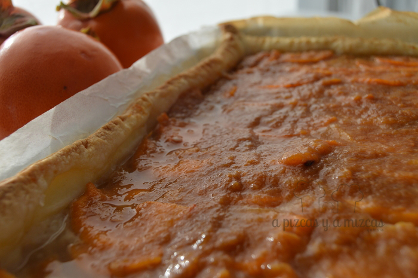
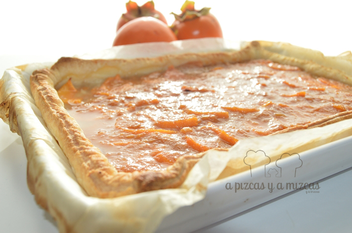

Desde finales de octubre y hasta finales de diciembre más o menos estamos en plena temporada del caqui persimon. En casa nunca faltan, porque el iaio Mizcas nos tiene bien provistos. Así que hay que buscarles salidas, bien sea para comer en fresco (recordad que hay que tratarlos si los cogéis directamente del árbol, si los compráis en tienda no hay problema), en forma de mermelada, o para utilizarlos como ingrediente en una deliciosa tarta de caqui.

Para esta receta de tarta de caqui seguimos el esquema de nuestra tarta de manzana, pero sustituimos la manzana por caqui persimon y la cobertura de mermelada de albaricoque o la cobertura de gelatina por nuestra mermelada de caqui casera clarificada.

## Ingredientes para la tarta de caqui persimon (6/8 raciones)

- Una lámina de hojaldre o de pasta brisa, como prefiráis
- Crema pastelera
- Mermelada de caqui
- Dos caquis persimon

El primer paso para la tarta de caqui es precalentar el horno a 200 grados mientras preparamos los ingredientes. Así en cuanto la tengamos "montada" la podemos meter al horno.

Cogemos un molde de horno y colocamos la lamina de hojaldre (es aconsejable sacarla del frigo unos minutos antes para que se pueda desenrollar con facilidad y sin romperse) con un papel de horno entre el hojaldre y molde (para que no se pegue). Pinchamos el hojaldre que será la base de nuestra tarta de caqui para evitar que el hojaldre suba.

Preparamos la crema pastelera como ya os hemos contado antes en el blog (también podéis utilizar el preparado de pudding de vainilla que venden, por ejemplo en Lidl) y dejamos que se temple un poco (recomendamos remover de vez en cuando, para evitar que se reseque la parte superior). Mientras pelamos dos caquis y los cortamos en láminas bien finas, que utilizaremos para decorar.

Mientras, en un cacito ponemos dos o tres cucharadas de mermelada de caqui casera y a fuego suave la calentamos. Luego clarificamos con una cucharada sopera de agua. Así quedará una especie de almíbar espeso.

Vamos a montar la tarta de caqui. Repartimos crema pastelera sobre el hojaldre y la nivelamos para que quede bien repartida. Si os sobra crema, podéis preparar una versión de crema catalana que tiene mucho éxito en casa.

Luego vamos colocando de forma más o menos armoniosa las láminas de caqui.

La metemos al horno precalentado durante unos 20 minutos (dependerá de cómo vaya vuestro horno). Cuando el hojaldre esté tostado, la sacamos y la colocamos en una rejilla. Aún caliente, decoramos con un poco del almibar de mermelada de caqui y cuando haya templado la metemos en el frigorífico.

Ahora a tener mesura con las raciones!!

