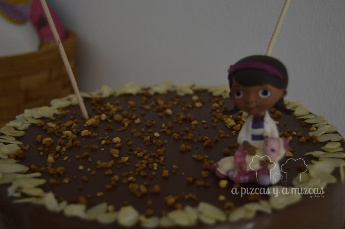
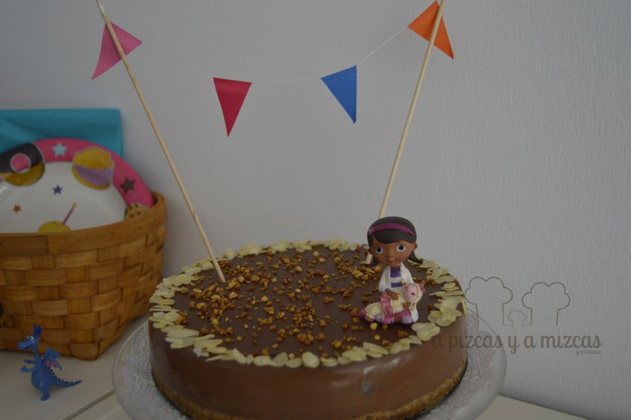

El mes de mayor es el mes de las celebraciones en casa de A Pizcas y a Mizcas y decidimos preparar para el cumpleaños de Trizcas una tarta de chocolate fácil que la pudiéramos preparar el día de antes y gustara a grandes y pequeños.  Y parece que encontramos el equilibrio perfecto porque la tarta triunfó.

## Ingredientes para preparar la tarta de chocolate fácil

- 200 gramos de galletas (nosotros mezclamos galletas maría y de chocolate)
- 60 gramos de mantequilla
- 250 gramos de chocolate a la piedra C.R.E.O de Tortosa con sabor canela
- dos sobres de cuajada Royal
- 1 litro de leche entera
- 60 gramos de azúcar

Para decorar la tarta:

- almendra laminada
- crocanti de almendra

Trituramos las galletas. Nosotros mezclamos galletas maría y galletas de chocolate. Fundimos la mantequilla en el microondas. En un bol ponemos las galletas trituradas y añadimos la mantequilla y mezclamos todo.

Ponemos la mezcla en un molde desmontable y vamos aplanando para que se quede igual por todas las partes del molde. Para que se endurezca la base de galletas podeís metes unos minutos en el congelador o en el horno. Nosotros en esta ocasión lo metimos en el horno para que la galleta se tostara un poquito.

En un cazo ponemos a leche, el chocolate troceado y el azúcar. Removemos con una cuchara de palo hasta que se funda el chocolate. Cuando el chocolate esté completamente fundido añadimos los dos sobres de cuajada y esperamos hasta que hierva. Volcamos en el molde (un truqui: para evitar que la galleta se deshaga romper la cascada de chocolate con la ayuda de una cuchara de madera). Dejamos que se enfríe un poco y después lo meteremos en la nevera al menos seis horas para que cuaje.

Antes de servir la tarta la decoramos con láminas de almendra en el borde de la tarta y espolvoreamos almendra crocanti por toda la tarta. Por último colocamos una guirnalda de mini banderines y una muñeca pequeña de Dra. Juguetes. Y así todos contentos...Trizcas tuvo su tarta de Dra Juguetes y la familia disfrutó de una tarta de chocolate buenísima.

Tarta de chocolate de cumpleaños

Tarta de chocolate para el cumple de Trizcas #trizcascumpletres
