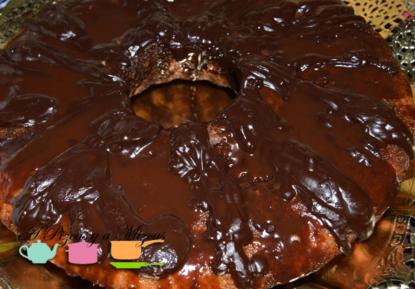
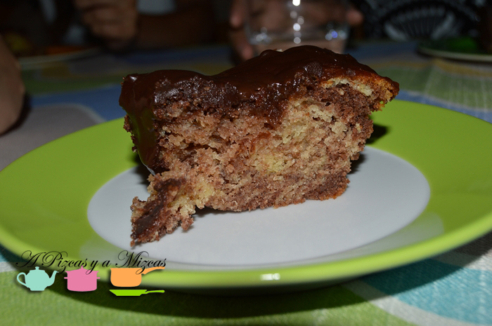

En casa de A Pizcas y a Mizcas el mes de mayo es el de las celebraciones. Cumpleaños de Mizcas el de Trizcas, aniversario... pero en el mes de julio seguimos con más fiestas... y le toca el turno a Pizcas. Así que él también se merecía su tarta de chocolate para su gran día.

Esta vez preparamos la tarta de chocolate con la ayuda de la yaya Mizcas y nos quedó así de bien.

## Ingredientes para preparar la tarta de chocolate

- 4 huevos
- 225 gramos de mantequilla
- 225 gramos de azúcar
- 225 gramos de harina
- 1 sobre de levadura en polvo
- 2 cucharadas soperas de cacao en polvo
- 2 cl de agua caliente

Para la decoración:

- 150 gramos de chocolate negro
- 50 gramos de chocolate con leche
- 100 gramos de mantequilla
- 4 cucharadas soperas de agua

Primero precalentamos el horno a 180 º. Nosotros hicimos esta tarta en un molde en forma de corona, pero serviría cualquier otro molde. Engresamos con mantequilla el molde.

Mezclamos en un bol los huevos, la mantequilla a punto pomada, el azúcar, la harina y la levadura. Batimos bien hasta obtener una masa homogénea.

En un bol mezclamos el cacao y el agua caliente y lo añadimos a la masa. Removemos bien y echamos la masa al molde.

Metemos al horno a 180 º durante 25 y 30 minutos.

Para decorar. Troceamos el chocolate negro en un bol con dos cucharadas de agua y la mantequilla en pomada. Introducimos en el microondas para que se derrita el chocolate. Removemos hasta que se derrita el chocolate.

Retiramos la tarta de chocolate del horno, dejamos que se enfríe un poco y desmoldamos sobre una fuente redonda.

Bañamos con cuidado con el preparado de chocolate y dejamos enfríar una hora.

Ahora hacemos la misma operación con el chocolate con leche. Derretimos el chocolate con leche en un bol con dos cucharadas de agua y la mantequilla en pomada e introducimos en el microondas hasta que se derrita el chocolate.

A continuación, bañamos con el chocolate con leche y dejaremos enfríar unas dos horas a temperatura ambiente.

Ya tenemos la tarta de chocolate preparada para sorprender a papá Pizcas. Tenemos que decir que le sorprendió y le encantó!

