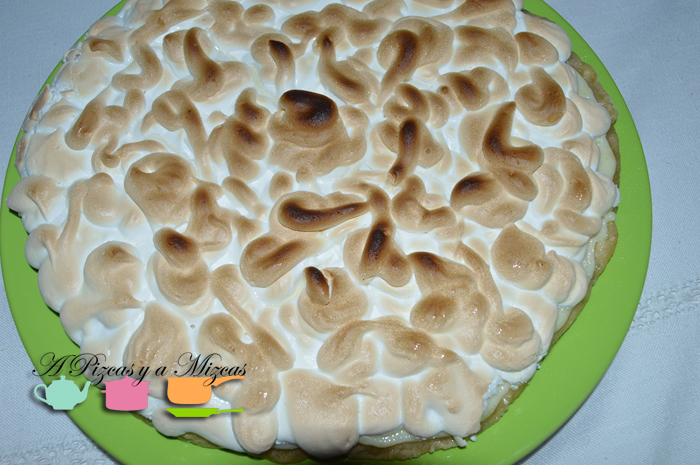
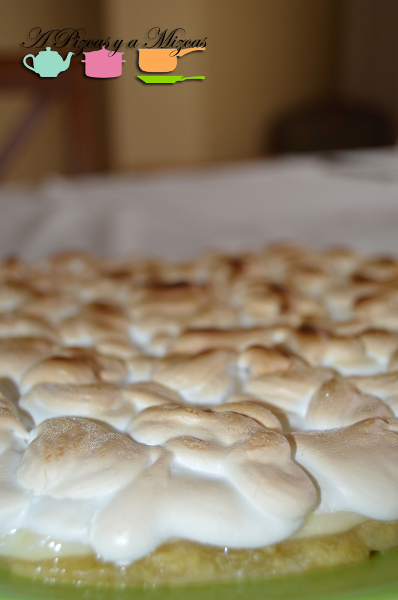
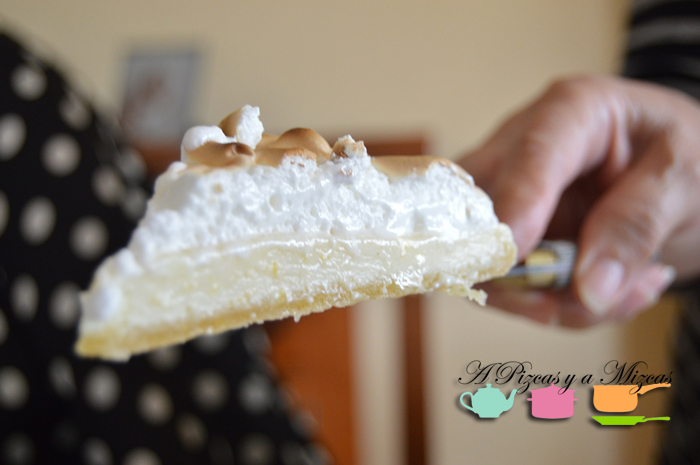
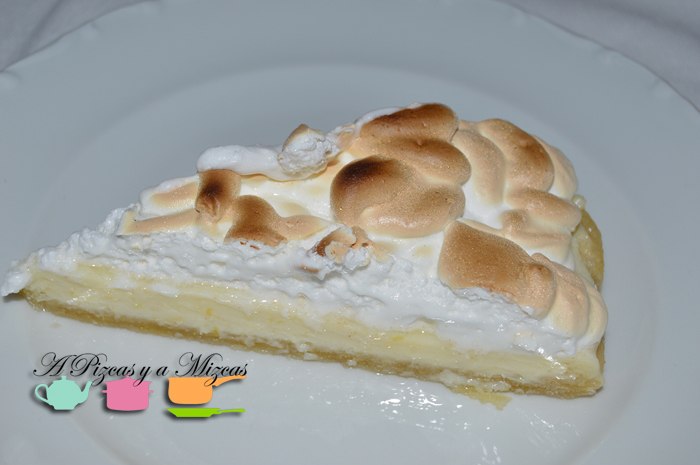

El mes de mayo es el mes de las celebraciones en casa de A Pizcas y a Mizcas...y en toda celebración no puede faltar un buen dulce. Y el colofón de los cumpleaños es LA TARTA!! Esta vez nos decantamos por la tarta de limón y merengue.

La elaboración de la tarta sirvió para pasar un buen rato en la cocina Mizcas y la yaya Mizcas... las dos con las manos en la masa, aunque cuando ya casi casi estábamos terminando se unió Trizcas... ja ja ja

## Ingredientes para preparar la tarta de limón y merengue:

Para la preparación de la masa base

- 200 gramos de harina (aproximadamente)
- 80 gramos de mantequilla en pomada
- 50 ml de agua muy fría
- una pizca de sal

Para el relleno:

- 250 ml de leche condensada
- ralladura y zumo de dos limones

Para el merengue:

- 4 claras de huevo
- 250 gramos de azúcar
- una pizca de sal

Preparados?... Allá vamos!

Tamizamos la harina y mezclamos con la mantequilla. Para conseguir la matequilla en pomada: introduciremos en el microondas unos segundos y batimos con un tenedor hasta obtener una especie de pomada. Añadimos una pizca de sal y el agua muy fría. Amasamos y añadiremos harina hasta que no se nos pegue en las manos y podamos formar una bola. Precalentamos el horno a 180 º C. Estiramos la masa con un rodillo sobre una superficie enharinada. Colocamos en un molde redondo desmontable. Pinchamos varias veces con un tenedor y metemos 15 minutos en la nevera y transcurrido este tiempo al horno a 180 º durante 12 minutos.

A continuación preparamos el relleno. Batimos la leche condensada con el zumo y la ralladura de los limones. Repartimos en el fondo de la masa ya horneada pero una vez fría. Metemos en la nevera unos 30 minutos para que cuaje.

Y por último preparamos el merengue. Montamos las claras a punto de nieve (con la ayuda de las barillas de batidora) con una pizca de sal y el azúcar y extendemos sobre la tarta con la ayuda de una manga pastelera. Horneamos a 180 ºC hasta que se dore la superficie.

Retiramos del molde....y a disfrutar de la tarta de limón y merengue

