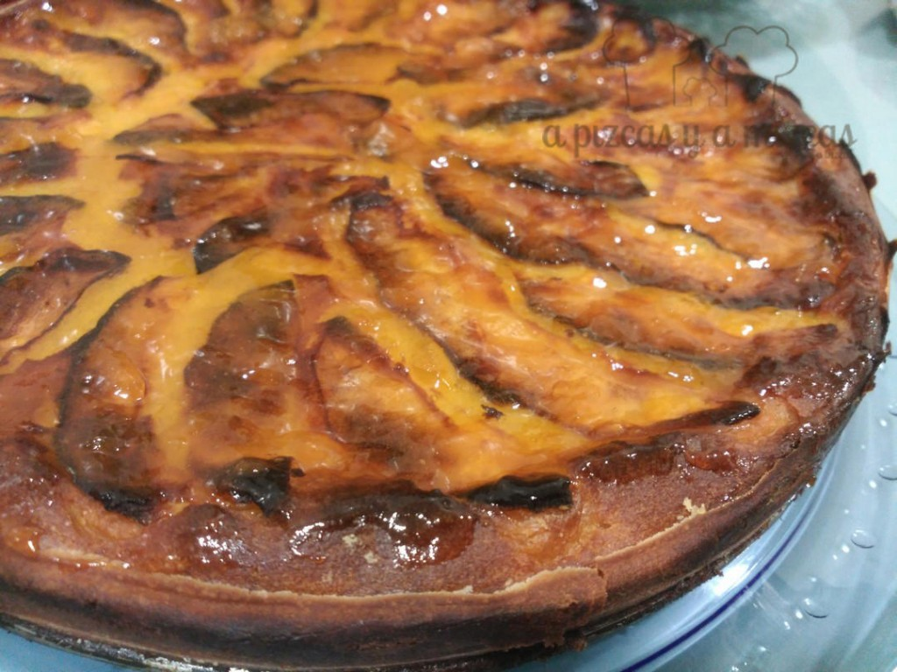

Los que nos seguís de hace tiempo y nos conoceís sabreís que nos encanta preparar postres y dulces con manzana. Por cierto, muchas gracias por acompañarnos en cada post... De todas los postres con manzana uno de nuestro preferidos en la tarta de manzana de la abuela... que de vez en cuando nos prepara la iaia Mizcas... quédate y descubre la recetaSi cómo nosotros sois muy fans de los postres con manzana os dejamos estos enlaces de recetas que hemos preparado nosotros para que podáis cocinar la que más os guste

[Tarta de manzana rápida](/tarta-de-manzana/)

[Flores de manzana](/flores-de-manzana-y-hojaldre/)

[Tartaletas de manzana (apple pies)](/tartaletas-de-manzana-apple-pies/)

[Delicias de manzana](/delicias-de-manzana-en-compota-y-crema-pastelera-con-tierra-de-galleta/)

[Bizcocho jugoso de manzana](/bizcocho-jugoso-de-manzana/)

Ahora vamos con la receta de la tarta de manzana de la abuela.

## Ingredientes para preparar la tarta de manzana de la abuela

- 6 manzanas grandes
- 200 gr de mantequilla
- 100 gr de harina
- 160 gr de azúcar
- 135 ml de leche desnatada
- 3 huevos medianos
- un sobre de levadura tipo Royal
- mermelada de albaricoque o de melocotón

Pelamos cuatro manzanas, las cortaremos en trocitos y cocemos. Cuando comprobemo que estén blanditas, las sacamos, las escurrimos y dejaremos enfriar.

Cuando las manzanas cocidas pierdan algo de calor, añadimos la mantequilla a temperatura ambiente, la harina (previamente tamizada), la levadura, la leche, el azúcar y los huevos. Trituramos con la ayuda de la batidora.

Utilizamos un molde apto para horno desmoldable redondo. Lo engrasamos con mantequilla, y añadiremos la mezcla que hemos triturado.

Con las dos manzanas que habíamos reservado, las cortamos en gajos y cubrimos toda la tarta en redondo.

Introducimos en el horno a 180ºC unos 45 o 50 minutos. O hasta que la manzana esté un poco doradita y pinchemos con un cuchillo y salga limpio.

Cubrimos la tarta con la mermelada de albaricoque o melocotón. Si no podéis aguantar hasta que esté fría podéis comerla templadita.

 Tarta de manzana irresistible!!

No hay quien se resista!
