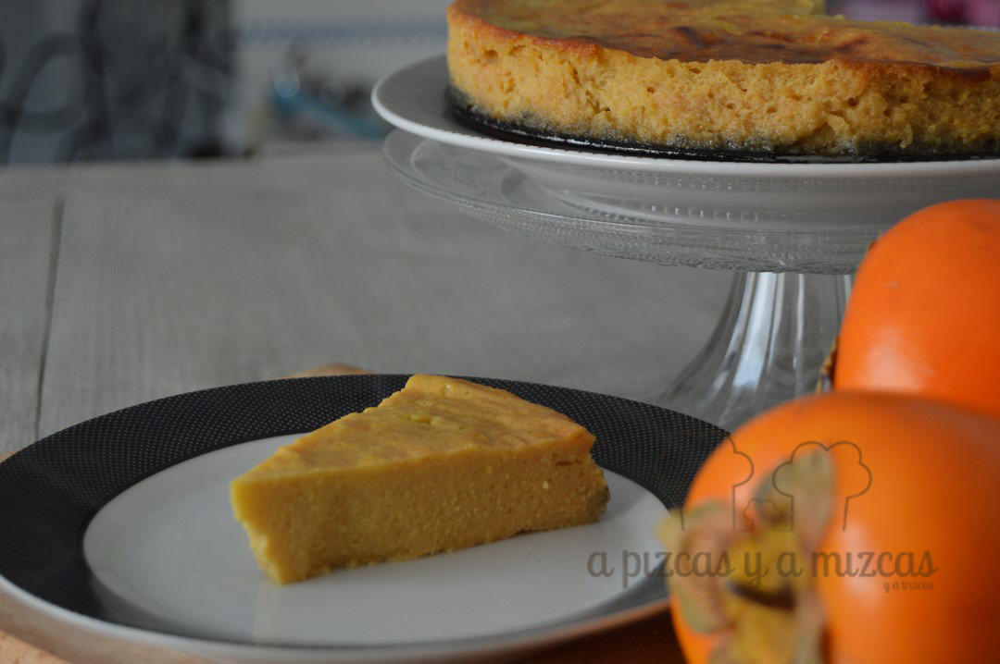
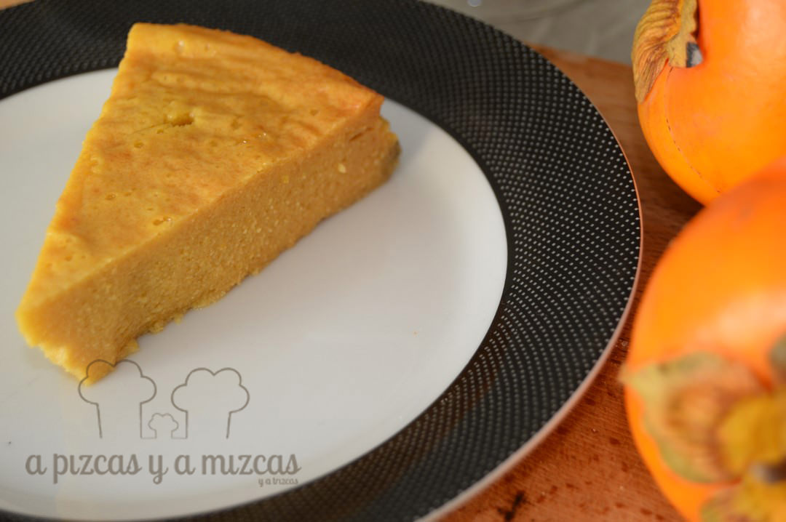
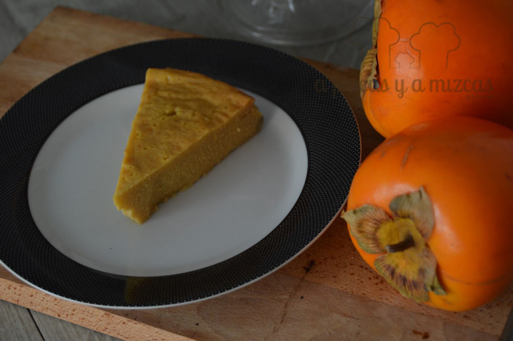
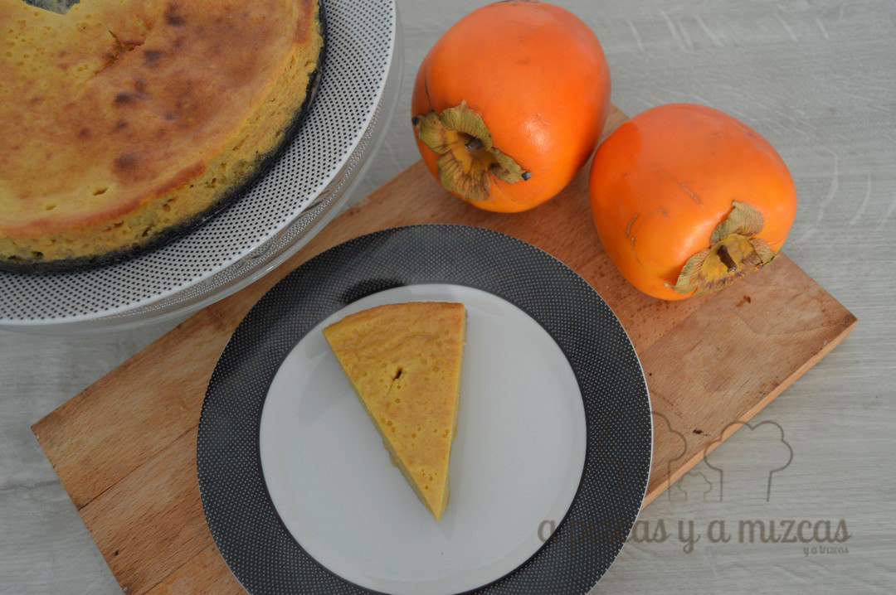

Los que nos seguís desde hace tiempo ya sabreís que el iaio Mizcas tiene un campito de caquis y desde finales de octubre y hasta finales de diciembre más o menos estamos en plena temporada del caqui persimon. Por eso en casa nunca faltan. Y esta vez vimos una tarta-flan de caqui persimon en [Bocadosdecielo](http://bocadosdecielo.blogspot.com.es/) y nos animamos a prepararla

Es una tarta muy fácil de preparar y nos encanta su sabor a fruta. El postre ideal para cualquier día de la semana.

Recordad que hay que tratarlos si los cogéis directamente del árbol, si los compráis en tienda no hay problema, [aquí](/una-manana-en-el-campo/) podéis ver cómo tratarlos.

## Ingredientes para preparar la tarta-flan de caqui persimon

- dos caquis persimon
- tres huevos
- dos yogures griegos naturales
- 150 gramos de azúcar
- dos sobres de preparado para hacer flan
- 160 gramos de azúcar (si el flan ya lleva azúcar pondremos sólo 50 gramos de azúcar)
- piel de un limón rallado
- 60 gramos de maizena
- una cucharadita de levadura tipo royal

Pelamos y troceamos los caquis y los trituramos. A continuación añadimos el resto de ingredientes y batimos todo. Va a quedar bastante líquido.

Engrasamos un molde (nosotros utilizamos uno redondo desmoldable) echamos la mezcla. Introducimos al horno a 175º C durante 40 minutos o hasta que pinchando con un cuchilo en el centro, éste salga seco.

A merendar!

Y así de rápido y fácil se prepara la tarta-flan de caqui persimon.

Tarta-flan caqui persimon
