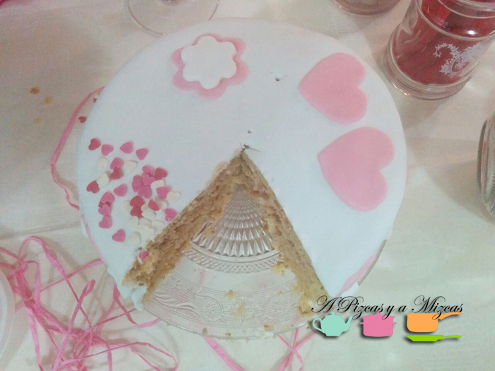
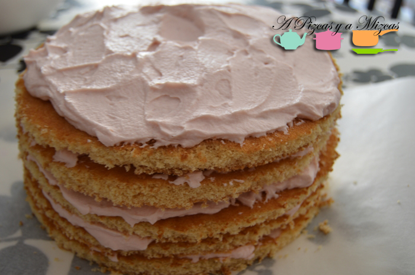
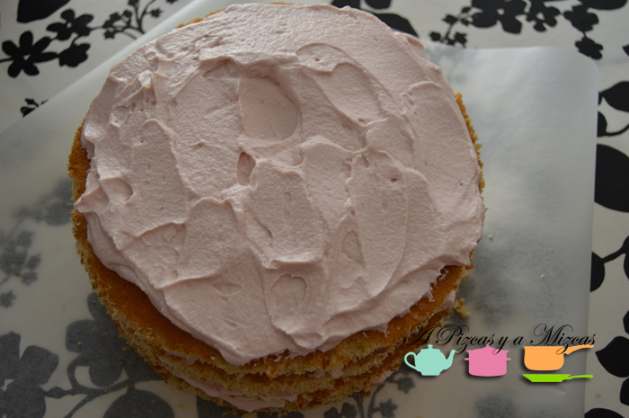
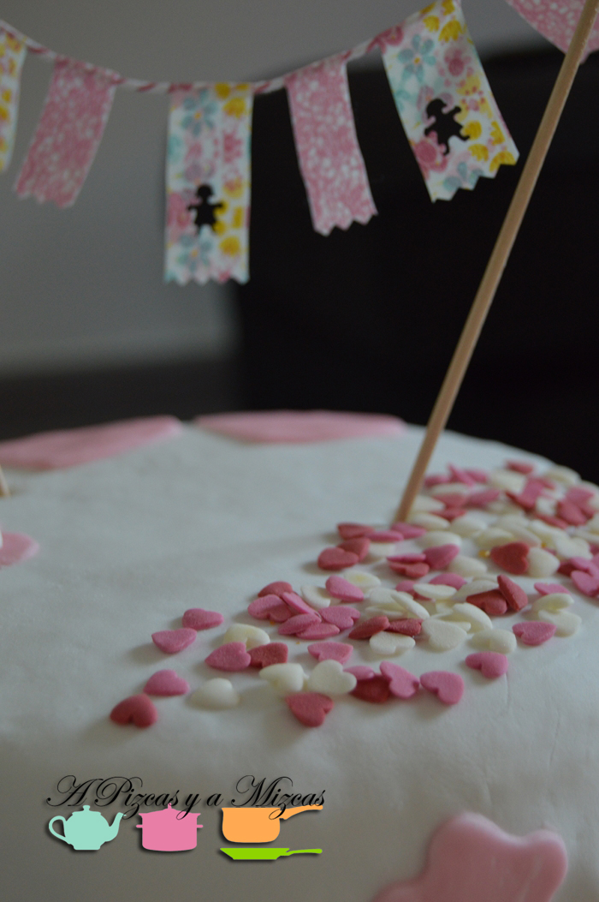
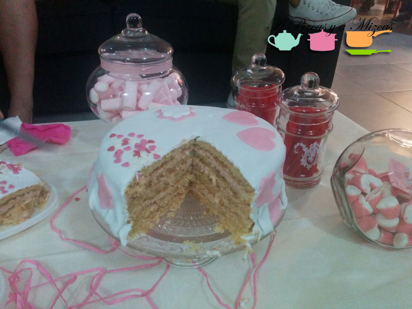

Como ya os indicamos hace poco, uno de los retos que hemos tenido últimamente fue el cumpleaños de Mrs. Green y una de las piezas esenciales de esta celebración era la tarta. Mrs. Green nos dio total libertad a la hora de elegir qué tarta preparar, así que nos pusimos rápidamente manos a la obra y optamos por una original tarta fondant de petit suisse de mascarpone. Así conseguimos que la tarta combinara perfectamente con la decoración de la fiesta (en tonos blancos y rosas), además de que resultara riquísima.

## Ingredientes para la tarta fondant de petit suisse de mascarpone (unas 20 raciones)

- Dos bizcochos redondos precortados.
- Dos tarrinas de 250 gramos de queso mascarpone.
- Azúcar.
- Azúcar vainillado
- Leche.
- Sirope de fresa.
- Dos tabletas de fondant blanco.
- Una tableta de fondat rosa.
- Azúcar glasé

Para preparar nuestra tarta fondant decidimos emplear unos bizcochos que venden ya preparados y precortados en tres alturas. Si no, podéis preprarar vosotros un bizcocho y luego, con ayuda de un cuchillo panero y bastante pulso, cortarlo en tres rebanadas.

Además, como queríamos que esta tarta tuviera más altura, para que quedara más elegante, utilizamos dos bizcochos. De esta forma tendríamos seis pisos de altura!! Para potenciar aún más la verticalidad de nuestra tarta fondant recortamos ligeramente los bizcochos. Para ello nos ayudamos de una tapadera de olla que tenía el diámetro perfecto que necesitábamos. Los recortes no los tiréis, nosotros los guardamos y los empleamos para elaborar otro día un rico [pudding](/pudding-la-segunda-vida-de-un-bizcocho/ "Pudding").

Con la base de la tarta fondant preparada, pasamos a elaborar el relleno. En este caso un rico relleno inspirado en el sabor del petit suisse. Así facilitaríamos a Mrs. Green y a sus invitados viajar a su \[ya lejana?\] infancia. Para conseguirlo utilizamos 500 gramos de mascarpone y sirope de fresa. En un bol amplio introducimos el queso y unos buenos chorreones de sirope de fresa hasta que logremos el color (rosa) deseado. Lo vamos mezclando todo con movimientos suaves y envolventes.

Para que la textura quede mejor y sea más fácil extender el relleno luego en la tarta fondant, vamos añadiendo poco a poco leche. No os paséis, insistimos en que la añadáis poco a poco. Cada vez que echéis un chorrito de leche, mezclarlo todo para ver que textura tiene. Debe quedar consistente pero que veáis que es manejable. Ahora, lo probamos de azúcar y rectificamos si es necesario. Nosotros aprovechamos un poco de azucar vainillado que teníamos. El sabor quedó totalmente de petit suisse pero más ligero. Muy rico para comer así.

Con ayuda de una lengua y una espátula de cocina vamos rellenando todos los pisos de nuestra tarta fondant con nuestro relleno, de forma generosa, pues nos interesa que al cortar las porciones se vean claramente sus colores y capas. La reservamos en la nevera.

El siguiente paso es extender el fondant para nuestra tarta. Si os queréis animar a preparar el fondant vosotros mismos, podeís consultar [aquí](/fondant-de-nubes-para-cobertura-de-pastel/ "fondant de nubes"). Empezamos por el fondant blanco, que deberá cubrir toda la tarta. En una superficie despejada espolvoreamos una generosa cantidad de azúcar glasé (no reparéis en cantidad, luego lo agradeceréis al ver que no se pega nada). Amasamos ligeramente con las manos las tabletas de fondant y hacemos una bola con las dos. Las colocamos en el centro de la mesa de trabajo y aplanamos ligeramente la pelota. Espolvoreamos azúcar glasé sobre el fondant. Con un buen rodillo vamos extendiendo la cobertura manteniendo la forma circular y hasta que tenga un diámetro suficiente como para cubrir nuestra tarta fondant y un grosor de unos 2 o 3 mm.

Si habéis sido generosos con el azúcar glasé y habéis tenido la precaución de ir añadiendo más en aquellas zonas donde no había, podréis levantar sin problemas el fondant con ayuda del mismo rodillo y trasladarlo hasta la tarta para cubrirla. Es importante que quede el menor número de arrugas en la tarta. Con un cuchillo bien afilado cortamos el sobrante y tratamos de meter las "faldas" por debajo de los bizcochos para que quede más aseado. La volvemos a meter en la nevera.

Ahora mismo tenemos la tarta fondant "vestida de blanco". Para decorarla vamos a utilizar fondant rosa y un corta pastas. Extendemos de nuevo el fondant tal y como hemos explicado antes. Con el corta pastas vamos cortando diversas formas que queramos. Si no teneís corta pastas podéis utilizar tapones de agua de diferentes tamaños, cortar tiras...

Con los dedos mojamos un poco una parte de cada forma y la "pegamos" sobre la tarta blanca. Así vamos decorando toda nuestra tarta fondant hasta que esté totalmente perfecta. A nosotros ésta nos  ha gustado especialmente.

Si os animáis a preparar alguna o tenéis alguna idea para que mejoremos las nuestras (rellenos, decoración...) estaremos encantados de leer vuestros comentarios.

