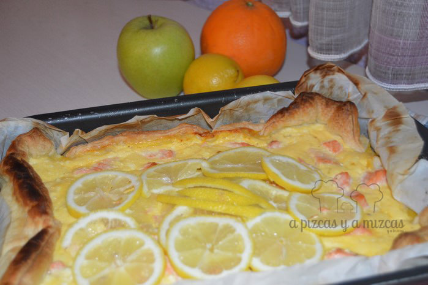
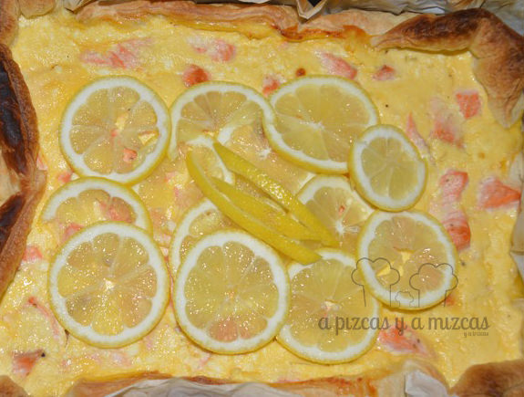

Hace unos días que preparamos una tarta salada de salmón y requesón y estamos deseando repetirla y guardar unos trocitos en un tupper y preparar un picnic rápido e irnos a la playa con Trizcas.... que con este calor donde se está mejor es a la orilla del mar.Esta tarta salada de salmón y requesón es muy parecido a un [mini quiches de jamón york y queso](/mini-quiches/) porque es muy rápido de preparar... Ya veréis es muy fácil de preparar y está buenísima.... palabrita de Mizcas :)

Esta receta la vimos en el blog de [L´Exquisit blog](http://blogexquisit.blogs.ar-revista.com/), que si aún no lo conocéis os lo recomendamos... a nosotros nos encantan todas sus recetas y las de bocadillos y sandwiches nos súper encantan.

**Ingredientes para preparar la tarta salada de salmón y requesón**

- una lámina de hojaldre
- 2 puerros, limpios, cortados finos
- 2 cucharadas soperas de  aceite de oliva virgen extra
- 3 huevos grandes
- 125 gramos de requesón
- 3 cucharadas soperas de requesón
- 1 cebolleta picada
- 300 gramos de salmón sin piel ni espinas, cortado a dados
- 1 limón, cortado a rodajas finas
- sal y pimienta

Ponemos la lámina de hojaldre estirada en un molde forrado con papel de horno. Pinchamos la la base con un tenedor. A continuación sofreímos los puerros en una sartén a fuego suave durante unos cinco minutos aproximadamente.

Mezclamos en un cuenco el requesón con los huevos batidos y el zumo de limón. Incorporamos la cebolleta y salpimentamos. Después agregamos el puerro al molde, incorporamos el salmón salpimentados y la mezcla de los huevos y el queso.

Introducimos en el horno a 200 º C durante unos 30 - 35 minutos. Retiramos del horno y dejamos enfriar en el molde.

Mejor servirlo a temperatura ambiente con las rodajas de limón por encima, el limón le aporta un toque muy fresco a la tarta salada de requesón y salmón.

La tarta salada dice có-me-me

Es mejor preparar la tarta salada el día anterior y guardarlo en la nevera y sacarlo media hora antes de consumir.

Preparados, listos ...ya!! A comer!
