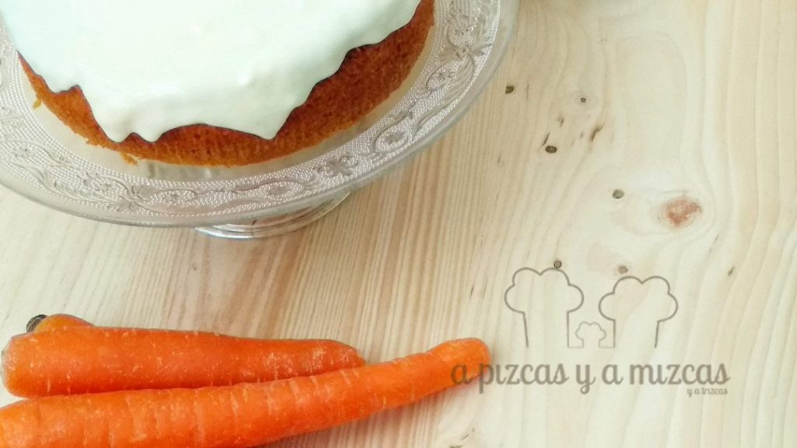
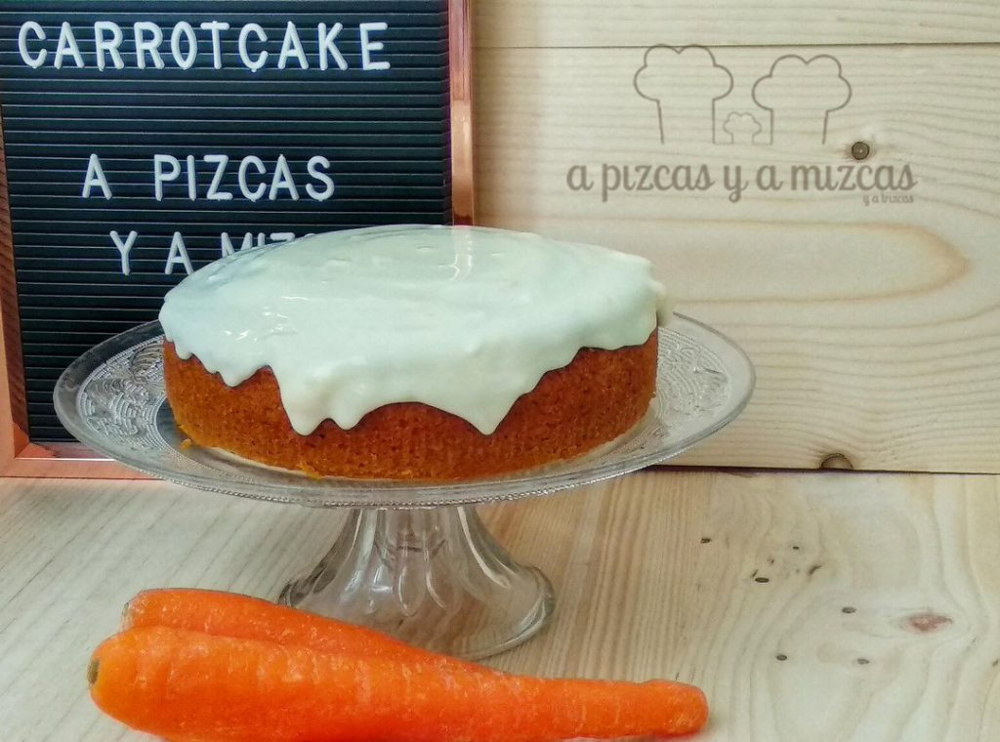
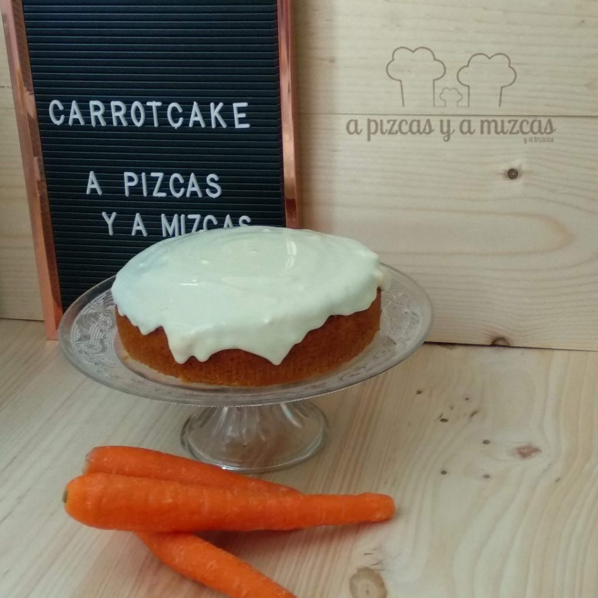

Volvemos al dulce con una tarta de zanahoria o carrot cake muy fácil de preparar. Nosotros la preparamos para acompañar el café y nos guardamos algún trocito para el desayuno del día siguiente... un, dos, tres... empezamos

## Ingredientes para preparar la tarta de zanahoria

- 175 gramos de zanahoria rallada
- 175 gramos de harina
- una cucharadita de levadura en polvo
- 3 huevos
- 150 gramos de azúcar moreno
- 75 ml de aceite de oliva virgen extra
- 1 cucharadita de canela
- media cucharadita de nuez moscada
- 100 gramos de nueces

Para la crema (buttercream)

- 175 gramos de queso mascarpone
- 175 gramos de mantequilla
- 225 gramos de azúcar

Preparamos un molde de aluminio redondo (nosotros compramos uno de Mercadona) y lo untamos de mantequilla.

A continuación, batimos los huevos y el azúcar y añadimos poco a poco el aceite de oliva. Después agregamos las zanahorias ralladas, la harina (tamizada con la ayuda de un colador), la levadura, la canela y la nuez moscada. Removemos para que se integren todos los ingredientes. Por último agregamos las nueces troceadas.

Precalentamos el horno. Añadimos la masa al molde redondo e introducimos al horno a 190º C durante 25 minutos (hasta que la parte de arriba esté dorada). Para comprobar qúe el bizcocho ya está hecho pincharla con un cuchillo, cuando salga limpio ya estará hecha la tarta de zanahoria.

Ahora preparamos la crema. Ponemos en un bol el queso mascarpone (mejor que esté a temperatura ambiente), la mantequilla y el azúcar. Removemos con movimientos envolventes.

Cuando esté la tarta de zanahoria fría untamos por encima. Si preferis podéis probar el bizcocho sin la buttercream porque también queda muy jugoso.

