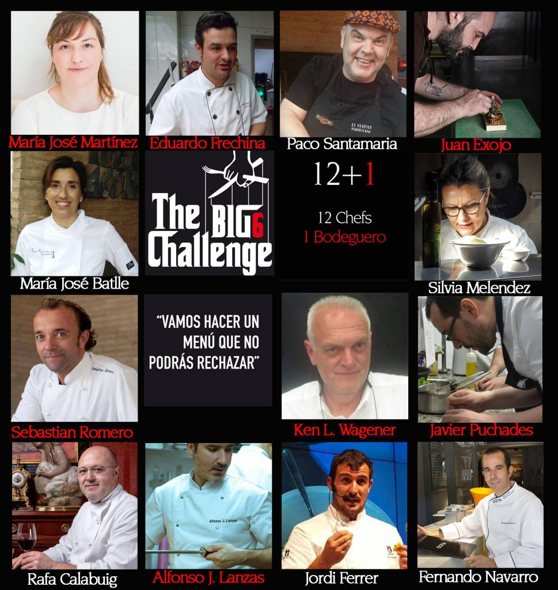
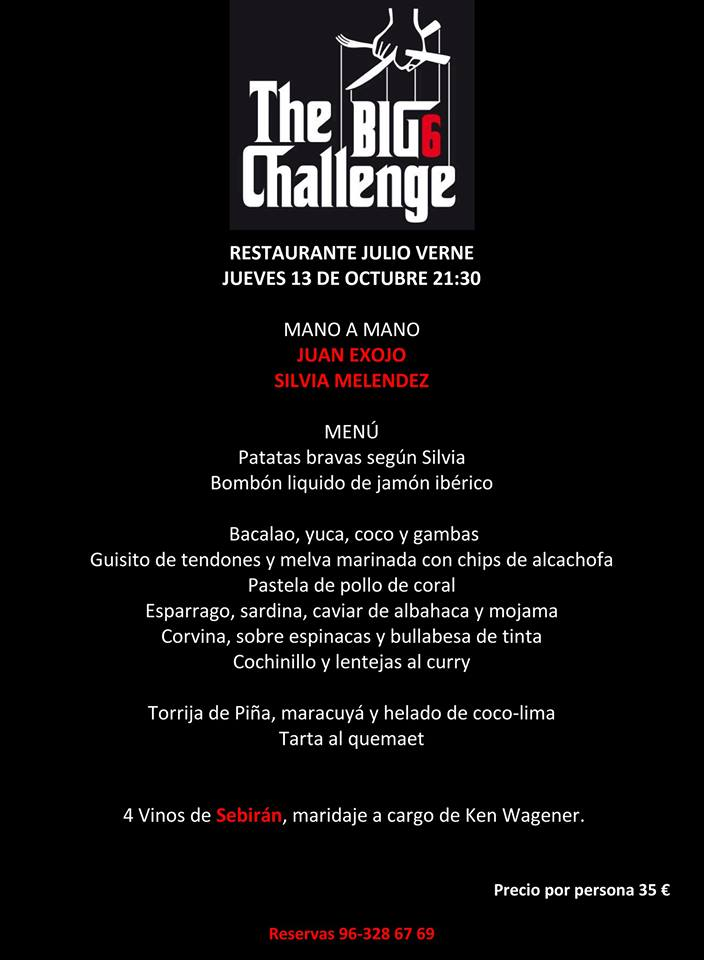
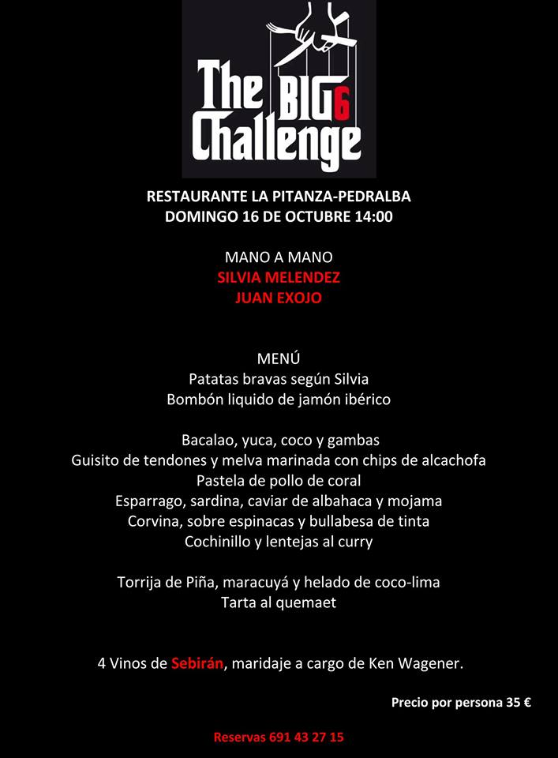
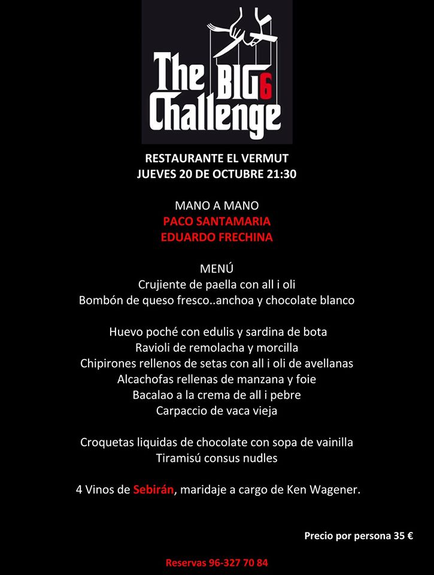
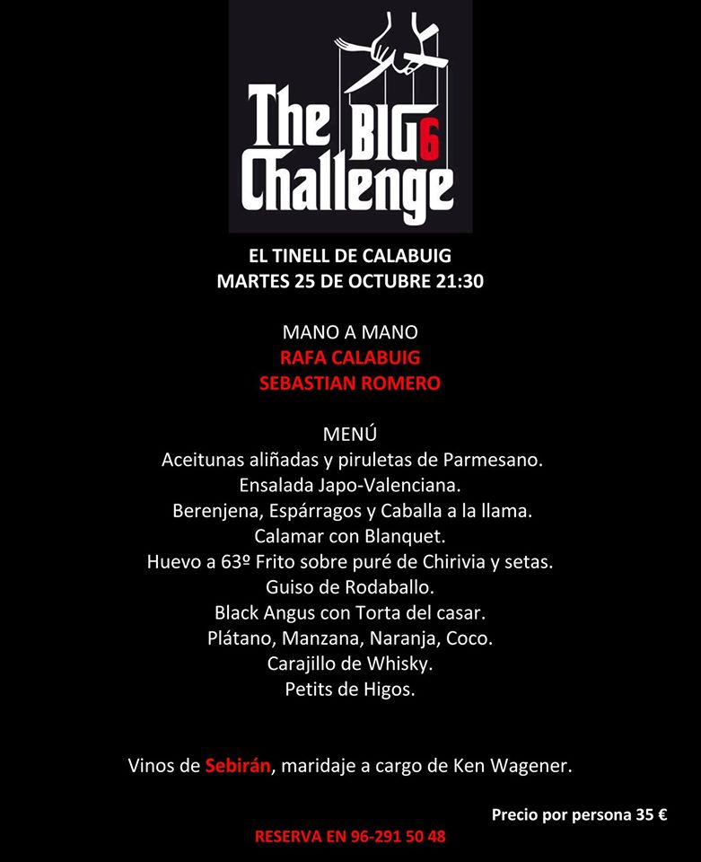
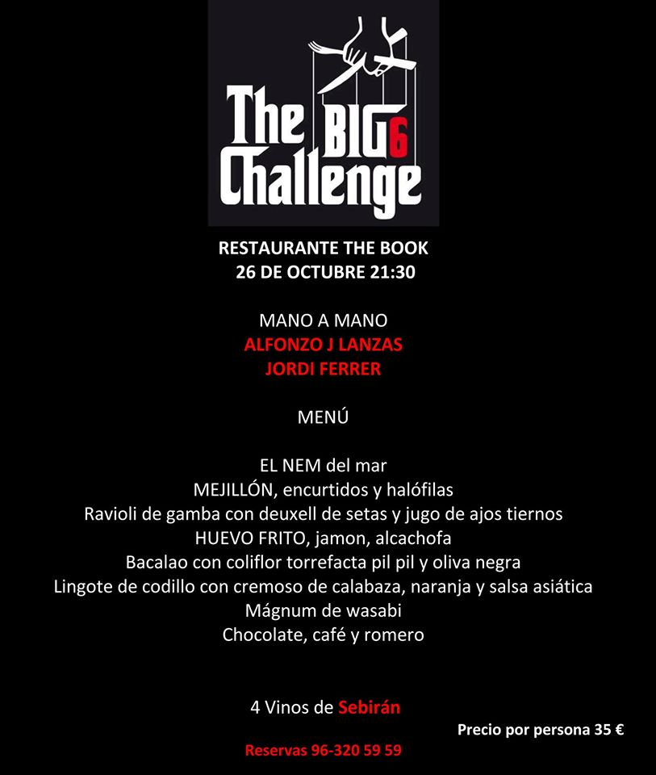
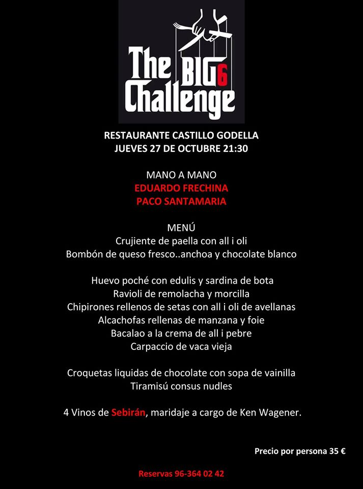
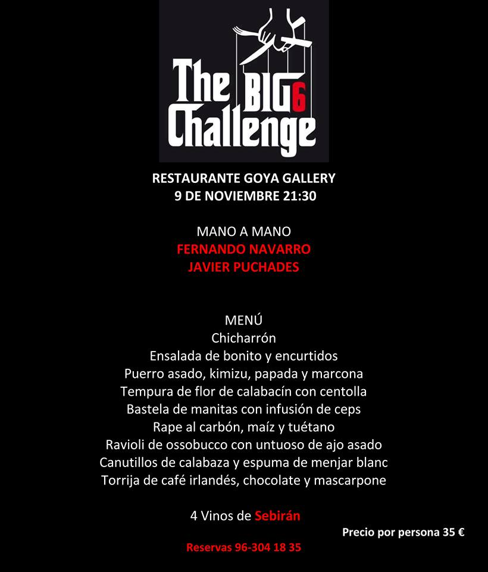

Lo reconocemos, somos fans de la iniciativa gastronómica The Big 6 Challenge, que impulsa Ken Wagener (Bodegas Sebirán). La tercera edición ya ha arrancado, pero un fuerte resfriado de Pizcas nos ha impedido contarlo antes. Una vez recuperados, os contamos las novedades que este evento tiene preparadas, la fundamental, es que a los seis chefs originales, se han sumado otros seis más, para plantear un divertido juego de menús "a cuatro manos".

## The Big 6 Challenge son ahora 12

Como os decíamos, Junto a los chefs originales: Sebastián Romero, de [La Sequieta](http://www.lasequieta.com/) (Alaquàs, Valencia); Juan Exojo, de [Julio Verne](https://www.facebook.com/Julio-Verne-Restaurante-350550118379299/info/?tab=overview) (Valencia); Alfonso J. Lanzas, de [The Book](http://www.thebookrestaurant.com/) (Valencia); Toni Aliaga, de [Venere](http://www.restaurantevenere.es/) (Aldaia, Valencia); Javier Puchades, de [Ginebre](http://www.ginebre.com/esp/) (Valencia); y Eduardo Frechina, de [Restaurante Castillo](https://www.facebook.com/restaurante-castillo-CUINA-VALENCIANA-CREATIVA-110051672344395/) (Godella, Valencia); ahora Ken ha "reclutado" a otros tantos para que la propuesta se base en menús elaborados a cuatro manos.

De este modo, en esta edición se han juntado 6 parejas de 2 chefs cada una para crear un menú de 8 platos, maridado con 4 vinos.

Las parejas de "baile" resultantes son:  Mª. José Martinez y Mª. José Battle; Sebastián Romero y Rafa Calabuig; Juan Exojo y Silvia Meléndez; Javier Puchades y Fernando Navarro; Paco Santamaría y Eduardo Frechina; y Alfonso J. Lanzas y Jordi Ferrer.

Es importante que la iniciativa no se plantea como un "duelo"  entre los chefs, más bien constituye el intento de establecer una simbiosis entre los dos jefes de cocina de cada pareja. Así, se han creado platos que fusionan los dos estilos, experiencias y técnicas de los dos chefs para crear un nuevo y excepcional menú.

Como decíamos, algunas de las cenas ya se han celebrado, pero todavía estáis a tiempo de participar en The Big 6 Challenge. El calendario de cenas pendientes es el siguiente:

13/10 [Julio Verne Restaurante](https://www.facebook.com/Julio-Verne-Restaurante-350550118379299/)

 16/10 [La Pitanza Restaurante Pedralba](https://www.facebook.com/lapitanza.pedralba/)

 19/10 [Ginebre Restaurant](https://www.facebook.com/GinebreRestaurant/)

 20/10 [El Vermut Taberna Bar](https://www.facebook.com/elvermut.valencia/)

 25/10 [EL TINELL DE CALABUIG](https://www.facebook.com/EL-TINELL-DE-CALABUIG-360823576942/)

 26/10 [The Book Restaurant & Lounge](https://www.facebook.com/thebookrestaurantlounge/) - COMPLETO

 27/10 [Restaurante Castillo](https://www.facebook.com/restaurantecastillogodella/)

 09/11 [GOYA Gallery Restaurant](https://www.facebook.com/goyagalleryrestaurant/)

