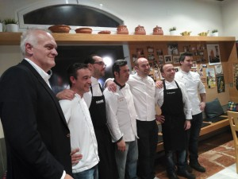
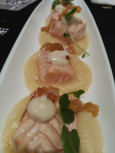
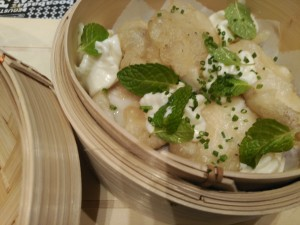

Ken Wagener, responsable de la [Bodega Sebirán](http://sebiran.es/) (D.O. Utiel-Requena), ha recargado su particular The Big 6 Challenge. Se trata de un “reto” que el bodeguero lanza a seis chefs valencianos y que éstos han aceptado, que consiste en elaborar un menú de cinco creaciones gastronómicas más dos copas de vino por el competitivo precio de 19,90 euros.

Los chefs que han vuelto a asumir el reto son: Sebastián Romero, de [La Sequieta](http://www.lasequieta.com/) (Alaquàs, Valencia); Juan Exojo, de [Julio Verne](https://www.facebook.com/Julio-Verne-Restaurante-350550118379299/info/?tab=overview) (Valencia); Alfonso J. Lanzas, de [The Book](http://www.thebookrestaurant.com/) (Valencia); Toni Aliaga, de [Venere](http://www.restaurantevenere.es/) (Aldaia, Valencia); Javier Puchades, de [Ginebre](http://www.ginebre.com/esp/) (Valencia); y Eduardo Frechina, de [Restaurante Castillo](https://www.facebook.com/restaurante-castillo-CUINA-VALENCIANA-CREATIVA-110051672344395/) (Godella, Valencia).

Los dos vinos que se ofrecerán en los menús serán el nuevo Sebirán-T (Tardana 100%) y Sebirán c en Minúscula (100% Bobal). Los menús estarán disponibles desde el 25 de febrero y hasta el 6 de marzo. En la primera edición de The Big 6 Challenge se vendieron más de 2.500 de estos menús.

En cuanto al nuevo vino de Tardana, una variedad que no suele vinificarse como monovarietal, y que es más común encontrarla en coupages, resulta muy agradable en nariz, de intensidad media/alta con un perfil muy tropical, con notas de plátano, ciruelo amarillo muy maduro y manzana Golden. En boca resulta fresco y muy sencillo de beber, de trago largo.

En la presentación, que tuvo lugar en el restaurante La Sequieta, de Alaquàs (Valencia), pudimos probar algunas de las propuestas de los cocineros que están incluidas en el menú.

Éstas fueron las 'joyas' que pudimos degustar:

- Mil hojas de foie y mango con puré de orejones (Toni Aliaga . Venere-Aldaia) 
- Carpaccio de alcachofas con mango y citro-lima (Sebastián Romero. La Sequieta-Alaquàs) 
- Buñuelo de bacalao Jack The Ripper (Juan Exojo. Julio Verne-Valencia) 
- Gamba al ajillo osmotizada (Eduardo Frechina. Castillo-Godella) 
- Tataki de salmón a la llama con manzana (Toni Aliaga. Venere-Aldaia) 
- Sopa Thai con ravioli marinero (Javier Puchades. Ginebre-Valencia) 
- Cazón en tempura con espuma de wasabi (Alfonso J. Lanzas. The Book-Valencia) 
- Brandada de bacalao crujiente con guiso de sus callos (Javier Puchades. Ginebre-Valencia) 
- Hamburguesita asiática con berros (Alfonso J. Lanzas. The Book-Valencia) 
- Jamoncitos de pollo con curry rojo picante (Sebastián Romero. La Sequieta-Alaquàs) 
- Coco, plátano, cereza, limón y aguacate (Juan Exojo. Julio Verne-Valencia) 
- Queso con miel y helado de frutas rojas (Eduardo Frechina. Castillo-Godella) 

Una oferta de lo más creativa y competitiva. La tenéis disponible del 25 de febrero al 6 de marzo, en horario de comida y de cena (en The Book sólo se sirve a mediodía)
