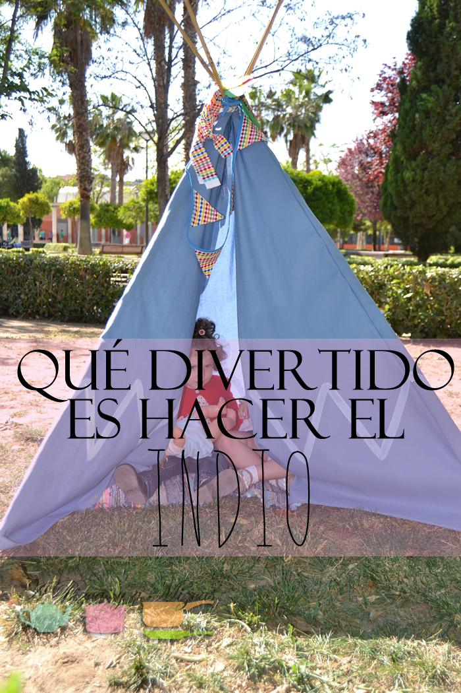

Para el cumpleaños de Trizcas decidimos hacer una fiesta india. Y en nuestro poblado no podía faltar el tipi indio. Otra vez más pedimos ayuda a la yaya Trizcas (que haríamos sin ella!) que cosió nuestro tipi.

Nos inspiramos en el tutorial de "[4 en la carretera](http://4enlacarretera.blogspot.com.es/ "Blog 4 en la carretera")" : " [Cómo hacer un tipi o tienda de campaña para los niños](http://4enlacarretera.blogspot.com.es/2010/01/tutorial-how-to-make-tipi-for-kids-como.html "Tutorial 4 en la carretera cómo hacer un tipi")". Aunque con algunas variaciones.

## Cómo hicimos nuestro tipi indio

Los materiales que utilizamos:

- 4 cañas de bambú (que compramos en la sección de jardinería de Leroy Merlín)
- Tela de loneta . Unos 3,20m x 1,35m para la tienda en sí y 2m x 0,50m para las aristas de los palos.
- Máquina de coser
- Cuerda
- Pintura blanca
- Una alfombrilla para el suelo (la nuestra es del [Ikea](http://www.ikea.com/es/es/catalog/products/90267066/ "Alfombra ikea"))

Vamos a empezar a confeccionar nuestro Tipi indio. Doblamos la tela dos veces sobre sí misma, de forma que nos queden cuatro capas en total.

Marcamos la tela con tiza de sastre y marcamos una línea recta que divida la tela en triángulos. No lo tenéis que hacer de esquina a esquina; hay que dejar una holgura de unos 5 o 6 cm. Cortamos la tela por la línea dibujada.

Así, con sólo doblar la tela y realizando un único corte, tendremos todas las piezas de nuestro tipi indio y no desperdiciamos tela. El resultado será: tres triángulos isósceles (más grandes) y dos triángulos rectángulos (más pequeños) que servirán para las puertas de entrada del tipi. Tened en cuenta que los palo tienen que ser unos 15 o 20 cm que el lado del triángulo

El resultado será: 3 triángulos isósceles (más grandes) y 2 triángulos rectángulos (más pequeños) que servirán para hacer las puertas de entrada. Los palos tienen que ser unos 15 o 20cm más largos que el lado del triángulo.

A continuación, vamos a conrtar las aristas en las introduciremos los palos. Haremos 4 fundas con la tela de loneta.

Ya tenemos todas las piezas para formar nuestro tipi indio. Aquí ya se lo pasamos a la yaya Mizcas que nosotros con la aguja no nos apañamos demasiado. Así que os explicamos, pero para ver el paso a paso consultar el tutorial de "4 en la carretera".

En primer lugar cosemos las 4 aristas formando un tubo. Ahora toca unir los triángulos que forman el tipi indio. Excepto los triángulos pequeños que serán las puertas del tipi y las dejaremos abiertas.

Nosotros dejamos las aristas por dentro porque nos gustaba más. Así que por último unimos las aristas al cuerpo del tipi.

Por último introducimos los palos y atamos con una cuerda para que queden bien sujetos los 4 palos.

Nosotros quisimos darle un toque más indio a nuestro tipi y pintamos unas lineas en la parte baja con pintura blanca. Cuando montamos el tipi pusimo en el interior una alfombra para que nuestro indios estuvieran más cómodos!

El tipi fue el centro de la fiesta de cumpleaños y los pequeños indios lo convirtieron en su escondite.
