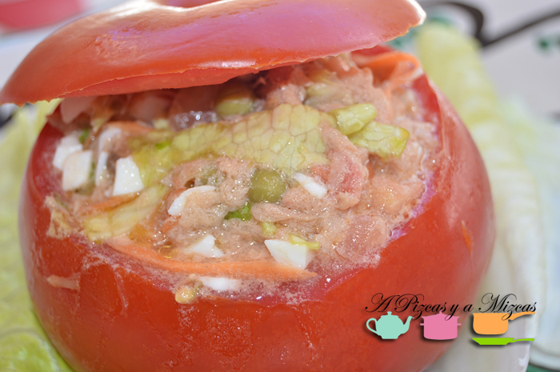
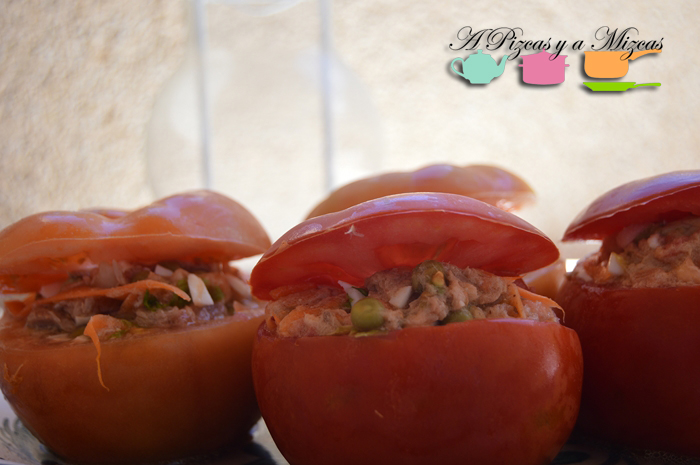

Esta es otra de esas recetas veraniega cien por cien... de esas que las preparas el día de antes o por la mañana prontito. Y cuando llegas a casa después de estar en la playa, la piscina o trabajando... sorpresa ahí están los tomates rellenos esperándote para disfrutar comiendo ligero.

## Ingredientes para preparar los tomates rellenos

- 4 tomates grandes
- 3 latitas de atún en conserva
- dos huevos
- 1 cebolla tierna
- una zanahoria
- una latita de guisantes
- vinagre
- lechuga
- aceite de oliva
- sal

Picamos la cebolla, lavamos y pelamos la zanahoria y también la picamos. Cocemos los huevos y cuando estén listos pelamos y picamos. Lavamos la lechuga y troceamos.

A continuación escurrimos el atún y lo mezclamos con la zanahoria, la cebolla, el huevos y la lechuga. Escurrimos los guisantes y removemos todos los ingredientes. Añadimos aceite, vinagre y sal.

Lavamos los tomates y les cortamos una tapa en la parte superior. Los vacíamos con una cucharilla y los rellenamos con la mezcla de verduras y huevo. Sírvelos con la lechuga

Además con la mezlca del relleno de los tomates nos preparamos para cenar un bocadillito y como en casa de A Pizcas y a Mizcas no se tira nada con el resto hicimos una ensalada de arroz. Esto es lo que se llama una receta bien aprovechada.

