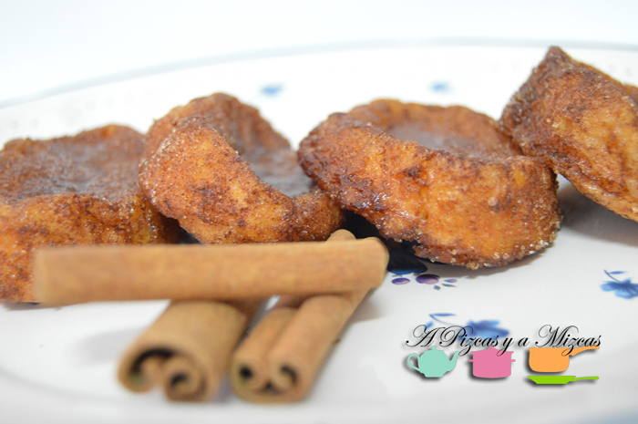
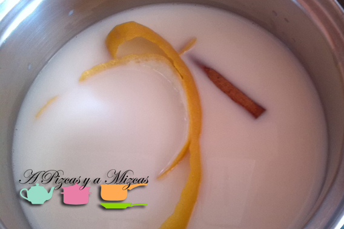
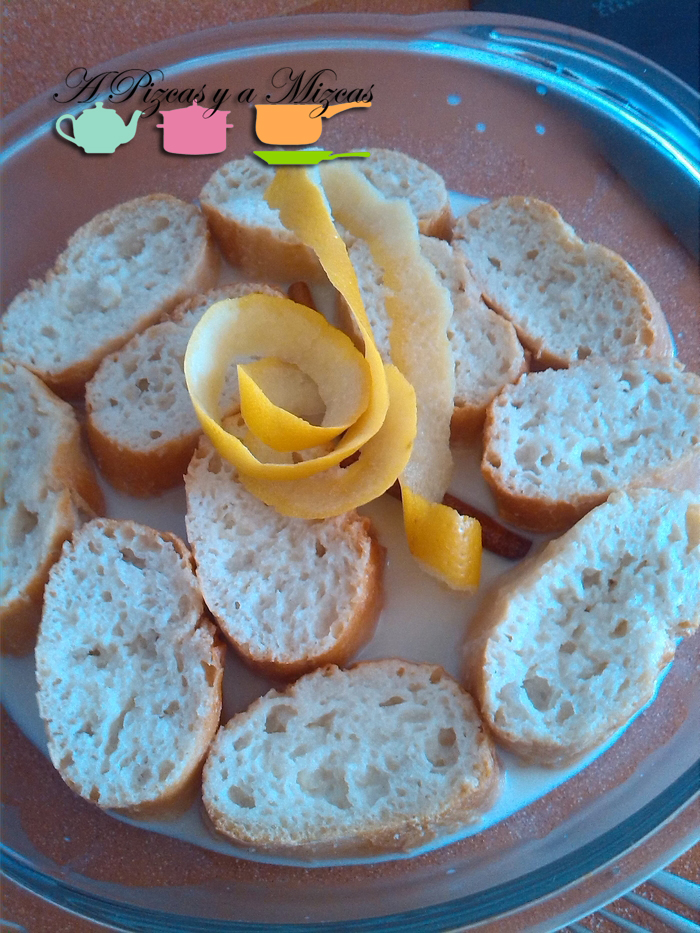
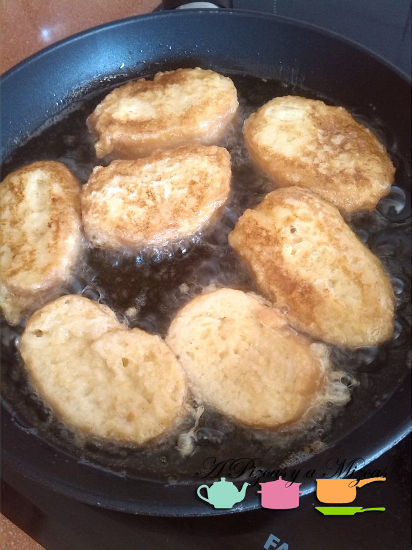
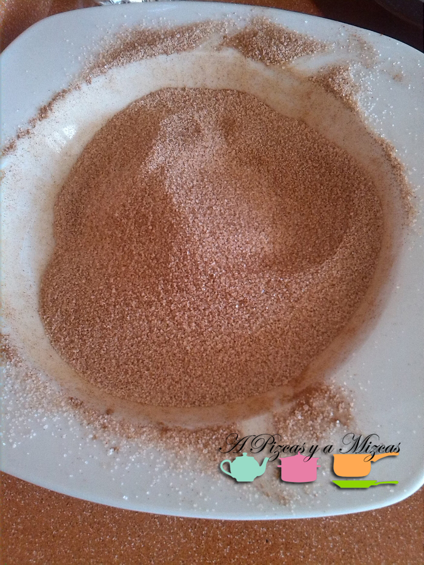
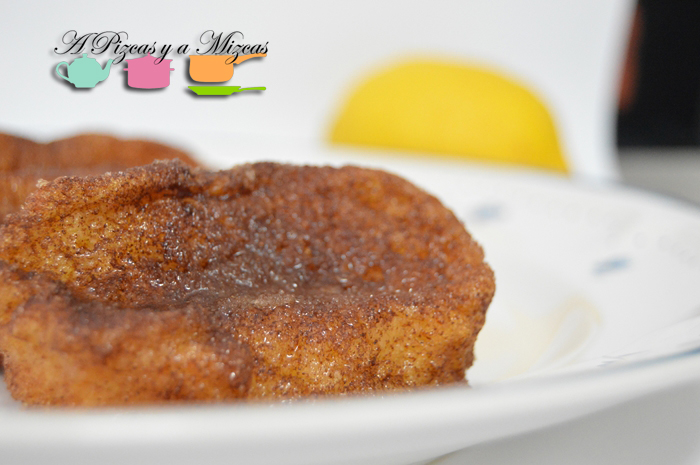

Todos los años cuando se acerca la semana santa la yaya Mizcas se mete en los fogones y nos prepara esas torrijas tan ricas. Así que este año nos fuímos a casa de la yaya Mizcas con cámara en mano y os contamos todos los secretillos para preparar las auténticas torrijas de la yaya Mizcas.

Las torrijas es un dulce típico de Semana Santa muy sencillo... pero deliciosoooo. ¿Por qué comemos torrijas en Semana Santa?

"Su asociación a la cuaresma  se debe tal vez a la necesidad de aprovechamiento del pan sobrante, que, durante el tiempo en que no se podía comer carne, era por ello menos consumido, aunque las familias elaboraban la misma cantidad." ([Torrija - Wikipedia](http://es.wikipedia.org/wiki/Torrija "Torrija - Wikipedia"))

## Ingredientes para preparar las torrijas

- una barra de pan (del día anterior)
- medio litro de leche
- cáscara de un limón
- una ramita de canela
- canela molida
- azúcar
- 2 huevos
- aceite de oliva virgen extra

En un cazo ponemos la leche a cocer con la cáscara del limón (sin la parte blanca para que no amargue) y la ramita de canela. Mientras cortaremos el pan en rebanadas de unos dos centímetros de grosor aproximadamente.

Colocamos las rebanadas de pan en una fuente y a continuación las empapamos con la leche preparada. Ahora toca ensuciarse las manos, batimos los huevos y pasamos las rebanadas de pan mojadas en leche por el huevo. A continuación, en una sartén ponemos el aceite y cuando esté caliente empezamos a freír nuestras torrijas.

Una vez fritas, las vamos colocando en un plato con papel absrovente. En un plato hondo pondremos azúcar y canela molida y mezclamos.

Por último rebozamos las torrijas por la mezcla de azúcar y canela. Y ya están listas para disfrutarlas a la hora del postre o del café.

Seguro que estos días le decimos a la yaya Mizcas que vuelva a hacer torrijas... que nos encantan!
