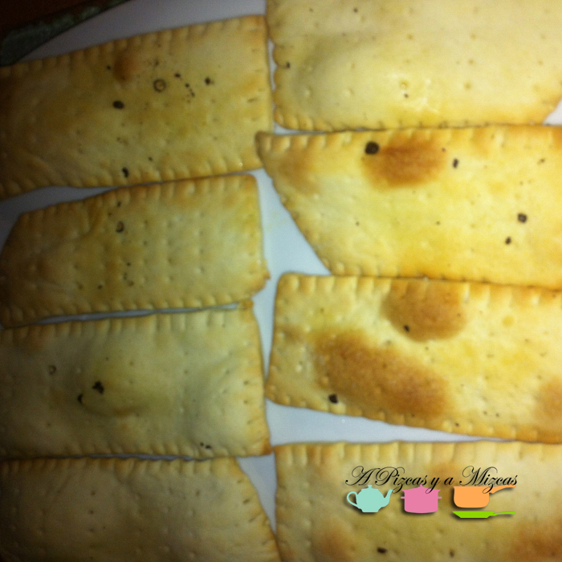
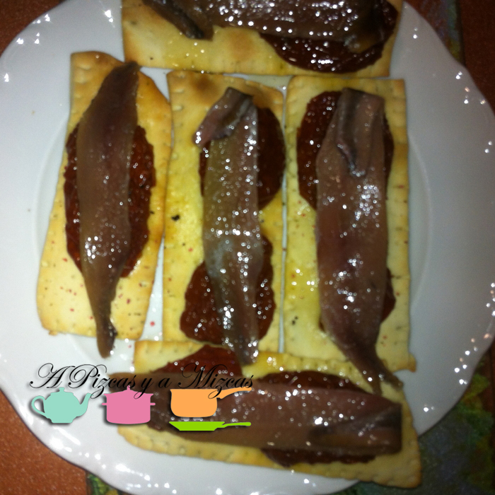
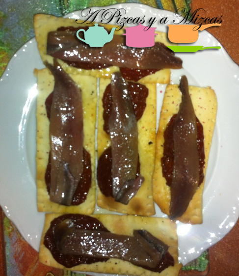

Cuando partimos de ingredientes de alta calidad cuanto más simple sea la elaboración más bueno será el resultado. Esto fue lo que pensamos cuando vimos en [Charcutería Casa Rodríguez](https://www.facebook.com/CharcuteriaCasaRodriguez?ref=hl "Facebook Charcutería Casa Rodríguez") las anchoas doble cero y el bote de tomates secos en aceite. El resultado fue una tosta de anchoas con tomate espectacular. A veces menos es más...

## Ingredientes para preparar la tosta de anchoa con tomate (8 tostas)

- una lámina de pizza preparada
- anchoas XXL
- aceite de oliva virgen extra
- pimienta negra molida
- sal en escamas
- tomates secos en aceite

En primer lugar para preparar la tosta de anchoa con tomate ... si tenéis dominada la técnica de elaboración de masa de pizza la podéis preparar vosotros. Sino la compráis preparada que es más rápido y práctico. No hace falta que estiréis la masa, la troceáis en 8 porciones y para que el resultado sea más vistoso, con la ayuda de un tenedor haremos un dibujo en los bordes de cada una de las porciones. Pintamos con aceite de oliva cada una de las porciones y horneamos siguiendo las indicaciones del fabricante. Espolvoreamos con sal en escamas (con mucho cuidado sólo es para aportar el crujiente) y pimienta negra molida.

Dejamos templar ligeramente sobre una rejilla de horno. Colocamos los tomates en aceite escurridos y sobre ellos nuestras anchoas XXL (talla doble cero).

Otra variante de esta tosta sería incoporarle queso fresco entre la tosta y el tomate pero correríamos el riesgo de que se reblandezca la tosta.

Disfruten del aperitivo... simplemente una delicia para el paladar
