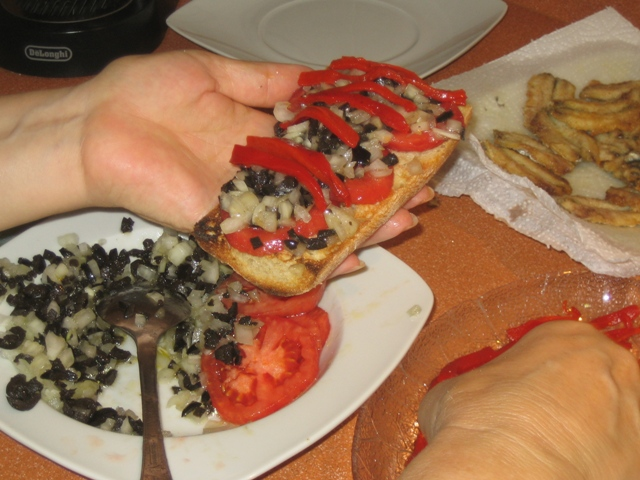
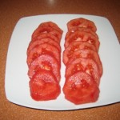
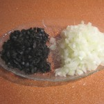
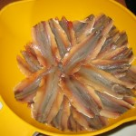
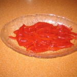
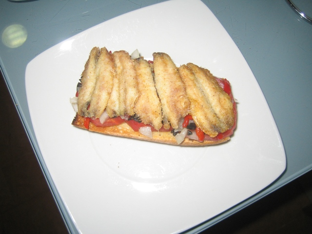

  Esta es receta de **Mati** aunque fue a sugerencia nuestra. Fue una cena de sábado distinta y muy completa. Aunque los ingredientes son sencillos, fue otra forma de comer boquerones. Seguro que la repetimos.

_Ingredientes para 4 personas:_

- 4 rebanadas de pan
- 4 tomates medianos
- 1 cebolla tierna
- 6 pimientos del piquillo
- 75 gr de aceitunas negras sin hueso
- 20 boquerones frescos
- 1 taza de harina
- 1 taza de aceite de oliva
- Sal

Tostar las rebanadas de pan por ambos lados. Limpiar los tomates y cortarlos en rodajas finas. Pelar la cebolla y picarla; picar también las aceitunas negras. Colocar estos tres ingredientes en un plato hondo y aliñar con 4 cucharadas de aceite de oliva y una pizca de sal.

Cortar los pimientos del piquillo en tiras finas. Eliminar la cabeza de los boquerones, limpiarlos de tripas y retirarles cuidadosamente la espina central, dejándolos abiertos en forma de libro. Lavarlos bajo el chorro del agua y secarlos con papel absorbente de cocina.

Pasar los boquerones ligeramente por harina y freírlos en el aceite de oliva muy caliente. Cubrir cada rebanada de pan tostado con las rodajas de tomate, distribuir encima la cebolla, las aceitunas negras, las tiras de pimiento y, por último, los boquerones fritos.

