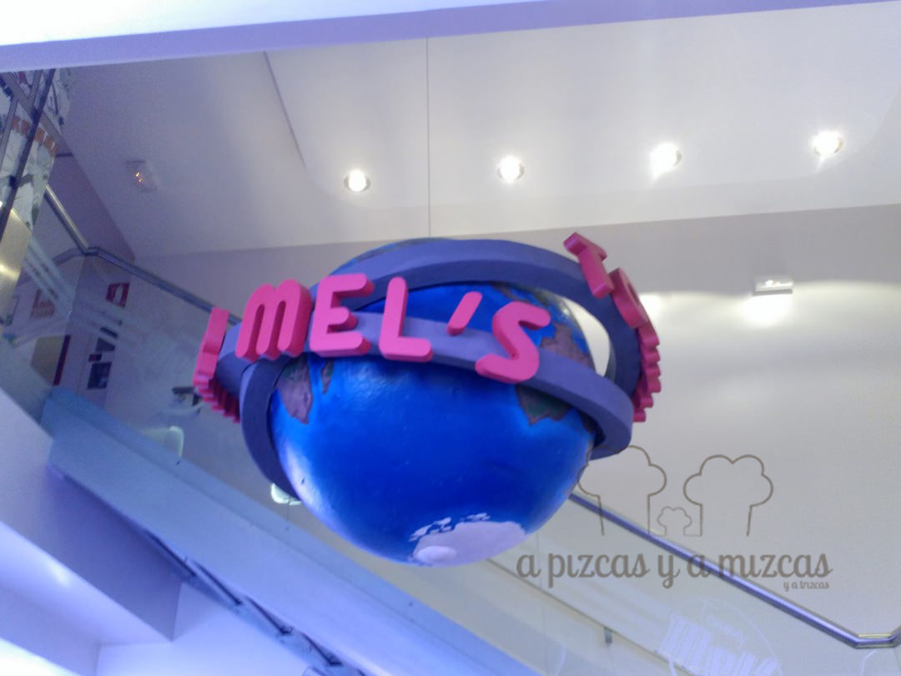
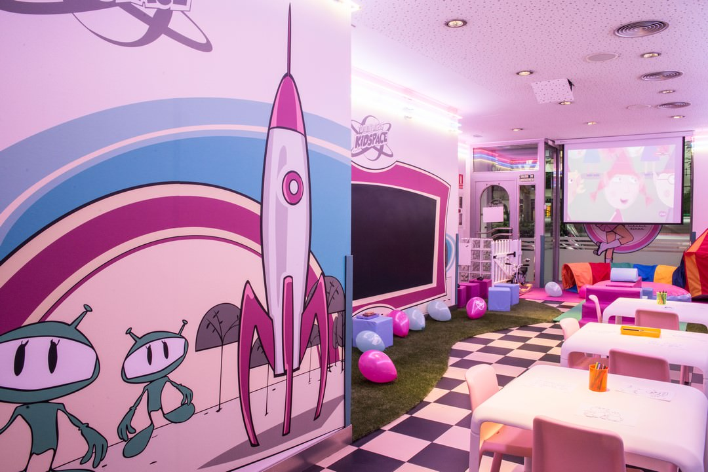
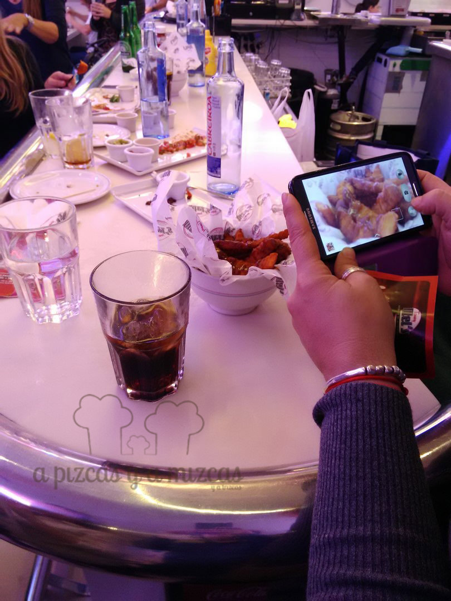

Imaginaos la situación. Dos parejas de papás tratan de mantener una conversación sobre lo que sea (más allá de las relaciones familiares de Peppa Pig o del último caso complicado de la Doctora Juguetes) mientras cenan en un local céntrico en Valencia con sus respectivos hijos. ¿Imposible? Casi, pero el Kidspace de Tommy Mel's Gran Vía Marqués del Turia de Valencia lo hace un poco más fácil. ¿Queréis saber cómo se lo pasó Trizcas en este espacio infantil?

La red de restaurantes Tommy Mel's en Valencia cuenta con cuatro locales, uno en la Gran Vía Marqués del Turia (número 50), otro en la céntrica calle Convento Santa Clara (n8), y dos más en el centro comercial Aqua y en Heron City (Paterna). Si no los conoces, vale la pena que lo hagas. Son restaurantes americanos tematizados en los años 50 de los EE.UU. y no les falta detalle, además ofrece una comida muy alejada de los fast food más conocidos.

Tommy Mel´s

## Trizcas en Kidspace de Tommy Mel's

Precisamente en el Tommy Mel's de Gran Vía Marqués del Turia han tenido la fantástica idea de establecer un amplio espacio infantil (el Kidspace), lleno de juguetes, una cocinita, una pantalla de tv, videoconsola, una pizarra gigante y vigilado por una monitora durante el fin de semana. El viernes pasado fuimos con Trizcas a conocerlo y se lo pasó genial.

La valoración de A Pizcas y a Mizcas

- **Comida**: ⭐⭐⭐
- **Local**: ⭐⭐⭐⭐
- **Servicio**: ⭐⭐⭐⭐

La valoración de Trizcas: Salió gritando que cuando volvíamos.... :)

Nos contaron que se trata del primer Tommy Mel's con zona infantil, algo que el resto de locales de la red ya está empezando a demandar ante las expectativas que ha generado ésta. La cadena ha entendido que las familias son uno de sus públicos potenciales más potentes y con este espacio colman dos necesidades básicas, por un lado ofrecen un lugar en el que los peques pueden jugar y desarrollar su creatividad y sus relaciones sociales y, por otro, garantizan una tranquilidad (necesaria) para que los papis tengan también un tiempo de ocio "propia".

Allí soltamos a Trizcas y enseguida se hizo amiga de Marina (la monitora) y de varias peques que ya estaban por allí. Le encantó la pizarra gigante, donde demostró sus dotes de artista cubista y a nosotros nos fascinó que todo el espacio es como un Tommy Mel's en miniatura, (luces de neón, sillones acolchados, rotulación...).

Kidspace de Tommy Mel´s Gran Vía

Trizcas merendó unas ricas tortitas con nata y un batido de fresa (también hay un menú infantil para los peques) y volvió rápidamente al Kidspace, pues no se quería perder las actividades de pintura y de papiroflexia que había en marcha (volvimos a casa con un coche américano de cartón en azul celeste que es una chulada).

Nosotros aprovechamos que la terremoto estaba en este espacio infantil vigilado y pudimos probar lo que nos recomendó Josué, el atento jefe de sala. Nos encantó el sandwich Route 66 Club (pechuga de pollo a la parrilla, lechuga, tomate, bacon, jamón cocido, queso cheddar y mayo) y la hamburguesa All Right Burger con pan de 5 cereales (con queso de cabra al romero, cebolla confitada al bourbon, canónigos y salsa).

Nos sorprendió la calidad de la carne y Josué nos explicó que la "bolean" ellos mismos para hacer las hamburguesas al momento.

Toda una experiencia rockabillie que repetiremos sin duda, pues además de que la comida nos gustó bastante más que en otros locales más masivos, pudimos disfrutarla con tranquilidad y Trizcas acabó encantada.
