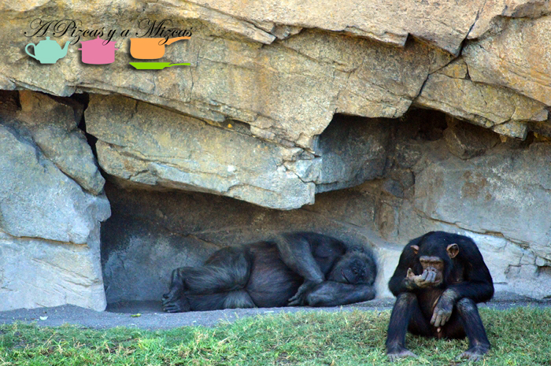

A Trizcas le encantan los animales. De hecho, hay veces que nuestro comedor parece un zoo de peluches, con leones, monos, guau-guaus, elefantes, ponis... Una visita que esperábamos con mucha ilusión era la que hicimos recientemente al [Bioparc de Valencia](http://www.bioparcvalencia.es/ "Bioparc de Valencia"). Nosotros ya habíamos ido al poco de que lo inauguraran, y estábamos convencidos de que pese a su edad (2 años y medio) iba a disfrutarla. Para nuestra segunda escapada a Bioparc aprovechamos una de las muchas ofertas que a lo largo del año tienen vigentes y así nos ahorramos unos eurillos.

Una de las cosas que tenéis que tener presente es que no se puede entrar comida al recinto, para evitar que la gente dé de comer a los animales cosas que les [puedan perjudicar](http://www.bioparcvalencia.es/informacion-al-visitante/normas-de-la-visita/ "Normas de visita"). No obstante, si vais con niños sí que os dejan entrar zumos, yogures de beber, potitos y, por supuesto, agua. Tenedlo presente, pues la visita se prolonga durante varias horas (puede ser casi todo el día, si acudís a todos los espectáculos, charlas y documentales que programan)

Los "mayores" almorzamos en la cafetería del parque y los precios no son excesivamente elevados. Así, Trizcas aún pudo salir del parque cargada con un tigre de peluche (aunque en el Bioparc no los hay, pues sólo hay fauna de África), para sumar al zoo doméstico.

Ahora estamos convenciendo a los iaios para que se saquen el [Pase Berde](http://www.bioparcvalencia.es/entrada-berde/ "Pase Berde") para que lleven a Trizcas más a menudo.

Os dejamos alguna selección de las fotos que Pizcas hizo en el Bioparc, hasta que se quedó sin batería.

Tenemos pendiente volver, lo pasamos genial!
