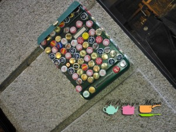
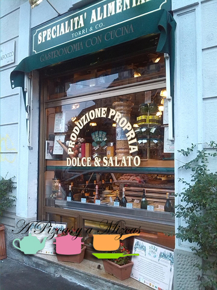

Acabamos de regresar de Milán, donde Trizcas ha visitado a sus tíos milaneses. Como la capital lombarda ya la conocíamos, nuestros anfitriones decidieron que fuéramos a pasar unos días a la orilla del [Lago Maggiore,](/sangria-blanca/ "El Lago Maggiore")  a una hora y media en coche desde Milán y casi ya en Suiza. Este lago es inmenso (el segundo mayor de Italia) y tiene origen glaciar. Estuvimos en una casa familiar de "antes de que Italia fuera Italia" (antes de la unificación revolucionaria) y era como estar en un museo con piezas de mobiliario y de arte centenarias. En esta entrada intentaremos resumir nuestras impresiones del Lago Maggiore.

## Una visita al Lago Maggiore

Volamos al aeropuerto de Milán-Bérgamo con Ryanair desde Valencia y no tuvimos ningún problema. Eso sí, antes de viajar nos habíamos encargado de que Trizcas tuviera su propio DNI (con solo 16 meses!) y sacamos la tarjeta sanitaria europea para los tres. A la cabina subimos una maleta de mano y una bolsa con todo el pertrecho para la peque. Además, el carrito de paseo lo dejaron en la bodega del avión.

Un único consejo: si pensáis viajar con esta compañía de bajo coste, estudiad si os interesa pagar un poco más por reservar los asientos, pues con pequeseres es muy complicado subir pronto al avión y luego puede costaros encontrar asientos consecutivos. La peque voló con un cinturón especial que se conecta con el cinturón de un adulto.

Mientras esperábamos a tomar el vuelo nos sorprendió la campaña de Coca-cola "Comparte una Coca-cola con..." y nos dimos cuenta con esta botella: Nos encantó!

Llegamos al aeropuerto de Bérgamo y lo primero que notamos fue... el frío. Vaya diferencia. Hacía sobre 15 grados y habíamos salido de Valencia con 27!! Íbamos prevenidos pero no nos imaginábamos que hubiera tanta diferencia.

La primera noche cenamos en la famosa [pizzería Big Pizza](https://maps.google.es/maps?oe=utf-8&client=firefox-a&ie=UTF-8&q=big+pizza+mil%C3%A1n&fb=1&gl=es&hq=big+pizza&hnear=0x4786c1493f1275e7:0x3cffcd13c6740e8d,Mil%C3%A1n,+Italia&cid=0,0,1317251284600897631&ei=E2JaUtiSHoTMtQaGioHgAQ&ved=0CEoQrwswAg "Big Pizza Milán"), muy cerca de la Estación Central de Milán. Son pizzas de un gran diámetro, pero su clave está en la masa, que es muy fina y ligera. De esta forma no resultan nada pesadas, aunque puedan asustar al principio. Tienen una carta de unas 30 variedades de pizza. Es un local muy peculiar, con un diseño no muy atractivo, pero característico. Dentro uno se da cuenta de la pasión que sienten los italianos por la fórmula 1 y el motociclismo (una gran foto de Ayrton Senna te da la bienvenida en el mostrador). No tuvimos la suerte de cruzarnos con Michael Bubble pero una foto suya atestiguaba que había estado hace poco allí.

Estás pizzas están en el lado opuesto de nuestra pizzería favorita de todo Milán: [Spontini,](http://www.pizzeriaspontini.it/ "Spontini Milán") donde solo hay una única variedad de pizza (tomate, mozzarella, orégano y anchoas) y tu única opción es si quieres la porción normal o grande.

Como nuestra excursión al Lago Maggiore iba a durar varios días, nos vimos en la necesidad de buscar alimentos preparados para Trizcas. Fue un poco odisea. Imaginábamos que sería sencillo encontrar potitos infantiles habituales en Italia pero no fue así. El primer intento lo realizamos en la cadena Simply, todavía en Milán. Ni rastro de potitos de verduras con... lo que sea. Lo más parecido eran unos concentrados de ternera, pollo, pescado... para mezclar con la pastina (especie de sémola). Lo dejamos para el Lago.

A la mañana siguiente partimos hacia el Lago Maggiore. En concreto hacia Pallanza (en el municipio de Verbania).En el desayuno, la tía nos sorprendió con unas tortitas caseras, que acompañamos con Nutella, sirope de arce canadiense y miel. La receta que siguió fue esta:

## Tortitas para coger fuerza camino del Lago Maggiore

- 150 gramos de harina
- 1 cucharadita de levadura en polvo
- 1 pizca de sal
- 2 cucharadas de azúcar
- 200 ml. de leche
- 2 huevos
- 50 grs. de mantequilla

Mezcló todos los ingredientes en una batidora y luego fue dorando las tortitas en una sartén. Le salieron riquísimas.

Ya en Pallanza, fuimos al supermercado Esselunga, muy bien surtido... pero nada de potitos con los que estuviera familiarizada Trizcas. Así que nos animamos a coger varios envases de pastina y tuvimos suerte de que le gustaron!!

No tuvimos muy buena suerte con el tiempo, pues estuvo lloviznando prácticamente todo el rato. Aún así, el Lago Maggiore es precioso y eso que nos afirmaron que con sol es una pasada. La casa daba directamente al lago y era posible ver las islas que hay en su centro y hasta la ribera opuesta. Pese al tiempo, pudimos recorrer las callejuelas de Pallanza y de los pueblos cercanos.

Los tíos nos prepararon para comer una riquísima pasta con almejas. No sé a vosotros, pero a nosotros en Italia la pasta nos sabe mejor ;oD

Las noches las amenizó el tío con la guitarra y las carreras y las risas de Trizcas mientras jugaba al escondite.

Al día siguiente teniamos un reto bastante complicado: preparar una paella en Italia. Solo teníamos el recipiente, la paella, nada de paellero o de quemador amplio. Otra cosa fueron los ingredientes, la bajoqueta tuvo que ser redonda, no había garrofó... pero sí pollo, conejo y azafrán (es el elemento central, junto con el tuétano, del auténtico arroz a la milanesa).

Tuvimos que encender los cuatro quemadores de la cocina e ir dando la vuelta a la paella de forma constante para conseguir, primero que no se quemara el aceite y se friera bien la carne, y luego para que hirviera el caldo de forma uniforme. El romero lo conseguimos del fantástico jardín de la casa. Había rincones realmente encantadores.

El resultado fue bastante bueno, hasta logramos el socarrat característico frente al Lago Maggiore!!!

De vuelta a Milán, no pudimos resistirnos y entramos en [Torri](http://www.lafattoriasas.com/?sito=chi "Torri"), un establecimiento muy auténtico donde preparan comida casera italiana y donde se pueden conseguir los mejores quesos y embutidos de las regiones del Piemonte y de Lombardía. Nos hicimos con unas riquísimas piezas de queso tomino (típico del Piemonte), que se toma caliente (envolviéndolo en papel de aluminio y hecho a la brasa o en sartén) y un salami casero.

Con la experiencia de nuestro primer viaje en avión con Trizcas y lo bien que nos han tratado los tíos, seguro que enseguida volvemos a Milano!!

