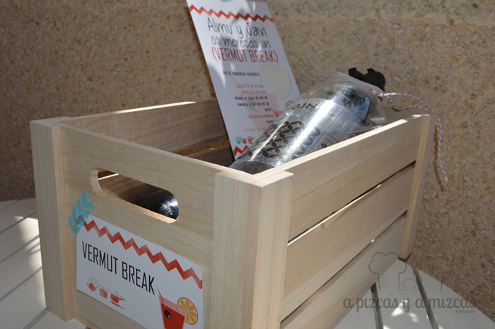
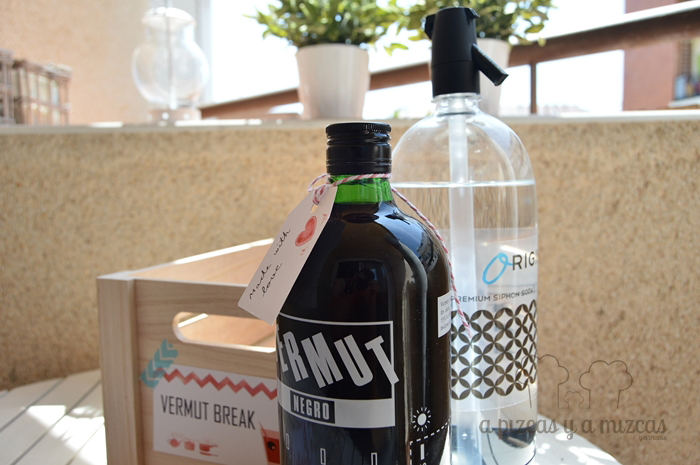

Siempre hay que encontrar un hueco para el vermut. El tradicional aperitivo que ahora está viviendo un auténtico auge (lo puedes ver escrito vermut, vermú, vermouth…). Pero si estás agobiado por cualquier motivo (mucho curro, la preparación de una boda…) hacer un vermut break es casi una cuestión de supervivencia.

Nosotros nos enfrentamos a una de esas emergencias. Unos de nuestros mejores amigos se casaban y para hacerles más llevaderos los últimos días antes del enlace, en los que parece que el tiempo no da suficiente de sí y que se antoja que no vas a poder llegar a todo, les enviamos un kit de “primeros auxilios vermuteros”. Nos aseguraron que les vino muy bien.

Hay infinidad de vermuts, pero para este regalo nos decantamos por el [Vermut Negro de Casa Mariol](http://www.casamariol.com/vermut-negre/ "Vermut negro Casa Mariol"). A nosotros nos encanta, por la filosofía de la empresa (están revitalizando el momento del vermut, para convertirlo en una fiesta) y porque el producto está buenísimo; y lo solemos preparar así:

Llena 1/3 de un vaso ancho con hielo pilé. Añade un trozo de piel de naranja y otro de piel de limón. Una buena aceituna. Un toque de soda de sifón y a disfrutar. Unas buenas patatas fritas, o unos encurtidos, o unas conservas o un buen jamón recién cortadito son las mejores parejas de baile para este vermut.

Esta es la forma en la que más nos gusta a nosotros, pero cada uno tiene la suya preferida. ¿A vosotros cómo os gusta tomar el vermut?

El vermut es una bebida elaborada con vino. En el caso de Casa Mariol, lo hacen con una base de vino blanco Macabeo, que luego se oscurece con nueces verdes y se aromatiza con una selección de hierbas aromáticas y especias y un poco de caramelo. De este modo toma un precioso color caoba oscuro.

A nuestros amigos les preparamos el kit con una botella de vermut, una de soda de sifón, las aceitunas y las “instrucciones”.
