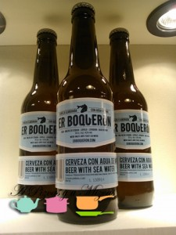
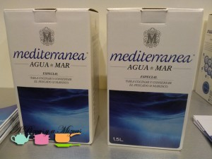
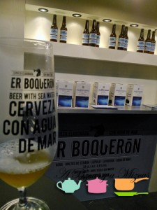
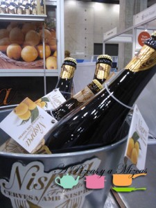
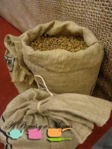
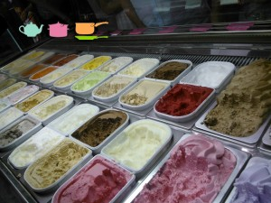
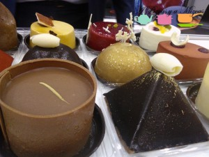
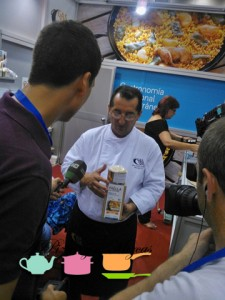
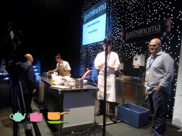

El sábado pasado (21 de septiembre) estuvimos en la feria [Gastrónoma](http://gastronoma.feriavalencia.com/), en Valencia. La verdad es que nos hubiera gustado poder pasar todo el día allí (y no solo el del sábado, sino el domingo y lunes también) pues el programa de ponencias, demostraciones y catas era de lo más completo. Nos hubiera encantado disfrutar de las ponencias de algunos de los chefs que pasaron por allí (estaba todo el panorama gastronómico de la Comunitat Valenciana), pero bueno... solo tuvimos un ratito para escaparnos y aquí os contamos lo que pudimos ver...

## Un paseo por Gastrónoma

Gastrónoma no es una feria comercial al uso, su clave es la amplísima programación. No obstante, sí que dispuso de un pabellón con expositores, donde se pudieron catar productos (algunos de ellos exigían pagar por probar, algo que nos sorprendió negativamente).

Vamos con algunas cosas que pudimos probar y que nos gustaron mucho:

Cerveza [Er Boquerón](http://erboqueron.com/): Elaborada por la misma empresa que hace la conocida cerveza Socarrada. En este caso, su peculiaridad es que está elaborada con agua de mar (la misma empresa comercializa también agua de mar para cocinar). Es muy refrescante, cuesta pillar la salinidad, pero enseguida el agua de mar es reconocible y le aporta mucha ligereza. Un expositor muy cuidado y muy bien atendido.

[Cerveza Nispra](http://www.frutaltea.com/grupo-empresarial-frutaltea/item/114-comunicacion-cerveza-nispra): Seguimos con las cervezas. Ahora con níspero. Más cuerpo que la anterior y algo más pesada. El sabor a níspero es muy sutil y agradable.

[Horchata Chove](http://www.horchatachove.com/) en bag-in-box: Con el sello de Subíes (Almàssera), esto tiene que triunfar seguro. En hostelería y también en casa. Se trata de un envase de cinco litros que, según nos informaron, es capaz de mantener la horchata con las mismas propieades que en los tanques de la horchatería durante seis días. Es la misma horchata que sirven en Subíes pero en un práctico envase de cinco litros, con dispensador. Además, en el stand se podían probar también los conocidos "amparitos", sus famosos fartons hojaldrados. No se podía pedir más.

Helados de [La Compagnie des Desserts](http://www.lacompagniedesdesserts.com/es/Accueil/): Helados franceses con alma italiana. Sorprendentes sabores y texturas. Los tradicionales muy ricos, pero los que más nos gustaron fueron los salados, como el helado de parmesano, el de boletus, de foie, de pimiento rojo asado... Con muchas posibilidades en la cocina. También muy ricos, pero menos sorprendentes los helados de mojito o el de gin tonic. Otro expositor que destacó por la atención de sus responsables.

[Dulces de Torreblanca Bombonerías y Pastelerías](http://www.torreblanca.net/es/): Obras de arte hechas dulce. Nos conquistaron.

Ya estamos contando los días que faltan para la próxima edición y prometemos preparar nuestras agendas para poder atender el mayor número posible de charlas, talleres, ponencias. Se nos hicieron los dientes largos al ver cuánto saber gastronómico nos estábamos perdiendo.

Enhorabuena.
