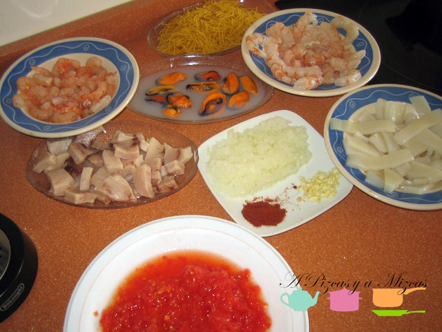
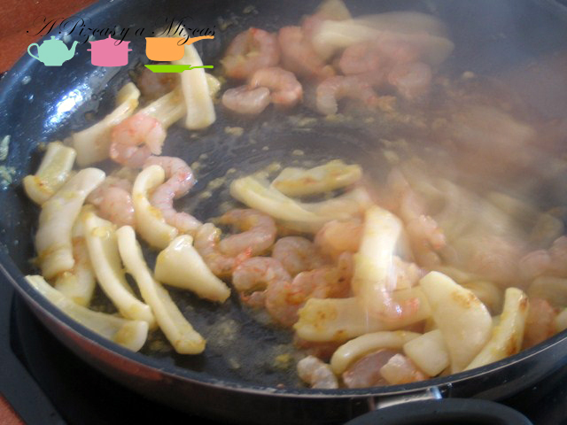
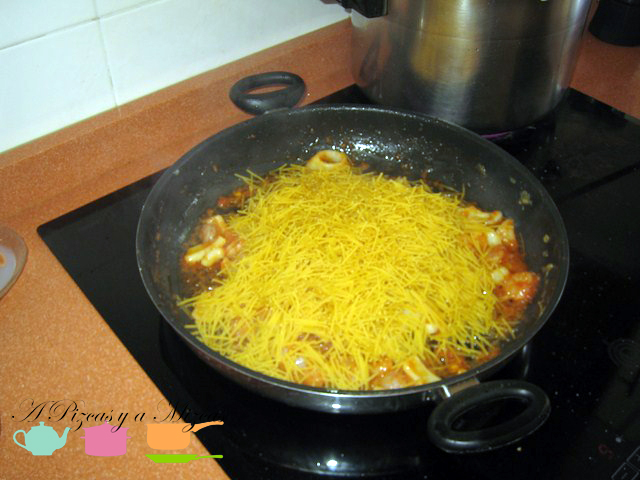
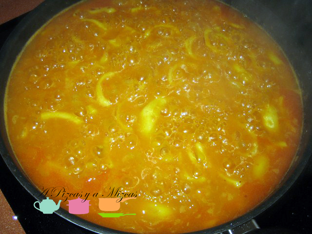
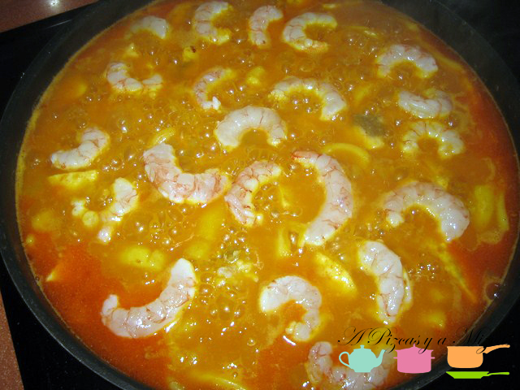
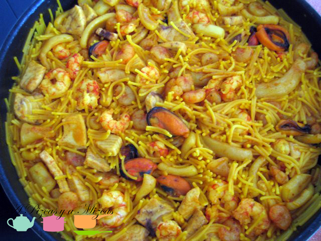
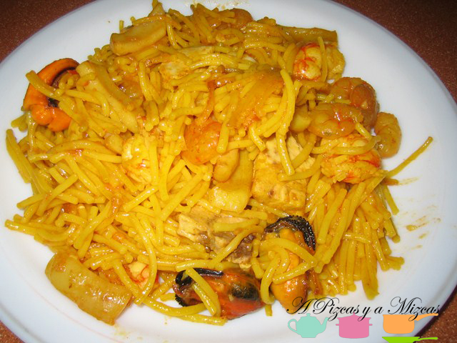

El otro día a Pizcas no le apetecía paella para comer el domingo, así que echamos mano del otro clásico de la gastronomía dominical, al menos en Valencia, se trata de la fideuà. Un plato muy sencillo de hacer pero que puede convertirse en todo un espectáculo gastronómico. Además, como todas las recetas de A pizcas y a mizcas puede ajustarse al presupuesto disponible, así se puede jugar con el marisco que se emplea, el caldo, o el pescado que se le añade. Aquí damos las claves para hacerla.

Ingredientes para 4 personas:

- 6 gambones
- Una cebolla pequeña picada
- Un ajo picado
- Un tomate grande y maduro rallado
- Una cucharadita de pimentón
- 250 gramos de anillas de calamar
- 1 cortada de mero
- 250 gramos de gambas peladas
- Fideos (nosotros empleamos los Gallo Nº4)
- 1 litro de caldo de pescado

Lo primero es preparar un buen caldo de pescado. No escatiméis, pues aunque os sobre caldo se puede congelar y lo tenéis listo para utilizar en el futuro. Nosotros solemos hacer el caldo con un kilo de morralla (pescado de playa pequeño variado), dos o tres galeras, hueso de rape o de mero, media cebolla y un tomate, tres o cuatro ajos y una hoja de laurel. Lo metemos todo en la olla express, lo cubrimos de agua y lo dejamos hervir unos 20 minutos en la olla.

Para la fideuà, es importante disponer de una paella o, en su defecto, de una sartén grande. En la paella se fríen bien los gambones, presionando las cabezas para que suelten la sustancia. Una vez fritas, como si fueran para comer, se retiran y se reservan.

A continuación añadimos la cebolla y el ajo picados y dejamos que se doren, añadimos el tomate rallado y lo freimos bien. Se le pone la cucharadita de pimentón y se remueve bien para que no se queme.

Ahora, incorporamos los calamares cortados en tiras y le damos unas vueltas, cuando hayan cambiado de color a blanco, se añaden los fideos (cinco puñados, es lo que utilizamos nosotros) y se rehogan un minuto.

Ahora ya se añade el caldo (el doble de caldo que de fideos y un pelín más) y se pone a hervir a fuego fuerte durante 5 minutos. Comprobamos de sal y le echamos un poco de azafrán o colorante alimentario.

Luego añadimos el mero y las gambas peladas y bajamos el fuego. Dejamos hervir 10 minutos más. Cuando aún quede caldo, ponemos los gambones y terminamos de cocer 5 minutos.

Es importante dejarla reposar unos 6 minutos para que coja todo el sabor.

A la taula y al llit al primer crit.

Alternativas a esta fideuà:

- Se le pueden poner mejillones. En este caso, se colocan los mejillones en una cazuela, con unas rodajas de limón y se ponen al fuego. Cuando se abran, retirar los mejillones y quitarles las conchas. Se incorporan junto con el mero y las gambas peladas.
- Se pueden ampliar la fideuà con cigalas.
- El pescado empleado, en lugar de mero puede ser rape, o ambos juntos.
