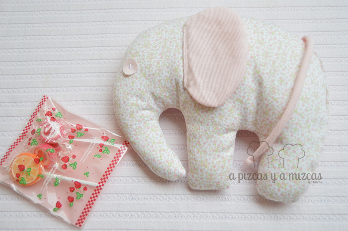
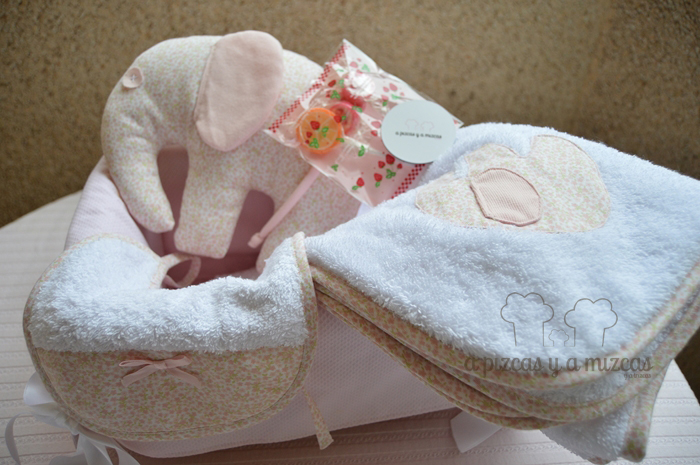
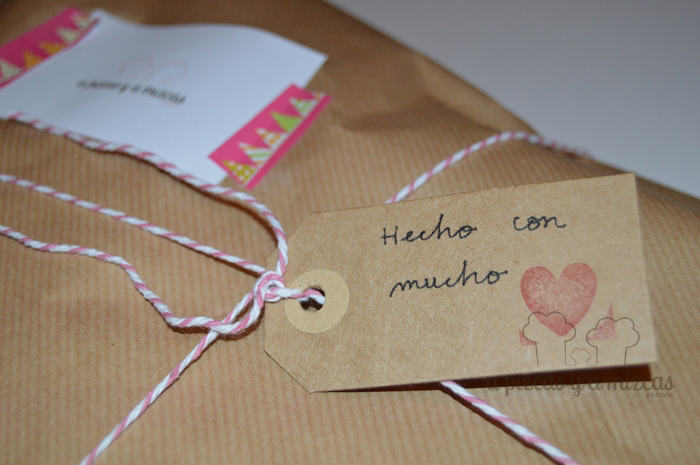
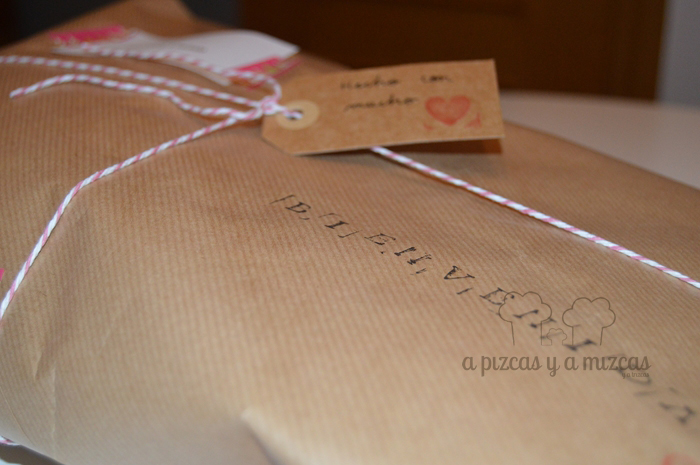

Este post es especial, es la primera vez que compartimos con vosotros las cositas que hacemos de costura. Antes de que naciera Trizcas la yaya Mizcas le hizo millones de cositas preciosas a nuestra peque... y es que las cosas hechas a mano y con amor no se pueden comparar con nada. Y de esta forma nos encargaron este regalo tan especial.Nos dijeron que querían algo funcional, sencillo y bonito. Nosotros después de pensarlo un poco pensamos que el mejor regalo era una capa de baño de bebé, un pechito y un gracioso elefantito para que pudiera acompañar en la cunita a su nueva dueña. Con la idea en la cabeza nos pusimos manos a la obra... tengo que decir que sin la ayuda de la yaya Mizcas no hubiera sido posible, entre las dos cortamos las telas, sacamos la silueta del elefantito y dejamos todo listo para coserlo.

El regalito era para una nena así que escogimos una tela con florecitas rosas (de las de toda la vida) y rizo blanco para la capa de baño y el pechito. Tengo que deciros que no perdí detalle de las puntadas de la yaya Mizcas y hasta me atreví a dar mis primeras puntadas... pero tengo que confesar que aún me queda mucho por aprender... pero empeño le pongo. :P

Y así de bonito quedó el regalo que encantó a los recién estrenados papás.

Y así de bien empaquetado llegó a sus nuevo dueños

Si quieres dar la bienvenida a alguien especial ponte  en [contacto](/contacto/ "Contacta con A Pizcas y a Mizcas") con nosotros.
