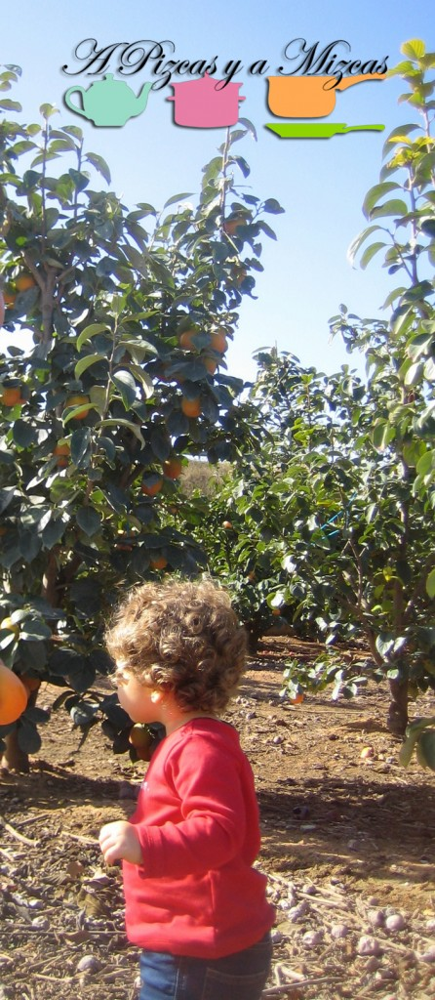

El pasado fin de semana aprovechando el buen tiempo que aún tenemos nos fuimos con los yayos a dar un paseito por la Ribera y pasamos una mañana en el campo. Como ya sabreís el yayo Mizcas tiene un campito de caquis y los tíos Mizcas uno de mandarinas... así que a parte del paseo pues aprovechamos para traernos a casa unos pocos caquis y unas bolsitas de mandarinas.

## Recolectando caquis y mandarinas

Estuvimos de árbol en árbol... Trizcas alucinaba viendo tanto arbolito junto e iba corriendo de uno a otro. El yayo le enseñó como coger las mandarinas directamente del árbol e intentamos que cogiera un caqui.... pero no le hacía demasiada gracia.

Los caquis que cogimos tuvimos que ponerlos en un recipiente amplio que luego se pueda cerrar (nosotro utilizamos un cubo) con un vasito de ginebra (aunque sirve cualquier otro licor) y los dejamos durante una semana. Transcurrido ese tiempo el caqui ya puede comerse.

El caqui persimon se recolecta semi maduro y se somete al un tratamiento de desastringentado. Con este proceso se elimina la astringencia del fruto, ya que esta variendad de caqui antes alcanzar el punto de madurez es muy astringente y por lo tanto no sería apto para el consumo

Este es el proceso de desastringentado, que consiste en eliminarle la astringencia al fruto. En los almacenes industriales se hace en cámaras de atmósfera controlada con etanol o CO2. El procedimiento del etanol es el más caro y complicado, por lo que prácticamente el CO2 es el más utilizado actualmente. Consiste en dejar elambiente de la cámara sin oxigeno, con niveles de CO2 del 98%. Con este ambiente en 1 ó 2 días la astringencia ha desaparecido del caqui.

El almuerzo nuestro fue un par de mandarinas.... es que en el campo las mandarinas tienen un sabor especial. Mirad que mandarinas tan buenas nos trajimos a casita:

