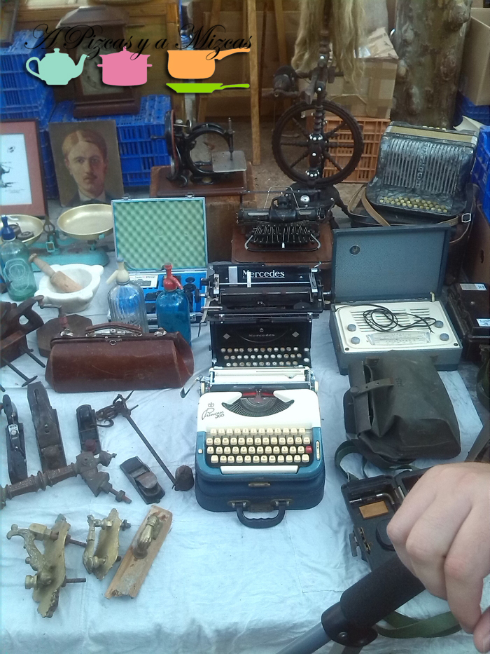
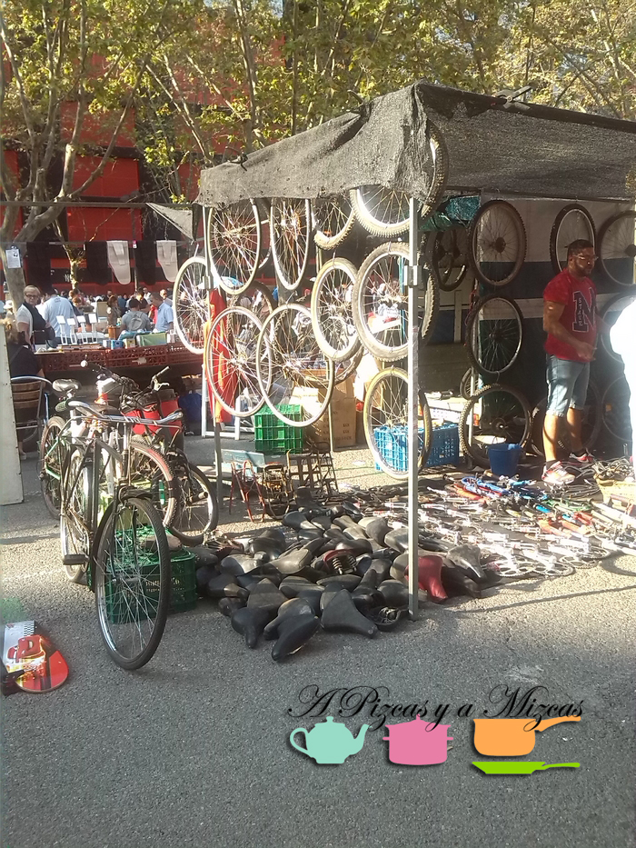
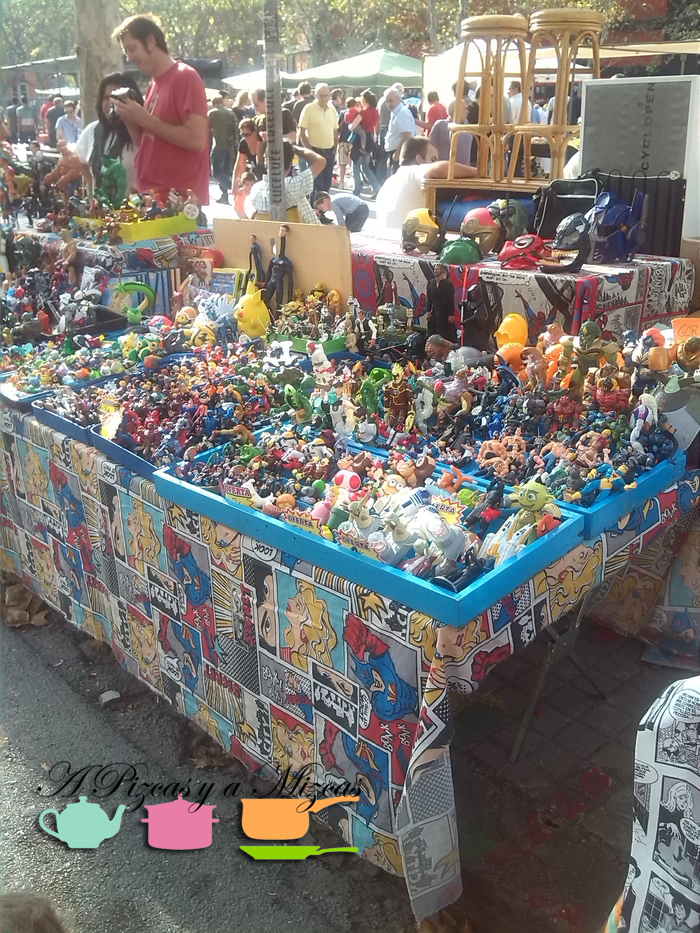
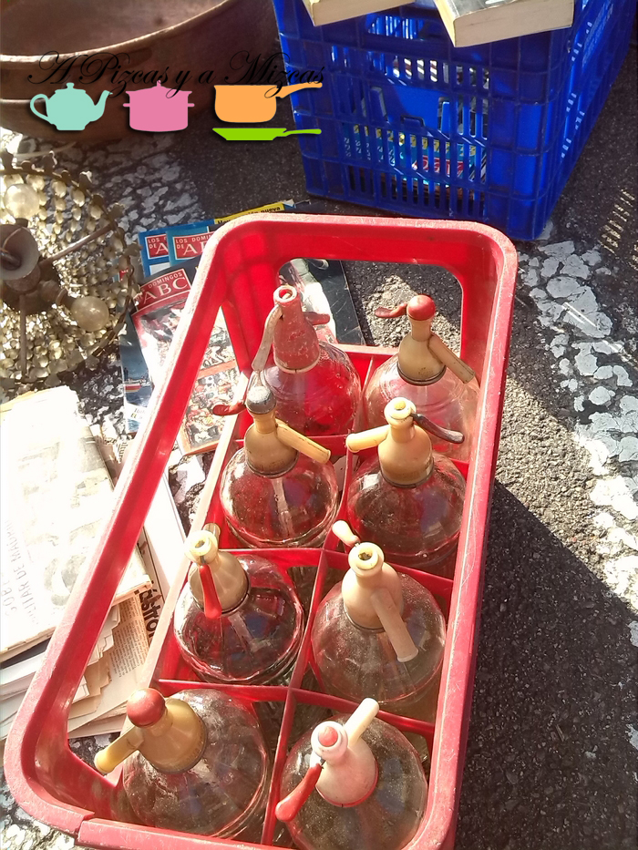
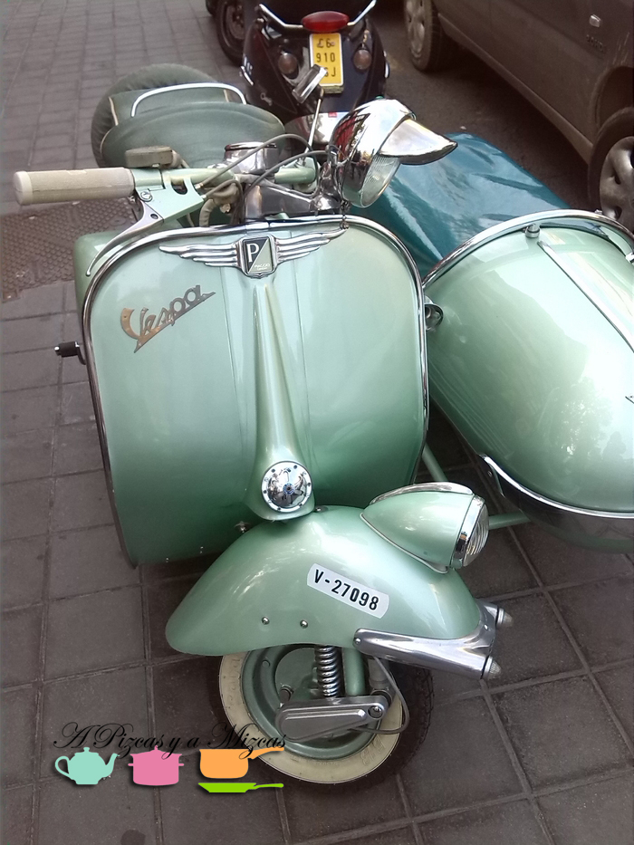
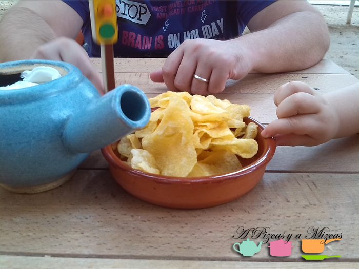
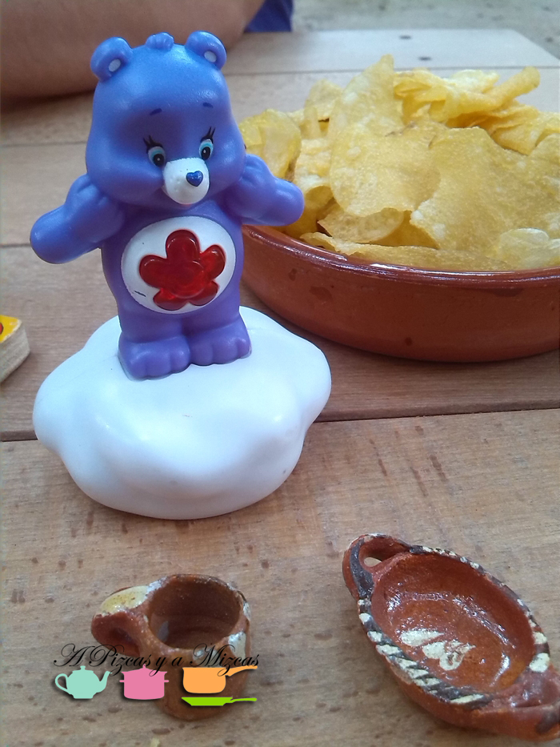
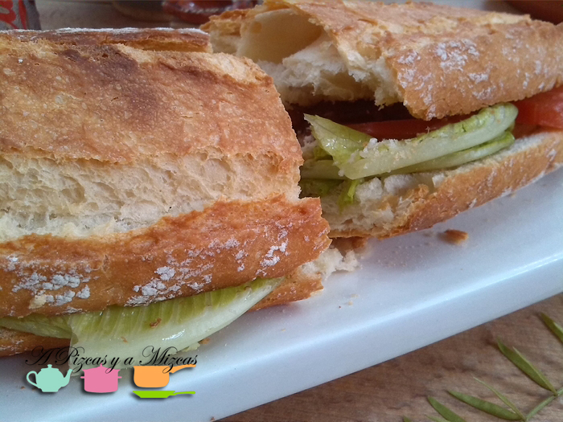
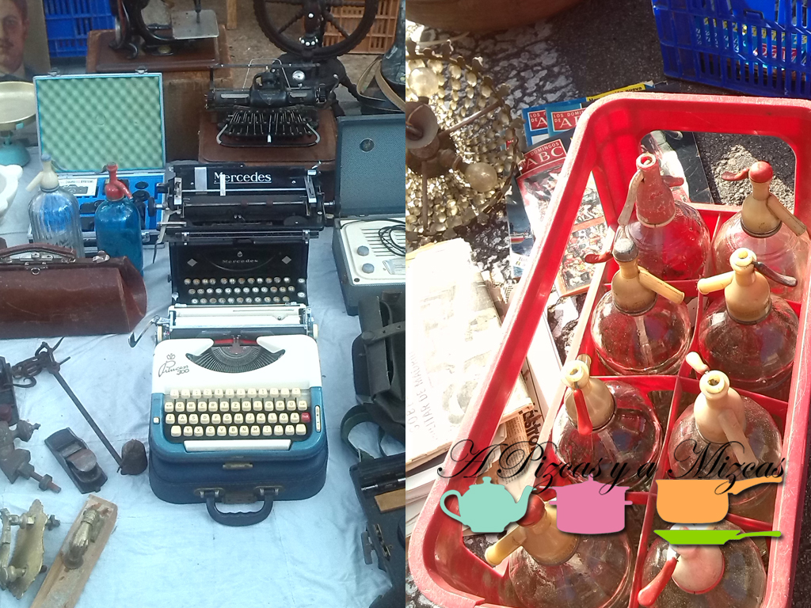

Con estos días tan buenos que tenemos por Valencia apetece mucho salir a pasear y a disfrutar de la calle. Como Trizcas nos ayuda a madrugar todos los días de la semana (ufff, qué tempranera nos ha salido), a Pizcas se le ocurrió la idea de dar un paseo por el rastro de Valencia y la verdad es que fue una gran decisión y lo pasamos genial.

## Nuestro paseo por el rastro de Valencia

Antes de contaros nuestras impresiones sobre el rastro de Valencia, os dejamos con un poquito de [historia](http://es.wikipedia.org/wiki/El_Rastro_de_Valencia "Historia rastro de Valencia"). El rastro de Valencia es un mercado al aire libre de objetos de segunda mano que se organiza todos los domingos y festivos en la plaza de Luis Casanova (junto al campo de fútbol del Mestalla). Actualmente, lo componen alrededor de 500 vendedores, que conforman un mercado tradicional consolidado en la ciudad dedicado a la "venta de antigüedades y objetos usados, así como objetos con fallo o rotura leve".

El rastro de Valencia estuvo durante siglos ubicado en la Plaza del Mercado, formando parte de la actividad diaria de este centro comercial y neurálgico de la ciudad. A las puertas de la Lonja de la Seda y la Iglesia Santos Juanes y la plaza de la Compañía, montaban sus puestos traperos, ropavejeros, chamarileros y chatarreros. Todos ellos dedicados a la venta de herramientas, muebles, ropas y enseres, libros, quincallas, y todo lo que pudiera ser reciclado para atender la demanda del momento.

En fin, que el rastro de Valencia ha ido creciendo con el paso de los años y ha ido cambiando de ubicación hasta quedarse (por ahora) junto al estadio de Mestalla.

A las 9:30 estábamos saliendo de casa y como fuimos en coche en un periquete llegamos. Dimos alguna vueltecilla pero enseguida encontramos sitio en la Avenida Aragón justo enfrente de Mestalla. Al ir tan pronto no había mucha gente y pudimos callejear por el rastro. A Pizcas le encantaron los puestos con muñecos de su infancia y en los que había máquinas de escribir antiguas, Trizcas se quedaba alucinada de ver tantas cosas por el suelo y a mí (Mizcas) me encantaron todas las botellas y artilugios antiguos que recordaba de la infancia en casa de mis abuelos.

Después de ver todas las calles del rastro nos fuimos a recargar fuerzas a [La Ola Fresca](https://www.facebook.com/LAOLAFRESCA?fref=ts "Facebook La Ola Fresca") , situado en la Calle Músico Magenti, 11 (Benimaclet) donde almorzamos un bocadillo de bacon con lechuga y tomate. Tomamos nota de los brunch que hacen, y seguro que otro día repetimos.

