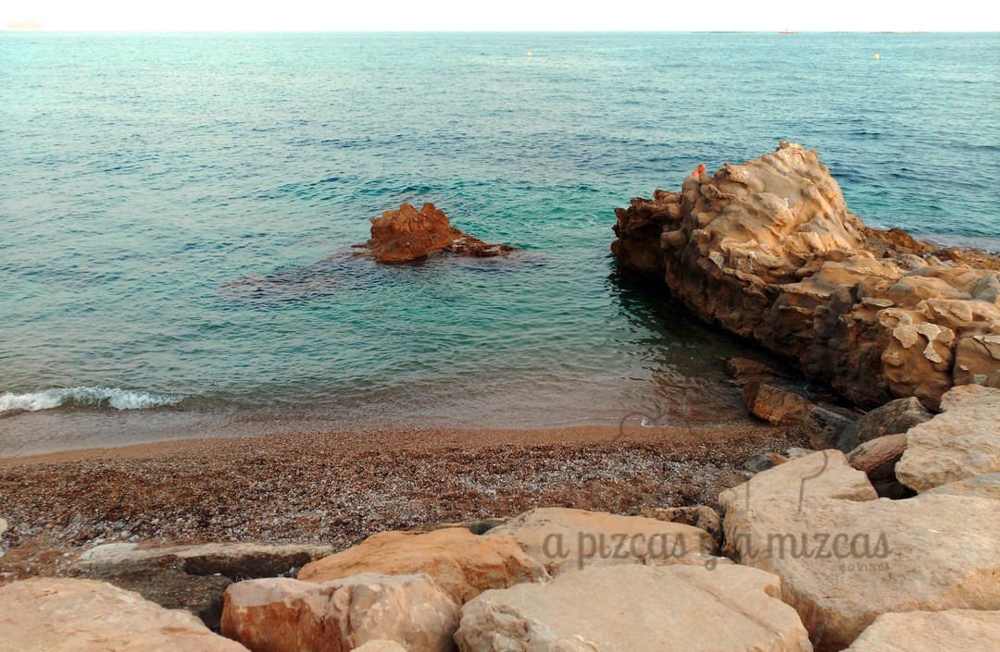
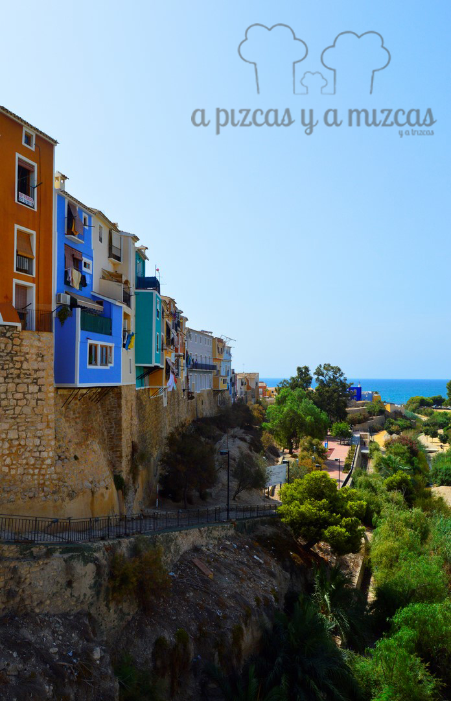
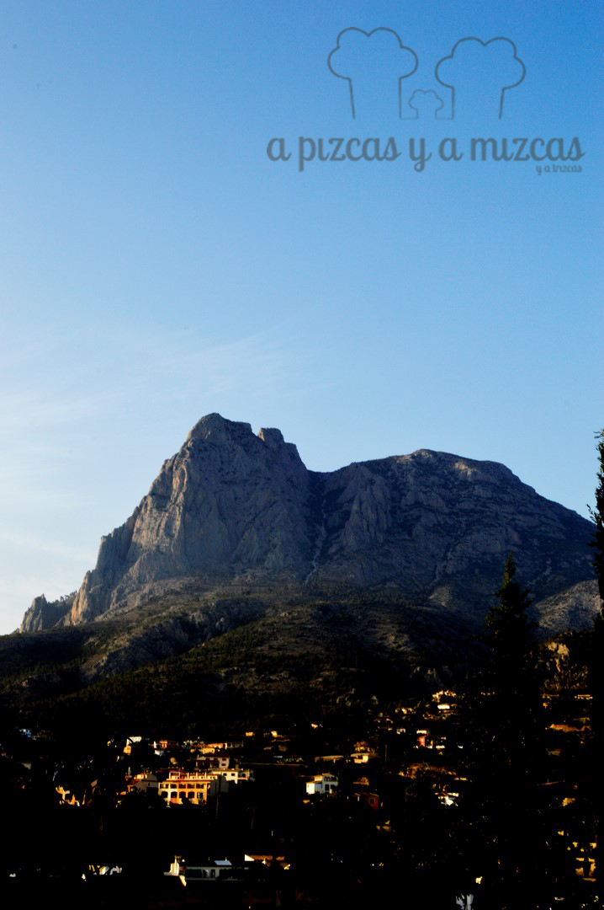
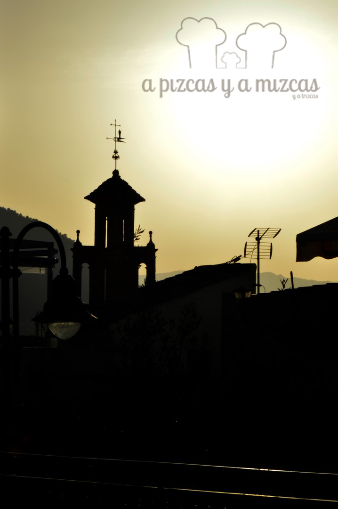
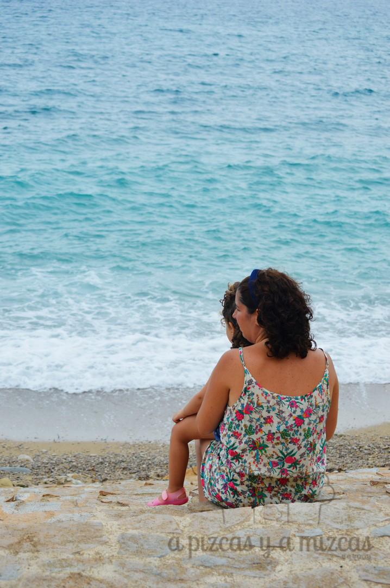
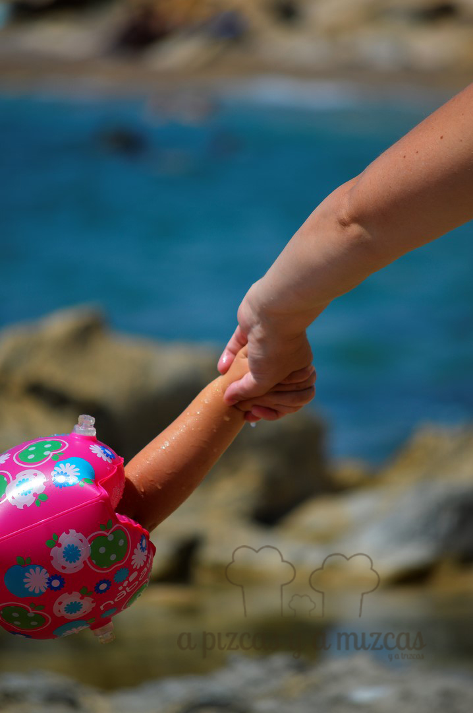

Uuuf! Ya está aquí septiembre, y con él la vuelta a la rutina, al trabajo, el primer año de cole de Trizcas... Pero para hacerlo un poco más llevadero hemos preparado este post condensando nuestro verano pizcas 2015. Hemos podido hacer muchas cosas. Hemos conocido lugares y gentes geniales y al recordarlo es como si tuviésemos vacaciones pizcas casi de nuevo. ¿Te vienes con nosotros?

Después de muchos años, Pizcas tuvo en 2015 unas vacaciones laaaargas. 21 días seguidos en agosto. Así que teníamos que aprovecharlo y montar un verano pizcas 2015 completo. Aunque antes de que llegaran esos días ya fuimos precalentando... Así aprovechamos ya en junio para darnos los primeros baños del verano (en mayo ya dimos los primeros de la temporada). Trizcas fue la sirena de Moncofar y más tarde de la piscina de los tíos Mizcas en el pueblito bueno. Sólo con unas gafas de bucear ya es feliz, eso y algún juguete que se hunda...

Nuestro destino elegido fue la [Costa Blanca](http://www.costablanca.org/Esp/Paginas/default.aspx) en Alicante y decidimos reservar nuestras vacaciones a través de [Air Bnb](https://www.airbnb.es/). Encontramos un apartamento perfecto en [Villajoyosa](http://www.villajoyosa.com/) y la verdad es que el sistema nos encantó. Nuestro anfitrión estuvo en contacto con nosotros desde que hicimos la reserva y no tuvimos ninguna "sorpresa", al revés, todo era como en las fotos y pasamos unos días geniales en esta localidad que, pese a estar pegada a Benidorm, permite descansar con tranquilidad y unas playas espectaculares.

Nuestro destino elegido fue la [Costa Blanca](http://www.costablanca.org/Esp/Paginas/default.aspx) en Alicante y decidimos reservar nuestras vacaciones a través de [Air Bnb](https://www.airbnb.es/). Encontramos un apartamento perfecto en [Villajoyosa](http://www.villajoyosa.com/) y la verdad es que el sistema nos encantó. Nuestro anfitrión estuvo en contacto con nosotros desde que hicimos la reserva y no tuvimos ninguna "sorpresa", al revés, todo era como en las fotos y pasamos unos días geniales en esta localidad que, pese a estar pegada a Benidorm, permite descansar con tranquilidad y unas playas espectaculares.

De camino a nuestra "casa de vacaciones" (como la llama Trizcas), paramos a comer en [Jávea](http://www.xabia.org/) y descubrimos La Siesta, un local que parece sacado de la mismísima Ibiza. Si queréis saber más, os lo contaremos en otro post.

Villajoyosa nos encantó. Fue el lugar del verano pizcas 2015. El apartamento estaba ubicado a la perfección, nos permitía ir a la zona de calas de piedra (El Varadero, Estudiantes...) con aguas cristalinas y llena de peces, muy tranquilas. Nos hicimos habituales del [Chiringuito Nuevo Varadero](https://www.facebook.com/ChiringuitoNuevoVaradero?fref=ts), un establecimiento con mucha vida y una programación muy variada (imprescindible las actuaciones de [Pablo Bloom](https://www.facebook.com/pablobloom?fref=ts), domingos por la tarde a partir de las 18.00 h). También podíamos ir andando a la playa del centro, un arenal impresionante, con todos los servicios y frente al casco urbano, característico por sus viviendas centenarias pintadas de vivos colores (así cada pescador podía diferenciar la suya al aproximarse).

Playa Varadero, Villajoyosa

Casas colgadas de colores en Villajoiosa

Desde Villajoyosa nos acercamos a [Altea](http://www.altea.es/es) y a [Finestrat](http://www.ayto-finestrat.es/index.php) (no confundir con la Cala de Finestrat). Una localidad de interior a los pies del Puig Campana con mucho encanto. Calles de trama musulmana, cuestas que enamoran... Todo el casco urbano está numerado y explicado, con lo que puedes hacerte una visita "guiada" en cualquier momento. Hay un párquing público en el centro de la población.

El Puig Campana, Finestrat

Finestrat

La gastronomía no pudo faltar en este verano pizcas 2015 y descubrimos que Villajoyosa es un tesoro: los productos del mar que maneja la Cofradía de Pescadores son una maravilla, sus chocolates ([Valor](http://www.valor.es/es/), [Clavileño](http://chocolatesclavileno.com/), [Pérez](http://www.chocolatesperez.com/index.php/es/)...), cocas... y si hay un restaurante que recomendamos encarecidamente es El Pòsit, en el número 23 de la Avenida del Puerto, que merece una entrada propia en el blog.

Adios Costa Blanca... con ganas de volver

Nos dio mucha penita dejar la Vila (Trizcas decía que las piscinas se quedaban tristes), pero aún quedaba verano para comer en la playa, dar paseos nocturnos, disfrutar de rica horchata...

Juntos a todas partes
