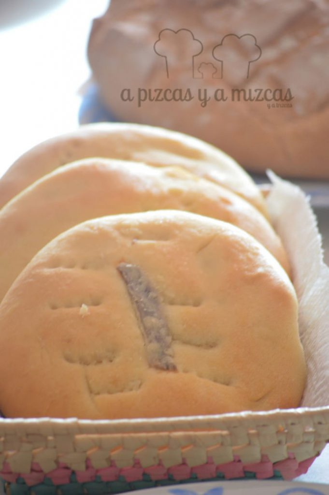

Hemos aprovechado el primer fin de semana de septiembre para hacer memoria de cómo han sido nuestras vacaciones de verano 2016. Unas vacaciones muy especiales, porque somos tres y medio: Pizcas, Mizcas, Trizcas y... Chispas, que llegará a nuestras vidas en diciembre. Así que tocaba un verano pizcas algo relajado. ¿Quieres saber qué hicimos en esta temporada estival?

## Así fue nuestro verano pizcas 2016

Este año optamos por ir cerca de casa, a la Costa Blanca alicantina y alquilamos mediante [AirBnb](https://www.airbnb.es/) un apartamento en la localidad de Altea. En la zona de Cap Negret. Se trata de una zona muy tranquila y familiar, con playas de aguas muy limpias y, eso sí, de guijarros. El apartamento fue una pasada, muy amplio y cómodo y con una piscina en la azotea de la que era imposible sacar a Trizcas. Parece una sirena y sólo quería estar a remojo. La casa estaba muy cerca de la playa y de la zona de L'Olla. Además, dando un paseo o en bicicleta se podía llegar rápidamente al pueblo. También está próxima la parada de Tram, que está a dos estaciones del centro de Altea.

¿Algunas recomendaciones en Altea? Pues claro. Lo primero, bucear en sus aguas cristalinas y llenas de peces. Gastronómicamente hablando la oferta es inmensa. En el pueblo os recomendamos el restaurante [Oustau](http://oustau.es/) , para comer o cenar; la heladería [Wapi Gelato Lab](https://www.facebook.com/Wapi-Gelato-Lab-180738742055737/) (no os perdáis su helado de yogur) y si sois de dulce o para desayunar, la mejor opción es la pastelería [Desabors](http://www.desabors.com/www.desabors.com/pastisseria_DE_SABORS_-_Altea.html). A nosotros nos encantaron.

En la carretera, N-322 cerca de casa está el restaurante [Quindici](http://www.quindicialtea.com/), muy agradable y con zona para los peques y un poco más adelante el asador [Ca Joan](http://cajoanaltea.com/), con las mejores carnes del mercado. Junto al mar, disfrutamos mucho del Cranc, un chiringuito con mucha clase y en el que hacen unos arroces y unos pescados de aupa.

Tuvimos la suerte de que nuestra estancia en Altea este verano coincidió con la [Nit de L'Olla](http://www.castelldelolla.com/esp/index.asp) (suele ser todos los años el sábado después del 8 de agosto), en la que disparan un castillo de fuegos artificiales espectacular, desde plataformas situadas en el mismo mar. Este año lo disparó Ricardo Caballer, uno de los mejores maestros pirotécnicos del mundo.

Tras pasar unos días fantásticos en Altea, nos movimos un poquito al norte para ir a Dénia, donde estuvimos en una casita en la falda del Montgó. Descubrimos que la playa de La Marineta es perfecta para ir con niños pequeños, pues se trata de una playa en la que es casi imposible ver una ola y en la que puedes adentrarte cien metros en el mar sin que te cubra más allá de la cintura. Además, pese a ser agosto, tampoco estaba excesivamente masificada.

De Dénia nos encantó callejear por las calles del Loreto, Marqués de Campo, el barri de les roques... Un lugar de contrastes. Además, nuestra casa estaba muy cerca de Xàbia y pudimos acercarnos algún día a sus playas.

¿Lugares para apuntarse en Dénia? Si quereis un lugar con un menú de diario economico y solvente, os recomendamos [La Llauradora de Loreto, en la calle Loreto](http://www.lallauradora.com/restaurante-tradicional-no-tipico-denia/), con un menú de 10 euros (bebida aparte), en el que no falta un arroz. Pero si queréis un arroz diferente, probad el arroz al horno que hacen en el restaurante [Al Forn dels Deveses](http://alforn.es/), en el barri de baix la mar, (el pollo "espatarrat" también es un espectaculo). Para almorzar, lo mejor es ir al mercado municipal, donde el producto fresco es el rey. El Bar Toni no falla, os recomendamos sus bocadillos de sepia con picadillo a base de cacahuete y el clásico bocadillo de figatells con tomate rallado.

Para refrescarse, lo mejor un helado artesano. En la calle Marqués de Campo encontraréis la [Heladería Verdú](https://www.facebook.com/HeladeriasVerdu/?rf=699666386735659) y la [Heladería Miquel](https://www.facebook.com/MiquelGelater/), las dos muy buenas.

La gastronomía dianense es espectacular, el arroz a banda (lo pedimos para llevar en el restaurante Haití y resultó muy rico), el pulpo seco (lo compramos en el mercado de Dénia) o les coques con anchoa...

Qué ganas tenemos de volver!

