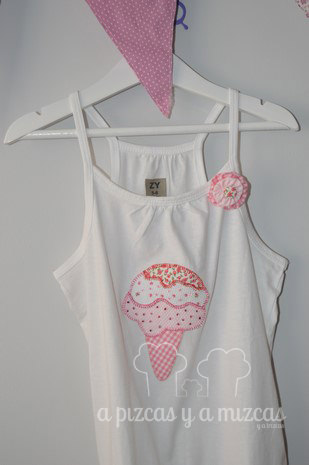
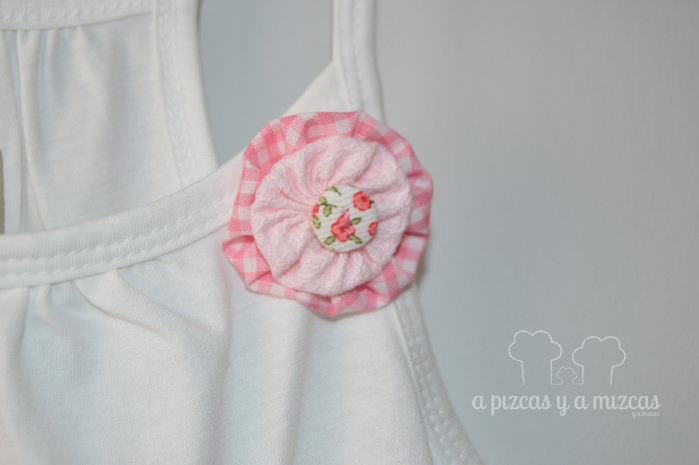
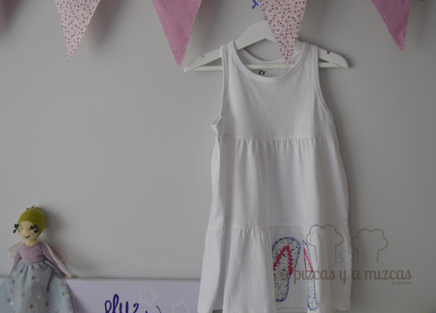
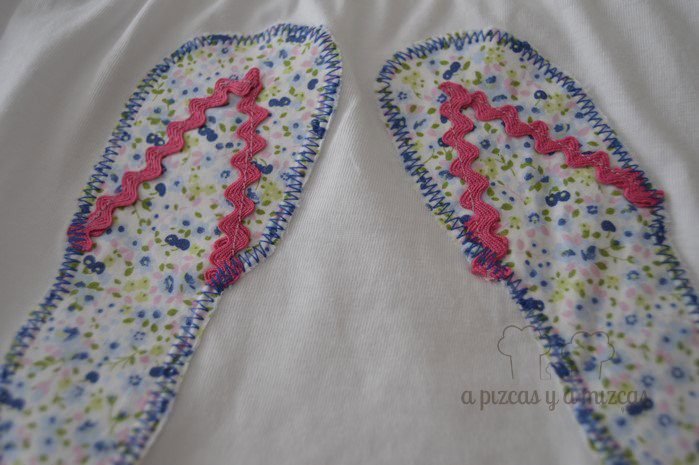

Estos días con la que está cayendo lo único que queremos es estar a remojo... pero de camino a la playa o a la piscina tendremos que ponernos algo... ji ji ji... y aquí va nuestra sugerencia: vestidos fresquitos para ser los más guapos de la playa.

Y es que nuestras pizqueras van a ser las más guapas este verano. Escogimos dos vestidos blancos básicos y dimos rienda suelta a nuestra imaginación. Rebuscamos entre los retalillos y cosimos unas aplicaciones en los vestidos básicos blancos para convertirlos en vestidos fresquitos y veraniegos.

Para el primero dibujamos un helado de tres sabores y fuímos poniendo telas una encima de otra para los distintos sabores de nuestro helado combinando distintas telas. En una de las capas cosimos unas cuantas bolitas rojas que era el topping de nuestro "helado". Nos encanta el resultado... y es que nos dan ganas de hincarle el diente... ji ji ji

Helado rico rico

Para completar el vestido fresquito cosimos un fuxico con la combinación de las telas que habíamos utilizado en el helado. Y no nos puede gustar más, ¿qué opináis vosotros?

Detalle fuxico

Para el segundo vestido queríamos un motivo bien veraniego... y qué hay más veraniego que unas sandalias?? Buscamos una plantilla de unas sandalias y a recortar y a buscar la tela adecuada en nuestra cajita de telas. Escogimos una tela floreada y las tiras de "nuestra sandalia" escogimos una cinta picunela en color rosa.

El vestido del verano

Las sandalias más bonitas para el veranito

Si os gustan los vestidos fresquitos o queréis preguntarnos o contarnos cualquier cosa podeís poneros en contacto con nosotros a través de nuestro [formulario de contacto.](/contacto/)
