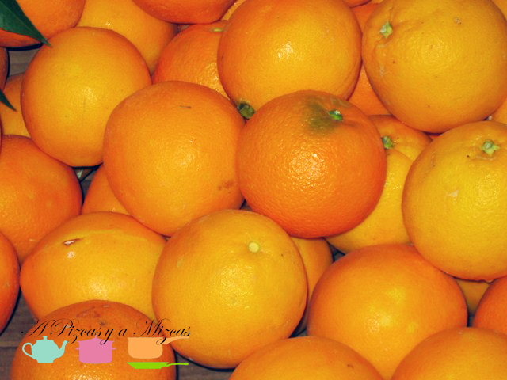

El otro sábado Pizcas y Mizcas nos fuimos a dar una vuelta por el Mercado Central de Valencia. Siempre es una gozada, aunque no compres mucho (no porque no quieras), solo con ver todo el género disfrutas.

 (pizcas)")

Nosotros aprovechamos para comprar algunos de los ingredientes que nos hacían falta para la [paella](/2011/paella-valenciana-con-denominacion-de-origen-pizcas "Paella valenciana con Denominación de Origen Pizcas") del domingo. La verdad es que se nota la frescura y la calidad de los productos, y a un precio que no se va demasiado de los que podemos encontrar en grandes superficies.

 (pizcas)")

Un almuercito y una cata de quesos completó una mañana perfecta, solo empañada un poco por la lluvia. (pizcas)")

El mercado tiene rincones muy pintorescos y puestos realmente espectaculares. Uno de nuestros favoritos es el Racó de Feri, especializado en cocina griega. Qué moussakas, qué hummus, que ensaladas, el auténtico queso feta. A ver si volvemos pronto y os lo presentamos en este blog.

 (pizcas)") (pizcas)")
