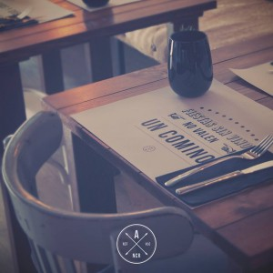
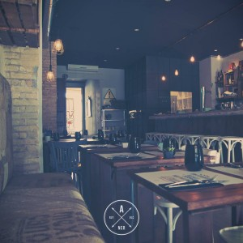
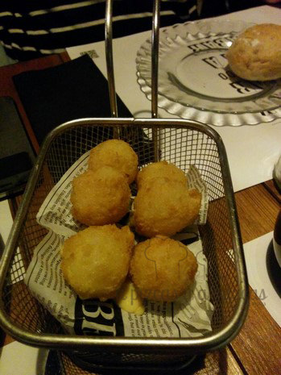
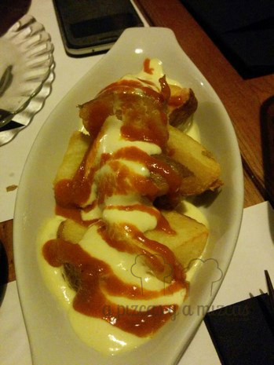
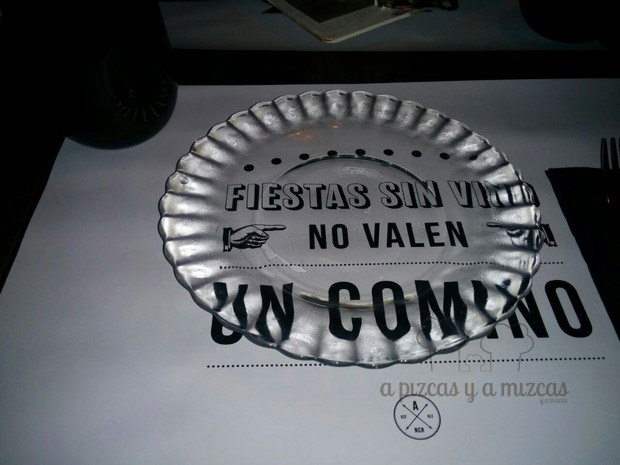
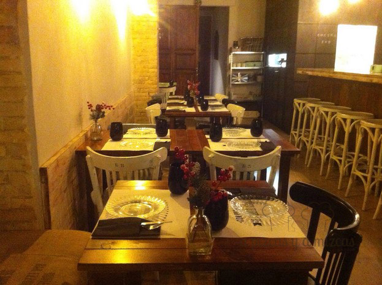

Hace poco que visitamos un local al que teníamos muchas ganas de ir. Se trata del restaurante [El Almacén](https://plus.google.com/105984156002820917924/about?gl=es&hl=es "Restaurante El Almacén, en Google+"), situado en la calle Sueca, 41, en el corazón del [barrio de Ruzafa](/tag/ruzafa/ "Ruzafa"), en Valencia. Se está volviendo uno de nuestros barrios favoritos de la ciudad, tanto por el día, como por la noche. Ya intentamos ir en una ocasión al Restaurante El Almacén, pero en aquella ocasión el local estaba a tope y con el carro de pequeser se iba a hacer muy complicado. Así que volvimos semanas más tarde, pero a una hora más temprana.

## Nuestra cena en el Restaurante El Almacén

- **Comida**: ⭐⭐⭐⭐
- **Local**: ⭐⭐⭐⭐
- **Servicio**: ⭐⭐

Acudimos a cenar, pero en horario "europeo" (milanés para ser más exactos, jeje). A las 20.30 horas estábamos en la puerta. Todavía ni habían abierto, pero así conseguimos un doble objetivo: asegurarnos una mesa (fuimos sin reserva) cómoda para dejar el carro de Trizcas y hacer que la peque pudiera cenar con nosotros. En total fuimos cuatro adultos y la pitufa.

> El local del Restaurante El Almacén es una maravilla, mucha madera y elementos vintage que dan ganas de llevar a casa. La vajilla seguro que os suena a todos los que tengáis más de 20 años.

Os contamos lo que cenamos:

Para la peque pedimos una tortilla francesa, pero nos dijeron que no hacían nada fuera de carta (punto negativo). Así que vimos qué opciones le podíamos pedir. Afortunadamente ya come de todo. Finalmente, le trajeron una hamburguesa de buey, que solicitamos que sirvieran "sin montar". Así se la pudo comer con su pequetenedor.

Los adultos pedimos:

\- Para compartir -

- Buñuelos cremosos de bacalao (increíblemente suaves, se acabaron en un pispas)

- Tempura de verduras (riquísima)
- Alcachofas fritas con salsa de yema trufada (lo que más le gustó a Pizcas)
- Bravas (lo menos sorprendente)

- \- Platos individuales -
- 1 tosta de hongos y jamón ibérico (correcta)
- 1 Brioche al vapor con secreto ibérico (muy rico pero escaso)
- 1 Tosta de sardina ahumada (un sabor muy intenso, o te gusta o no podrás con ella)
- 1 Samosa de morcilla y habitas (rica, rica)
- \- Para compartir -
- Torta de dulce de leche (dulcérrimo)
- Brownie de cacau del collaret (muy interesante)

La comida estaba muy rica. Como ellos dicen, sabores de siempre pero actualizados. A destacar las alcachofas y la tempura. Pero todo estaba muy bueno. Aunque parezca mucha comida, no sobró nada. Las raciones no son muy abundantes.

Al margen del local y de la comida, echamos en falta algo más de "cariño" o empatía por parte del personal de sala. Tal vez, las veces que hemos visitado el Restaurante El Almacén no hemos tenido suerte. Han sido siempre correctos, pero un poco distantes o "secos", por ejemplo con el tema de la cena de la peque (nunca se nos habían negado preparar una tortilla francesa).

Volveremos.
