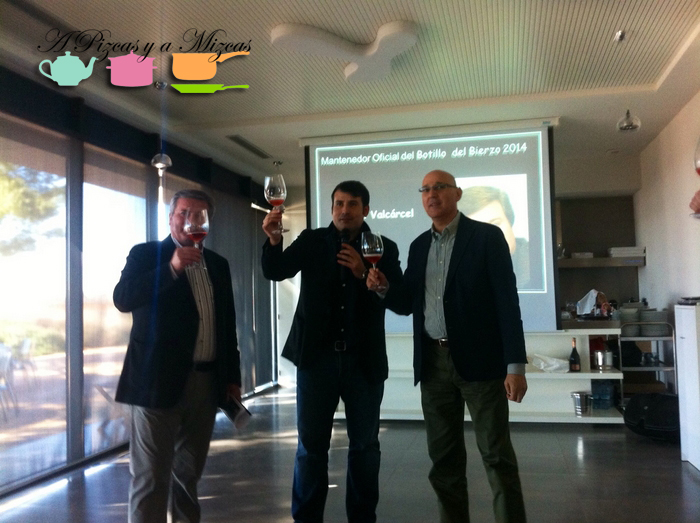
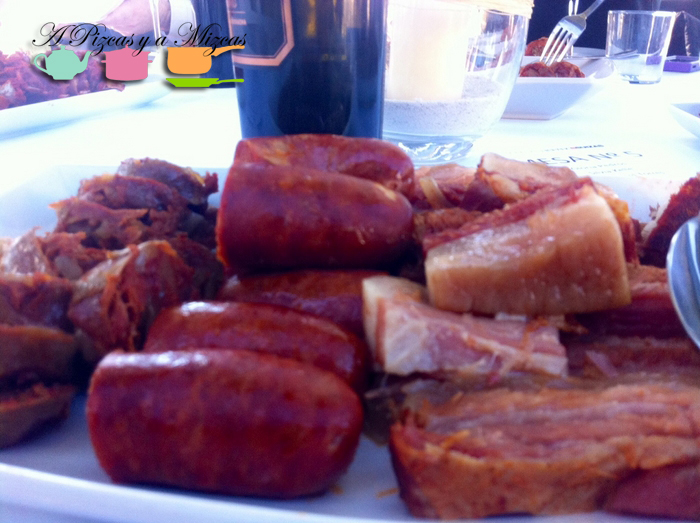
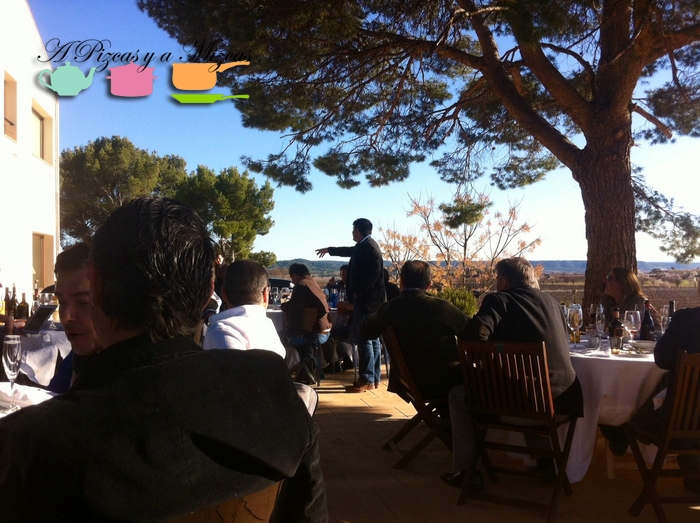
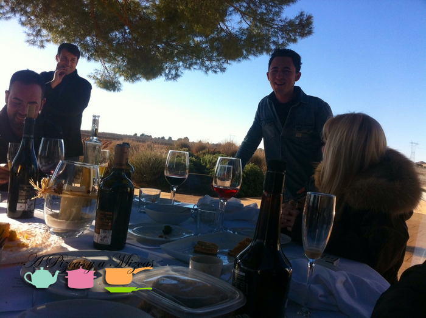

Hay cosas que sólo hace una madre. Es más, se nota que detrás de ellas está una progenitora cuidadosa, meticulosa, detallista. El pasado 7 de marzo nuestros amigos de [Bodegas Hispano+Suizas](http://www.bodegashispanosuizas.com/) celebraron su tradicional botillada y nos hicieron sentir bercianos por un día. Este encuentro de amigos es una de esas cosas que sería imposible sin una madre, en concreto la madre de Pablo Ossorio (y de Ángel). Por eso este post va dedicado a ella: ¡Viva la madre que parió a los bercianos!

## Viva la madre que parió a los bercianos

El Botillo de Hispano+Suizas es uno de los eventos más esperados por la prensa especializada en gastronomía y vitivinicultura de la Comunitat Valenciana. Un día al año en el que la toga del periodismo se deja colgada para vestirse de contador de chistes, cantante de karaoke... Toda una experiencia que Pizcas lleva varios años disfrutando gracias a su trabajo.

Las botilladas más famosas las popularizó el locutor y empresario radiofónico Luis del Olmo, haciendo gala de su patria berciana. Pero las segundas son, sin duda las que organiza Pablo Ossorio en Finca Casa La Borracha, en Requena.

Como hemos dicho, esto es un homenaje a la madre que parió a los bercianos. No vamos a explicar cómo se hace un [botillo](http://es.wikipedia.org/wiki/Botillo#Botillo_de_El_Bierzo), pero sí lo que hay detrás de este en particular.

La madre de Pablo Ossorio se encarga de preparar desde Ponferrada los ingredientes del guiso (botillo, chorizo, androlla, panceta, costilla de cerdo, garbanzo pedrosillano, cachelos (patatas) y col), según los comensales que tiene previsto Pablo, los envasa al vacío y los envía por mensajería (doblado el mapa de España para que se toquen Ponferrada y Requena) para que estén listos 24 horas antes de la botillada.

Este año, sin embargo hubo un contratiempo, pues por problemas de la empresa de mensajería todos los ingredientes no llegaron a Requena hasta el mismo día 7 de marzo a las 8.00 horas. Finalmente todo quedó en un susto y el botillo lució y supo de maravilla. Para acompañar no faltaron los fantásticos vinos de esta bodega, entre ellos el Bobos 2012, del que hablaremos en otra ocasión.

Pero las obras de la madre de Ossorio no quedan ahí. Después del suculento botillo llegó la hora de los postres, sí, los elabora ella en casa y los envía también a Requena: tarta de almendra, galletas de avellana, rosquillos...

Este año actuó como mantenedor del Botillo de Hispano+Suizas Raúl Valcarce, alcalde de Carracedelo, pueblo de origen de la familia materna de Ossorio, que además de político es bodeguero y empresario agroalimentario. Volvimos cargados de productos de su firma, que comentaremos en otra ocasión.

Fue un día genial. Abrazos, risas, complicidad. Amistad. Ya estamos tramitado la doble regionalidad. Hablaremos con la madre de Ossorio para que lo vaya agilizando.

Viva la madre que parió a los bercianos!
