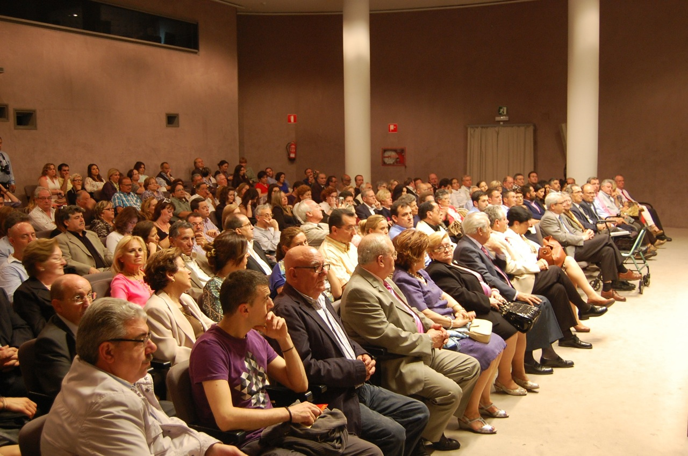
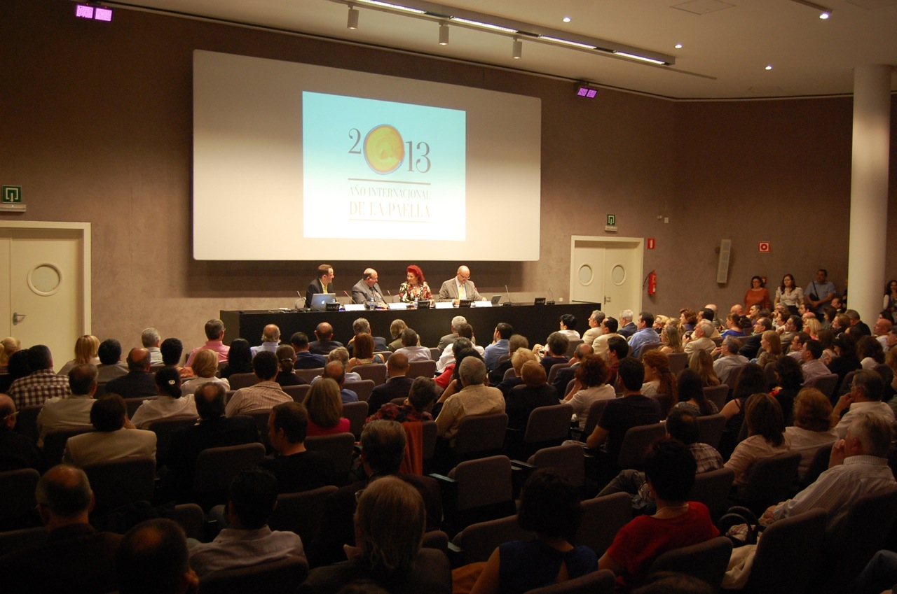
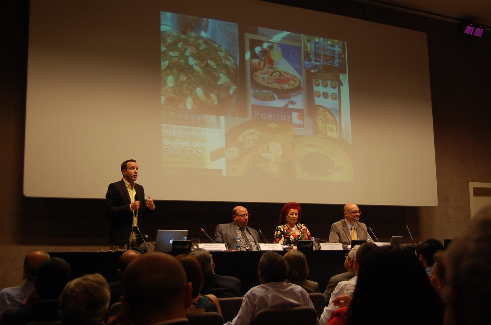
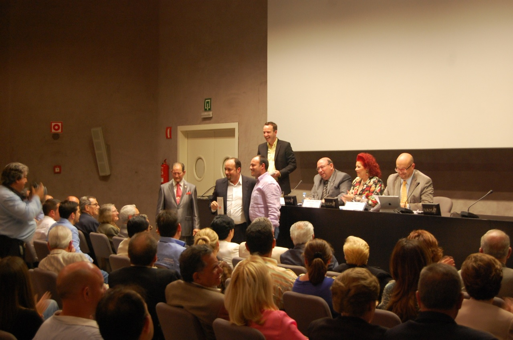
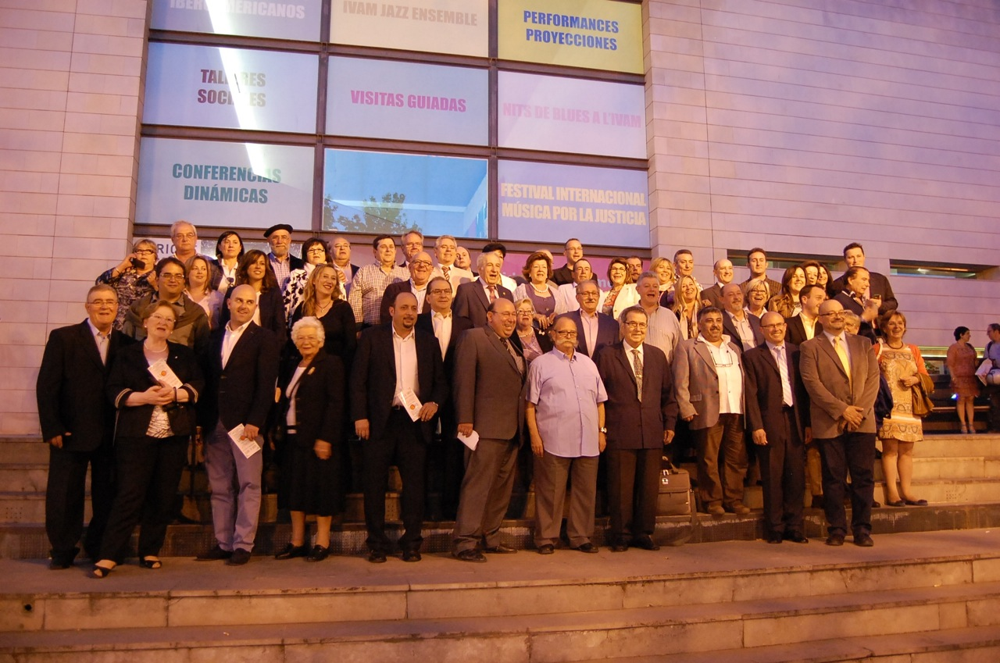
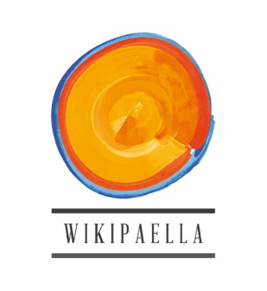
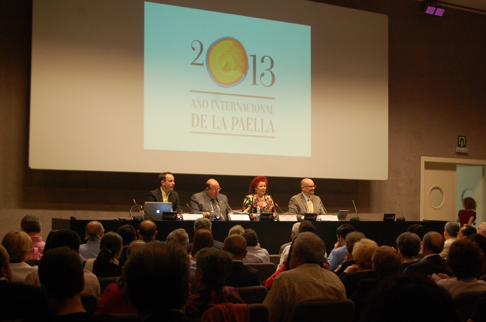
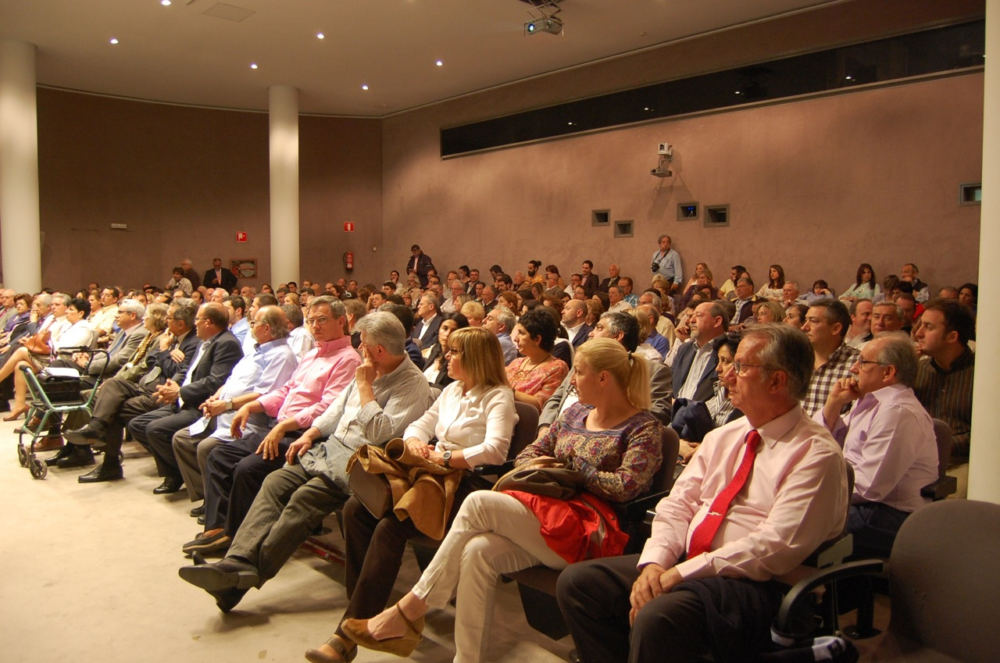

El pasado jueves 23 de mayo se celebró uno de los actos más destacados del Año Internacional de la Paella. En el auditorio del IVAM, y con una doble vertiente se **rindió homenaje** a 77 restaurantes de la Comunidad Valenciana que se han distinguido por su labor en la conservación y divulgación de la tradición gastronómica arrocera. En el mismo acto **se presentó la wikipaella**, un proyecto colaborativo destinado a conocer y difundir la tradición culinaria del arroz.

](/wp-content/uploads/DSC_00653.jpg)       [

Por su parte, **Wikipaella** se presentó como una herramienta destinada a trazar, entre todos, **el** **mapa definitivo de los arroces en la Comunidad Valenciana**. Dotada del mismo espíritu comunitario que ha de animar al buen comedor de paella, esta wiki nace para enseñar y aprender, para documentar, para difundir y para disfrutar de la paella, una receta que pertenece a todos y no pertenece a ninguno. La paella es de todos, pero a su vez no es de nadie.

2013 Año Internacional de la Paella es un movimiento gastronómico espontáneo. Nacido en las redes sociales, que ha ido tomando cuerpo gracias a las nuevas tecnologías y se está haciendo visible desde el pasado mes de abril con actividades como esta.

El acto fue retransmitido íntegramente vía _streamig_, y contó con la presencia en la mesa de **José Hoyo** (presidente de la Academia Internacional de Ciencias, Tecnología, Educación y Humanidades), **Consuelo Císcar** (Directora General del IVAM) que destacó el protagonismo del Arte y la Gastronomía durante las próximas semanas en el IVAM. **Guillermo Navarro** (publicitario y portavoz de la Comunidad de la Paella) y **Paco Alonso** (periodista y crítico gastronómico), son los promotores de la iniciativa

[**www.wikipaella.org**](http://www.wikipaella.org/)
